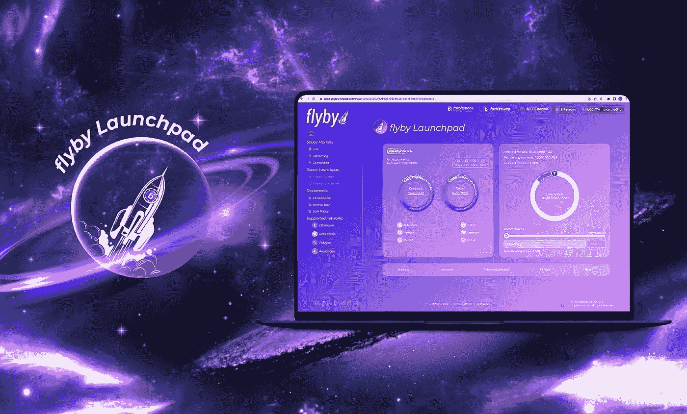

# 投资 IDO 是一种趋势？

> 原文：<https://medium.com/coinmonks/investing-in-ido-is-a-trend-62e0aafa7dd8?source=collection_archive---------51----------------------->

伴随着密码市场蓬勃发展的一年，DeFi-Decentralized Finance 也有了很大的发展，在 2021 年，关键资产的价值有时会达到 2550 亿以上。由于这一点，IDO 已经成为一种突出的趋势，变得越来越受欢迎并不是一件很难理解的事情。

**什么是 IDO？**

**IDO (Initial DEX Offering)** 是通过在分散交易所(DEX)首次出售代币进行筹资的一种形式。通常，IDO 将有两个池，一个用于社区，另一个用于旨在持有本机令牌的用户。

**I do 的好处**

由于它的分散化，IDO 平衡了包括开发者、投资者、DEX 和项目整体在内的参与者的利益。

开发商可以很容易地筹集资金，对项目拥有最大的控制权。投资者可以购买并持有通过 IDO early 开发的潜在项目的令牌。在 DEX 方面，更成功的项目将提高 DEX 的声誉，吸引新的潜在项目，并增加交易所的交易量，有助于建立一个强大的生态系统。

**热门 IDO 平台**

随着快速发展，出现了很多 IDO 平台，名字像 BSCPad，Solanium，Trustswap，Avalaunch，…

目前，一个新的 IDO 平台的推出与以前的平台没有太大的不同，这使得他们在 3 或 4 个月没有推出任何 IDO 项目时几乎冻结了运营

或者出现太多对投资者吸引力不大的 IDO 项目。

**我该不该参与 IDO 投资？**

决定投资与否，取决于比盯着质量更差的项目更多的因素。当一个潜在的 IDO 项目在一个具有出色功能和足够社区信任的优质 Launchpad 平台上启动时，就不难理解为什么那个项目会成功了。

IDO flyby Launchpad 正是您正在寻找的 Launchpad，它是 IDO 平台中的一个新名称，旨在确保项目的长期增长和发展，即使在 IDO 销售回合结束后也是如此。IDO flyby Launchpad 是推动交易所新资本和交易的完美发射台。继承自 forbitspace 生态系统(去中心化超级交换)，IDO flyby Launchpad 支持以太坊、BNB 链、多边形和雪崩。

**结论**

2022 年 IDO 的发展将更具发展潜力的项目，请在决定投资任何 IDO 项目前谨慎选择。

> 加入 Coinmonks [电报频道](https://t.me/coincodecap)和 [Youtube 频道](https://www.youtube.com/c/coinmonks/videos)了解加密交易和投资

# 另外，阅读

*   [Bookmap 点评](https://coincodecap.com/bookmap-review-2021-best-trading-software) | [美国 5 大最佳加密交易所](https://coincodecap.com/crypto-exchange-usa)
*   [如何在 FTX 交易所交易期货](https://coincodecap.com/ftx-futures-trading) | [OKEx vs 币安](https://coincodecap.com/okex-vs-binance)
*   [CoinLoan 评论](https://coincodecap.com/coinloan-review) | [YouHodler 评论](/coinmonks/youhodler-4-easy-ways-to-make-money-98969b9689f2) | [BlockFi 评论](https://coincodecap.com/blockfi-review)
*   [XT.COM 评论](https://coincodecap.com/profittradingapp-for-binance)币安评论 |
*   [SmithBot 评论](https://coincodecap.com/smithbot-review) | [4 款最佳免费开源交易机器人](https://coincodecap.com/free-open-source-trading-bots)