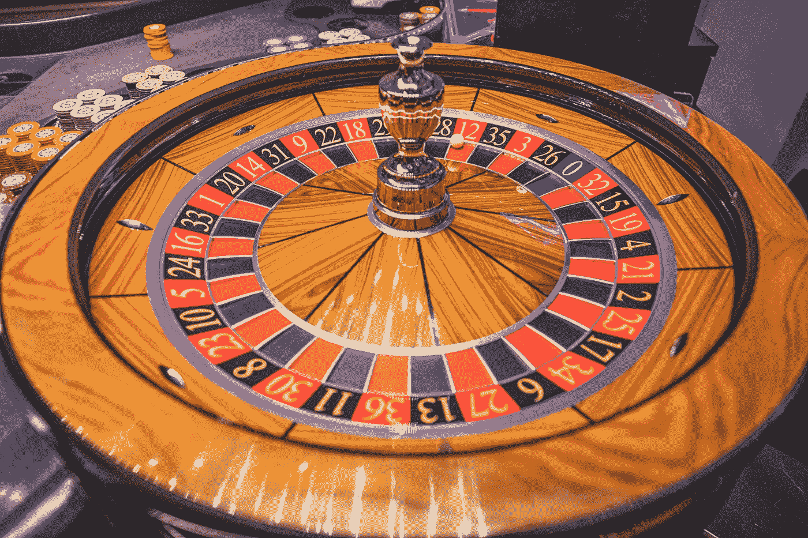

# 投资与赌博:哪个是更好的选择？

> 原文：<https://medium.com/coinmonks/investing-vs-gambling-which-is-the-better-option-65d2fb13160?source=collection_archive---------31----------------------->

## 终极指南:投资与赌博

Photo by [Free Walking Tour Salzburg](https://unsplash.com/@freewalkingtoursalzburg?utm_source=medium&utm_medium=referral) on [Unsplash](https://unsplash.com?utm_source=medium&utm_medium=referral)

当人们想到投资或赌博时，他们可能会想到一些与术语不同的东西。投资可以被认为是一个用你已经拥有的钱赚钱的机会，这只是让你的钱发挥作用以产生更多利润的一种方式。另一方面，赌博是一种有风险的娱乐形式，如果你足够幸运地赢了，它有可能带来丰厚的回报。如果你不小心的话，还可能带来重大损失。

## 投资和赌博有什么不同？

虽然投资和赌博有许多相似之处，但它们最显著的区别之一在于投资者的潜在利润。当你在体育或赌场赌博时，你总是会输钱。大多数赌徒明白，即使他们赢了，他们也可能永远不会有超过一次性支出的任何东西。一般来说，赌博的人通常输的比赢的多——尽管有些人确实大赚了一笔并带走了利润，但这远没有大多数人想象的那么普遍。相比之下，投资者即使不是每次都赢，也会获利。这是因为投资依赖的是长期增长，而不是短期运气。看股票是了解投资者即使不是每次都赢也能赚钱的最好方法。例如，假设你以每股 10 美元的价格购买 100 股 X 公司的股票。如果 X 公司的股票涨到每股 20 美元，你就能以 2000 美元的价格卖出这些股票(扣除费用)。然而，假设 X 公司的股价回落到每股 5 美元；现在，您的投资总额仅从 1，000 美元(1 x 100 美元)增长到 1，500 美元(1 x 150 美元)。这两种情况之间的差异表明，投资时亏损不如盈利重要。这个原则不仅适用于股票；几乎所有的投资都提供随时间波动的回报。

## 投资能赢，赌博能输吗？

虽然投资的确是赚钱的好方法，但赌博也是如此。根据市场表现、经济趋势和公司收益报告进行投资，你会赚钱或赔钱。但是在赌博中，你所有的赢和输都是基于运气。那么，哪种选择更有利于长期财务成功呢？答案可能会让你大吃一惊。大多数赌徒并没有从他们的赌注中获利，不管他们怎么想！事实是，总的来说，随着时间的推移，投资已经超过了赌博。当你看到历史上一些最大的赢家(和输家)时，原因就很明显了。例如，沃伦·巴菲特被称为历史上最伟大的投资者之一；他今天的身价是 1243 亿美元。然而，他第一次涉足商界是作为一名职业赌徒，在大学期间参加了纽约市的高赌注桥牌游戏。在决定投资之前，他在三年内损失了 50，000 多美元——而且再也没有回头！

## 判断我是否过于冒险的一些经验法则是什么？

以下是评估风险的一些经验法则。关于你的投资或潜在投资，问自己这些问题:它有很大的负面影响，只有很小的正面影响吗？如果是，那就不要做。如果我害怕我会在这上面赔钱，我能轻易离开吗？如果没有，就不要做。我的投资是否超出了我能承受的损失？如果是，那就不要做。你对自己正在做的事情有足够的了解，可以用简单的语言向其他对投资一无所知的人解释你正在做的事情吗？如果没有，就不要做。有没有监管机构监督你在做什么，并留意像我这样可能被你这样的专业人士欺骗的人？还有什么地方——比如州法律——可以保护我不被像你这样的人利用吗？如果没有，就不要做。最后，问问你自己，是否有一种不需要冒那么大风险的更简单的赚钱方法。大多数值得拥有的东西都不容易得到。但是大多数值得拥有的东西并不值得你拿你所有的东西去冒险，因为它们也很难得到。(这里的例外是彩票。)

## 我应该放弃投资股票或债券赚钱，转而去赌博吗？

许多人不把投资作为一种选择，因为他们把它与赌博联系在一起。投资和赌博完全不同。与赌博不同，如果你明智地投资，随着时间的推移，你真的有可能获得比开始时更多的钱——如果你试图击败一个作弊的机会游戏，这是不可能的。这里的关键词是如果。当涉及股票和债券(或任何你喜欢的投资)时，你可以明智地选择如何分配你的资源，但如果你长期以来做出糟糕的决定，这些都无关紧要；事实上，即使一个人在轮盘赌上把所有的钱都押在红色上，仍然有 50%的机会输。但与旨在通过随机奖励和惩罚来利用人类心理的赌场游戏不同，投资是基于历史数据和未来预测做出经过计算的决策。如果你不擅长统计或金融，那么雇佣别人来管理你的投资组合可能是个好主意；然而，如果你确实有一些数字方面的经验，或者上过经济学或商业管理的课程，那么你应该先自己尝试一下。记住:虽然投资成功需要长期的努力、奉献和耐心，但失败可能会因为运气不好或缺乏努力而很快发生——在讨论为什么有些人赢了很多而有些人却失去了一切时，没有人会谈论这两个因素。

## 投资与赌博的底线

这些东西中的一个和另一个不一样。毫无疑问，在某些情况下，投资和赌博既有上行潜力，也有下行风险。然而，投资者的关键区别在于他们控制自己资金的能力。如果你不把投资和赌博混为一谈，或者对它们一视同仁，那会有所帮助。看投资的时候，问问自己:我投资的时候对自己的钱有完全的控制权吗？有人会给我提供更好的理财建议吗？如果你对这两个问题的答案都是肯定的，你应该考虑通过投资来进行你的下一步财务行动。但是，如果你的答案是否定的，也许是时候看看有什么样的赌博机会了。在投入任何现金之前，想想你是在寻找投资还是赌博机会；否则，很有可能你失去的不仅仅是钱。例如，一旦赌徒迷上了某些类型的赌博游戏，如 21 点或轮盘赌，他们往往会忘记周围的一切——包括常识。

> 加入 Coinmonks [电报频道](https://t.me/coincodecap)和 [Youtube 频道](https://www.youtube.com/c/coinmonks/videos)了解加密交易和投资

# 另外，阅读

*   [Bookmap 点评](https://coincodecap.com/bookmap-review-2021-best-trading-software) | [美国 5 大最佳加密交易所](https://coincodecap.com/crypto-exchange-usa)
*   最佳加密[硬件钱包](/coinmonks/hardware-wallets-dfa1211730c6) | [Bitbns 评论](/coinmonks/bitbns-review-38256a07e161)
*   [新加坡十大最佳加密交易所](https://coincodecap.com/crypto-exchange-in-singapore) | [购买 AXS](https://coincodecap.com/buy-axs-token)
*   [红狗赌场评论](https://coincodecap.com/red-dog-casino-review) | [Swyftx 评论](https://coincodecap.com/swyftx-review) | [CoinGate 评论](https://coincodecap.com/coingate-review)
*   [投资印度的最佳密码](https://coincodecap.com/best-crypto-to-invest-in-india-in-2021)|[WazirX P2P](https://coincodecap.com/wazirx-p2p)|[Hi Dollar Review](https://coincodecap.com/hi-dollar-review)