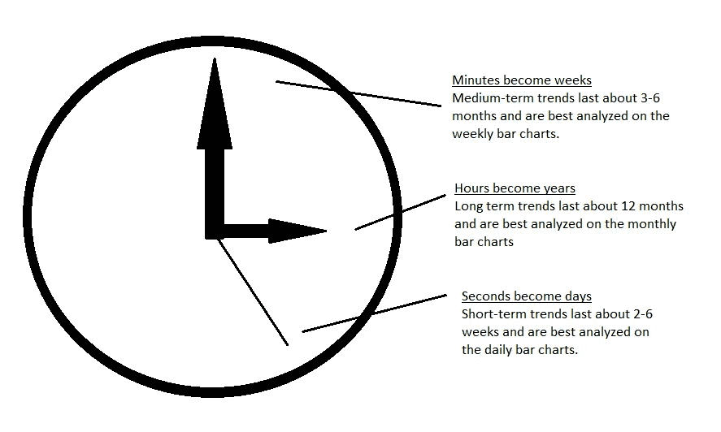

# 投资范围

> 原文：<https://medium.com/coinmonks/investment-horizon-6306858d2712?source=collection_archive---------51----------------------->

## 凝视地平线

用关于时间跨度的新语言学来划分你的思维。用长期战略和新的投资愿景征服地平线。

New clockwork² (to mess up your mind)

我们都有自己对短期、中期和长期趋势的解释，所以要小心用词，最好用数字。数字不会说谎，人们会尝试。

当投资者展望 12 到 18 个月的**时，交易大厅的技术人员可以用几天时间来制定一个**长期战略**，而远见者则超越了人类的几代人。**

***是的，这是真的，区分趋势势在必行。***

> **注意:**当日-周-月图表指向同一个方向时，你会得到最好的结果。****

**更多语言学:
长期-中期&短期趋势也可以称为主要(或主要)趋势-次要&次要趋势。没关系，这只是总结了一些词汇来帮助你分清主次。我不会太在意小的修正，除非你想在小的时间框架内通过做空赚点快钱。优先考虑你的长期投资计划，像一个真正有远见的人那样积累一些世代财富。**

***资料来源:瑞士瑞信银行，全球技术研究***

> **加入 Coinmonks [电报频道](https://t.me/coincodecap)和 [Youtube 频道](https://www.youtube.com/c/coinmonks/videos)了解加密交易和投资**

# **另外，阅读**

*   **[3 商业评论](/coinmonks/3commas-review-an-excellent-crypto-trading-bot-2020-1313a58bec92) | [Pionex 评论](https://coincodecap.com/pionex-review-exchange-with-crypto-trading-bot) | [Coinrule 评论](/coinmonks/coinrule-review-2021-a-beginner-friendly-crypto-trading-bot-daf0504848ba)**
*   **[莱杰 vs n rave](/coinmonks/ledger-vs-ngrave-zero-7e40f0c1d694)|[莱杰 nano s vs x](/coinmonks/ledger-nano-s-vs-x-battery-hardware-price-storage-59a6663fe3b0) | [币安评论](/coinmonks/binance-review-ee10d3bf3b6e)**
*   **[Bybit Exchange 审查](/coinmonks/bybit-exchange-review-dbd570019b71) | [Bityard 审查](https://coincodecap.com/bityard-reivew) | [Jet-Bot 审查](https://coincodecap.com/jet-bot-review)**
*   **[3 commmas vs crypto hopper](/coinmonks/3commas-vs-pionex-vs-cryptohopper-best-crypto-bot-6a98d2baa203)|[赚取加密货币利息](/coinmonks/earn-crypto-interest-b10b810fdda3)**
*   **最佳比特币[硬件钱包](/coinmonks/hardware-wallets-dfa1211730c6) | [比特币 02 点评](/coinmonks/bitbox02-review-your-swiss-bitcoin-hardware-wallet-c36c88fff29)**