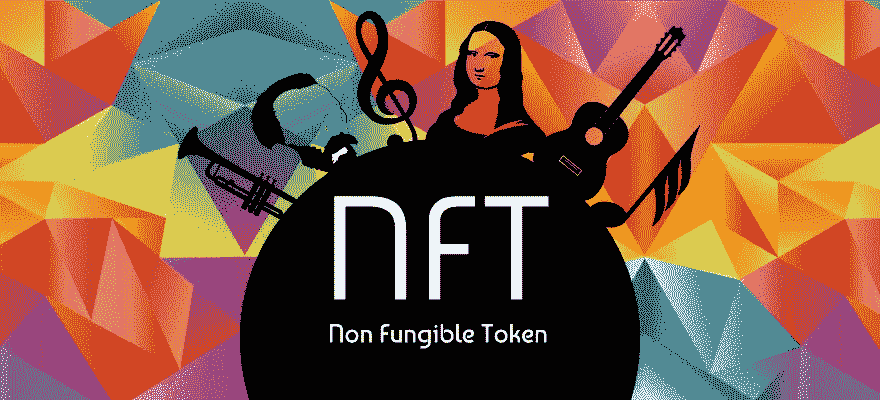

# NFTs 项目的投资步骤

> 原文：<https://medium.com/coinmonks/investment-steps-in-the-nfts-projects-155c441f05ce?source=collection_archive---------51----------------------->

独特的代币可能用于各种领域，如音乐、绘画、游戏等，但它们都有相同的目的；数字产权证明。

通过购买 NFT 你有一个令牌格式的数字文件。那个令牌显示了你的所有权，别人没有。不可替换令牌的价值取决于几个因素。它可能是一个像巴勃罗·毕加索这样的著名艺术家的纪念品，它可能是一个著名歌手的音乐会门票，甚至可能是一张无聊的猿类游艇俱乐部的照片，它没有内在价值；因此，NFT 的价值取决于艺术家、需求数量，有时还取决于它所依托的网络。

> 加入 Coinmonks [电报频道](https://t.me/coincodecap)和 [Youtube 频道](https://www.youtube.com/c/coinmonks/videos)了解加密交易和投资

你可能会问，为什么我们需要投资一个 NFT 项目，并把它纳入我们的投资组合。除了财务激励和通过买卖不可替代代币获利之外，接受代币的问题是一个基本和必要的原则。几十年前，许多人没有想到互联网会成为人类生活不可或缺的一部分。也许这种情况会在 NFT‌重演，这种资产，现在更多的是娱乐形式，有一天会成为经济-艺术辩论中的主要问题；因此，在进入之前，相对熟悉这个领域并掌握投资 NFT 项目的技巧是一个好主意。

**点击下面的链接阅读更多内容。**

*最初发布于**[***https://read . cash***](https://read.cash/@Masoud_Crypto/investment-steps-in-the-nfts-projects-edccad43)***。****