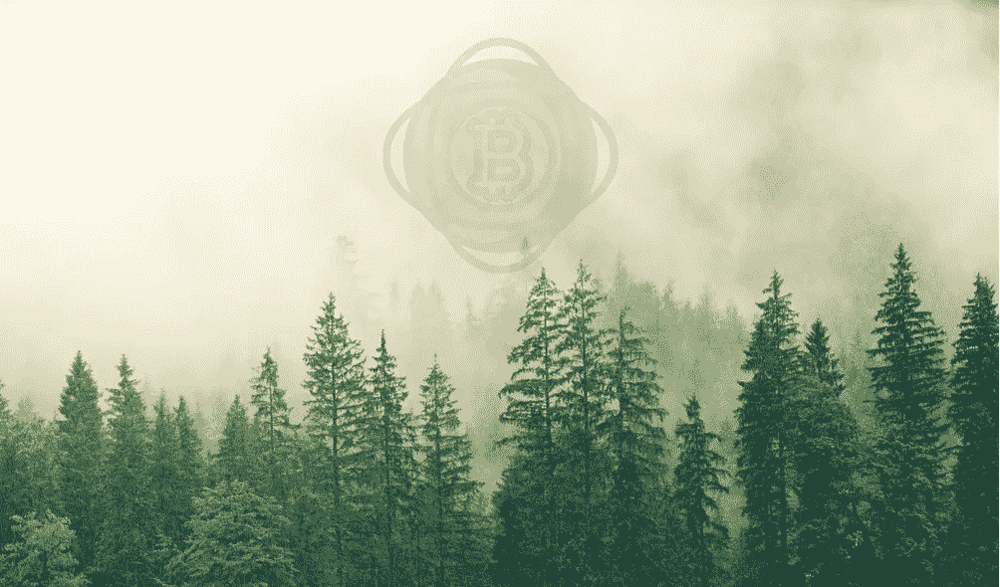

# 环境市场投资和未来

> 原文：<https://medium.com/coinmonks/investments-in-environmental-markets-and-what-lies-ahead-2e7f6a29ed5c?source=collection_archive---------46----------------------->

主题:气候科学、技术和金融

这篇文章的目的是批判性地审视气候变化行动的进展和融资工具。

**摘要**

随着集体智慧的增长和对更加合作和协作的方法的认识，世界迎来了一个新时代。从原始野蛮文明的历史中，我们已经认识到人-地球-利润之间协同作用的必要性。Covid 是一个很好的例子，说明了人类如何组织自己来适应疫情，并随着通信、交易和其他形式的产品、服务和娱乐交换中数字接口的增加而从“照常营业”转变。

另一方面，气候变化的敏感性和对化石燃料消耗和无管制工业化的巨大影响的认识，这些问题是众所周知的，如果我们不过渡到低碳经济，这些问题是不可避免的。这是一个最初的缓慢死亡，加速了久而久之，我们继续排放多余的温室气体。虽然这是最紧迫的，这个问题应该首先被所有人理解，其次处理远离化石燃料的转变，具有讽刺意味的是，这个问题几乎没有在公共和大众媒体论坛上讨论。随着大多数国家签署《巴黎协定》，生态服务正在渗透到地方和全球范围。合规和自愿市场只是资本主义向绿色革命过渡的开始，绿色革命是由千禧一代和 z 世代推动的行为变化推动的。

**环境市场——绿色革命的萌芽阶段**

利用再生技术的项目和组织，如农林业、永久农业、可再生能源、电动汽车移动性，以及其他高效自然资源管理技术，如废物变价值或能源，是推动供应方实体产生积极环境影响的一些例子。不幸的是，需求方只得到最大的污染者的支持，这些污染者是发达国家和企业，他们的目标是并声称通过资助全球其他地方的项目来“中和”他们的巨大生态足迹。

此类商品的交易机制包括排放交易系统、碳市场、环境登记和联合实施。这种生态市场仍处于非常初期的阶段，并且由于大众的参与而相当孤立。部分原因是，没有人愿意对自己的角色负责，而是指责公司或国家。[1]就像 20 世纪 90 年代的 CDS 一样，碳市场正处于发展的早期阶段，但如果建立了正确的标准并加以监管，它们可以迅速从利基市场转变为主流市场。

**问题？**

由于缺乏透明度和创造性的碳核算，很多时候一吨碳最终变成了半吨，甚至在某些情况下为零。研究表明，包括核证减排量供应在内的大多数项目，其减排量是额外的且没有高估的可能性很低。

许多植树造林项目实际上将森林砍伐转移到了附近不受管制的地区，重复计算经常给这些项目的有效性带来很大的问题。

柬埔寨的几个项目已经登记在案，但后来发现有一半的森林被砍伐或被破坏。

自巴黎框架以来，巴黎框架与京都框架的区别在于，所有国家都以国家确定的贡献形式做出了缓解承诺(NDC)。造成这种情况的原因是，做出雄心勃勃的整体经济减排承诺的东道国有动机将信用额的国际转让限制在很有可能实现额外减排的活动上，以便转让的信用额不会损害东道国实现其自身减排目标的能力。其次，各国只应在符合其 NDC 的情况下转让减排，这意味着基线可能必须根据东道国的减排承诺来确定，而不是使用“反事实”的“一切照旧”情景作为默认。

问题是，如果一个人资助的项目，无论如何都会发生，在这种情况下，资助真的没有什么不同。例如，清洁发展机制在印度失败的一个典型例子是，52%被批准的碳抵消被分配给了无论如何都要修建的项目，这反过来大大增加了全球碳足迹。

像 VCS 和 GS 这样的国际标准并不那么严密或稳健，需要向更大的包容性而不仅仅是资金流向的方向进行转型变革。

融资应该直接流向环境信用的供应商，而不是通过机构或合规机制输送。

**生态市场的驱动力——合规和自愿——初期繁荣**

驱动力有多种层次，包括政府改变政策，建立严格的合规性，同时石油巨头等大公司和微软和谷歌等科技公司通过自愿市场承诺气候目标，他们在自愿市场上资助气候技术项目，以抵消他们的环境足迹。截至 2021 年第 4 季度，全球合规市场价值 1000 亿美元，自愿市场价值 3 亿美元。不要忘记，气候行动主义也在解决问责制和呼吁绿色清洗方面发挥了一点作用，这正在影响利益相关者的利益。

**碳中和到底是什么意思？**

对于这个术语有很多解释，有各种各样的标准、认证和创造性的计算来估计生态足迹并中和它。我们通常会发现它被定义为“在碳排放和碳汇吸收大气中的碳之间保持平衡。从大气中去除二氧化碳，然后储存起来，这就是所谓的碳封存。为了实现净零排放，全球所有温室气体(GHG)排放都必须通过碳封存来平衡。”

碳中和公平的总体定义应包括减少历史排放量和大气中的排放量(这导致全球气温持续上升)。

**为什么《巴黎协定》未能形成规模？*不是字面意思，而是考虑到地球正在变暖，我们仍在燃烧化石燃料。**

它包含程序性条款(如生效标准)和操作性条款(减缓、适应和融资)。这是**一个有约束力的协议**，但是它的许多条款并不意味着义务或者是为了促进国际合作。

可以肯定地说**该条约的法律性质已经被几个民族国家和法院接受为具有约束力——或者至少不仅仅是选择性的。据路透社报道，一些国家在国内采纳了巴黎条约的目标，欧盟和日本的 2017 年贸易表明了每个国家的巴黎承诺。**

现实情况是，市场的现有状态是封闭的网络系统，具有碳认证框架，包括黄金标准、Verra、美国碳登记、CAR、CDM 等。所有这些都严重地未能扩大规模和吸引大众参与。

然而，人们没有义务去改变——除非严格的法律得到执行，或者直到通过规章和激励措施在大众层面上认识到形势的紧迫性。

全球北方和全球南方之间的差异，如早期工业化、快速技术创新和通过资源垄断产生的巨额资本，是导致净零竞赛的一些因素，这是一种谬论。

注册费用、官僚程序、咨询费和缺乏资本只是造成中小规模项目进入气候融资领域障碍的几个因素。此外，虽然供应方(即绿色项目和初创企业)在金融包容性方面已经受到限制，但需求方只受到能源和大型科技公司的推动，这些公司依赖自愿碳市场提供的廉价信贷来维护自己的利益，而不是真正旨在实现内部减排或此类融资的真正影响。

讽刺的是，新闻标题上写着“Reliance 从我们这里获得世界上第一批‘碳中和’石油”，他们声称产品的生产、分销、提炼和使用将通过取消碳抵消额度来平衡。

**旧与新；减排标准**

Verra、金本位、气候行动储备、美国碳登记等。是为数不多的标准之一，定义了在自愿碳市场下监测、报告和核实基于气候的项目的环境影响的方法。他们本质上充当了此类商品的监管和交易委员会，决定什么值得影响，什么不值得。虽然这些标准也收取大量的监测和报告费用，但在这种方案下主持一个项目对在气候空间工作的中小型项目和组织造成了进入壁垒。

从总体上看，现实的另一个角度是，我们如此依赖化石燃料，以至于突然转向可再生能源将花费很高的溢价，但会产生长期影响。虽然气候变化影响我们所有人，但一般来说，什么影响我们所有人，不关任何人的事，直到它真正影响到我们所有人。所有这些都可以归结为系统的转变和对污染者的正确监管以及绿色技术的推广，但最重要的是让人们参与到整个故事中来。

谈论气候变化并让人们理解起来很复杂。我们需要教育大众，让他们认识到负责任地消费、减少浪费、尽可能多地重复使用或重新利用的紧迫性。但是只有当一个人开始关心时，它才是重要的，或者说是来自内心的。

请放心，已经发生的是，像“可持续发展”、“碳负”、“净零”这样的词已经成为随意抛出的营销策略词。

气候融资包括各种工具，包括支持缓解和适应行动的地方、国家和跨国融资。旨在支持那些天赋较低或更脆弱的人。这些机制包括全球环境基金、SCCF、最不发达国家基金、清洁发展机制、适应基金、气候投资基金和碳市场。而对石油和天然气的补贴继续占全球总排放量的一大部分。

Klima Dao、Toucan、Moss 和 Regen Network 等替代机制是致力于全球大规模参与和采用气候投资工具的最初参与者，同时它们也主要得到需求方的大型公司或机构如微软或 Verra 的支持。随着采用曲线的上升，似乎 0.1%的人从事环境信贷，这实际上需要在主流和相当开放的市场上以商品交易的形式获得更多的机会。

这将意味着引进新的方法，分散现有生态影响提供和交换方法的标准。也许一个小的农林项目应该并且能够提出它的影响倡议，让气候专家(以及机构或国家组织，他们可以是当地的验证者)验证它，并让它直接从普通大众那里获得众筹资金，这些普通大众与大公司一起对地球上的可持续生存有着共同的责任和兴趣。

虽然气候市场增长的增加是向净零过渡的积极迹象，但现实是，这些市场的驱动力仍然是大型企业和发达国家，它们本质上一直在污染，同时投资于其他地方的生态影响项目。这就像因为“中和”了错误的行为而预测好的行为。

[2]国际金融市场的近期历史包含许多资产类别从一个深奥的市场利基转变为机构投资组合的中流砥柱的例子。

紧随其后的是生态市场，主要是碳市场，现在可以通过基于区块链的应用程序访问，如 Klima DAOs、Regen Registry、UPCO2 等。虽然这些技术、项目和概念旨在带来更多的包容性和大众参与，但财富分配却设法在 1%的人之间循环。

[3]例如，让我们以**克利马道令牌**为例:时间:晚上 7:40 日期；24–03–2022

[4]下面是 **Regen 网**:时间:晚上 7:40 日期:24–03–2022

[5]下面是**巨嘴鸟协议**:基准碳吨:时间:晚上 7:40 日期:24–03–2022

**气候融资工具的哪一部分会产生真正的影响？**

这种工具和机制在影响和宣传激励方面取得了重大进展。数十亿美元被输送到发展中国家，推动清洁发展，增强适应和减缓气候变化的复原力、意识和资金流动。尽管这些体系在大多数情况下都发挥了作用，但各种因素限制了推动真正变革所需的融资数量和类型的增长。由于融资被导向项目而非系统变革等原因，目前超过 95%的国际公共气候融资是通过现有的多边和双边发展融资机构作为发展融资提供的。

贷款和赠款是金融工具的主要部分，而基于政策和结果的金融、股权和补贴的增长幅度小得多。

供应商方面，即气候项目仅仅获得其产生的信用的成本价，而一旦这种资产进入投机，只有零收益流向原始供应商。由于缺乏透明度和第三方报告数据的可见性，有时项目在执行、实施甚至存在时可能存在可疑的凭证。重复计算是另一个问题，来自同一个供应商的信用可能会被一家公司或一个发达国家出售两次，以实现缓解结果。

生态影响交换的自由市场——潜在的未来？

2021 年见证了加密和 NFT 领域的大规模繁荣，数十亿美元被投入到 OpenSea、Rarible 等市场上的 jpegs 交易中。环境部分包括 IXO 协议、再生网络、UPCO2、Moss Token 等项目，以及其他建立在现有标准基础上的项目，与自愿碳市场中的公司利益相关，如微软、谷歌、苹果等公司。他们似乎在向所谓的“碳中和”赛跑。现实情况是，富人越来越富，在获取和金融包容性方面的差距持续存在。(金融包容性)

在这一点上，想象一个点对点的生态服务市场可能还不太早，在这个市场上，从事工业效率或林业的公司可以让他们的 impact 项目得到专家的认可和验证，并为众筹做准备，而不必通过标准，而是从他们那里找到支持。一个小农场可以推销他们的有机农业提案，同时向那些通过象征性或智能合同机制投资于他们的计划的人承诺公平的产品，这些机制为持有者定义了访问、服务或效用。这将定义由 IT 堆栈支持的协作和合作的新形式，以便通过此类开放市场进行分布式治理。(将某种资源聚集并提供给那些在该领域做出实际贡献的人)

**结论**

简而言之，根据巴黎协议，合规和自愿碳市场已证明对旨在缓解气候变化的绿色项目的发展和规模产生了大规模影响，并为大型项目开发商提供了激励，但未能在拥有巨大足迹的组织和国家中实施内部变革。新形式的气候融资工具，如使用数字代币的替代经济，为全球公民提供了行动和投资的机会，以推动人人享有清洁、公平和可持续发展的未来。随着绿色融资工具的大规模采用，以及监管和惩罚具有负面生态影响的企业的法规的出台，下一步将是个人意识和紧迫感，立即推动气候行动！

如果你觉得这篇文章有趣，请在这里关注，如果你不这么认为，请发表评论。。。；)

**参考文献**

[1] [2]

[https://www . McKinsey . com/~/media/McKinsey/business % 20 functions/sustainability/our % 20 insights/put % 20 carbon % 20 markets % 20 to % 20 work % 20 on % 20 path % 20 to % 20 net % 20 zero/put-carbon-markets-to-work-on-the-path-to-net-zero . pdf](https://www.mckinsey.com/~/media/mckinsey/business%20functions/sustainability/our%20insights/putting%20carbon%20markets%20to%20work%20on%20the%20path%20to%20net%20zero/putting-carbon-markets-to-work-on-the-path-to-net-zero.pdf)

[3]

[https://polygonscan . com/token/0x4e 78011 ce 80 ee 02d 2c 3 e 649 FB 657 e 45898257815 #余额](https://polygonscan.com/token/0x4e78011ce80ee02d2c3e649fb657e45898257815#balances)

[4]

[https://regen.aneka.io/charts](https://regen.aneka.io/charts)

[5]

[https://polygonscan . com/token/0x2f 800 db 0 fdb 5223 B3 C3 f 354886d 907 a 671414 a7f #余额](https://polygonscan.com/token/0x2f800db0fdb5223b3c3f354886d907a671414a7f#balances)

其他人

[https://open knowledge . world bank . org/bitstream/handle/10986/33917/149752 . pdf](https://openknowledge.worldbank.org/bitstream/handle/10986/33917/149752.pdf)

> 加入 Coinmonks [电报频道](https://t.me/coincodecap)和 [Youtube 频道](https://www.youtube.com/c/coinmonks/videos)了解加密交易和投资

# 另外，阅读

*   [瓦济里克斯 NFT 评论](https://coincodecap.com/wazirx-nft-review) | [比茨盖普 vs 皮奥克斯](https://coincodecap.com/bitsgap-vs-pionex) | [坦吉姆评论](https://coincodecap.com/tangem-wallet-review)
*   [如何使用 Solidity 在以太坊上创建 DApp？](https://coincodecap.com/create-a-dapp-on-ethereum-using-solidity)
*   [币安 vs FTX](https://coincodecap.com/binance-vs-ftx) | [最佳(索尔)索拉纳钱包](https://coincodecap.com/solana-wallets)
*   如何在 Uniswap 上交换加密？ | [A-Ads 评论](https://coincodecap.com/a-ads-review)
*   [加密货币储蓄账户](/coinmonks/cryptocurrency-savings-accounts-be3bc0feffbf) | [YoBit 审核](/coinmonks/yobit-review-175464162c62)
*   [Botsfolio vs nap bots vs Mudrex](/coinmonks/botsfolio-vs-napbots-vs-mudrex-c81344970c02)|[gate . io 交流回顾](/coinmonks/gate-io-exchange-review-61bf87b7078f)