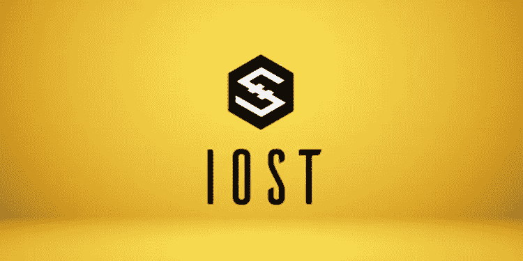

# IOS Token 的超快速分散区块链网络

> 原文：<https://medium.com/coinmonks/ios-token-s-ultra-fast-decentralized-blockchain-network-ce62249ca4e4?source=collection_archive---------43----------------------->

IOS Token (IOST)是一个超快速、成熟、去中心化的区块链网络和生态系统，包括其节点和钱包。它还基于被称为“可信度证明”的下一代共识协议

在试图理解 IOS 令牌(IOST)的含义之前，了解 IOST 的平台变得至关重要。据 IOST 网站介绍，IOST 的“IOS”代表“服务的互联网”该 IOST 平台旨在为面向服务的区块链生态系统提供坚实的基础。IOS 令牌(IOST)声称能够处理区块链大规模采用所需的高流量。这家公司还声称，它可以在一种特定类型的分片(高效分布式分片，或 EDS)和一种新的共识算法(可信度证明)的帮助下做到这一点；IOST 收取零交易费，在不牺牲安全性的情况下，每秒钟可以进行多达 8000 笔交易。

IOS 令牌(IOST)网络是分散的，这意味着 IOS 令牌(IOST)网络的用户使用他们的个人电脑，而不是为整个系统供电的单个服务器。这种 IOS 令牌(IOST)的主要优点是，即使托管这些节点或网络的一些计算机遇到问题，也不会影响整个 IOST 网络。据该网站称，IOS Token (IOST)平台的主要目标是支持我们今天使用和喜爱的广泛应用程序的分散化替代方案，如亚马逊、脸书和数字资产交易所。

> 阅读更多关于 procommun.com**的秘密故事**

# **IOS Token 的创始人是谁？**

**该项目由 Terrence Wang、Jimmy Zhong、Justin Li Ray Xiao、和 Sa Wang 于 2018 年 1 月启动。钟在大学期间在中国和美国创办了其他科技创业公司；他以 4000 万美元卖掉了第一家公司；这是一个学生可以轻松交换课堂笔记的市场。随后，王回到北京，与他人共同创建了 IOS Token (IOST)等项目。他之前的经历包括担任优步软件工程师。他还拥有明尼苏达大学的计算机科学学位和普林斯顿大学的计算机科学硕士学位。**

**此外，Justin Li Ray Xiao 之前在高盛担任投资银行助理，在摩拜单车担任数据科学家。他毕业时获得了计算机科学和应用数学学位。与此同时，谭凯文是 Ethercap 的联合创始人，并获得了清华大学的计算机科学学位。肖与 Jimmy 和 Sa 共同创立了 Dora，这是一家专注于智能信息亭的人工智能公司。他在大学里学习计算机科学和数量经济学。**

# **IOS 令牌的唯一性是什么？**

**IOS TOKEN (IOST)的区块链基础设施是开源的，并且被设计为安全和可伸缩的，希望它在未来成为在线服务的主干。该团队还开发了一种“可信度证明”共识算法，以确保网络上的交易高效安全。IOS TOKEN (IOST)旨在解决的最大挑战之一是，这些大公司如何在面向客户的环境中拥抱区块链，除非它们是可扩展的。此外，互联网服务令牌(IOST)正在解决这个问题。**

**要了解 IOS TOKEN (IOST)，最好的方法是将其与最近的竞争对手进行比较:以太坊(ethereum)，这是最受开发者欢迎的创新合同平台。也可以比作 TRON 和 EOS，它们是可扩展的、高度智能的合约平台，使用率很高。**

# **IOS 令牌(IOST)价格预测**

**IOS 令牌(IOST)是 IOST 平台上的一种加密货币，也可用作以太坊等交易的“燃料”来支付费用。此外，IOS 令牌(IOST)通过区块链的变化帮助建立 POB(可信度证明)共识。IOS 令牌(IOST)的价格为 0.06 美元或卢比。4.5.鉴于市场的这种看涨状态以及 IOSToken 受到的关注，可以有把握地说，未来几天，该硬币预计将上涨 10%至 15%。**

> **原载于**

> ****加入 Coinmonks [电报频道](https://t.me/coincodecap)和 [Youtube 频道](https://www.youtube.com/c/coinmonks/videos)了解加密交易和投资****

# ****另外，阅读****

*   ****[面向开发者的 8 个最佳加密货币 APIs】](https://coincodecap.com/best-cryptocurrency-apis)****
*   ****[支持卡审核](https://coincodecap.com/uphold-card-review) | [信任钱包 vs 元掩码](https://coincodecap.com/trust-wallet-vs-metamask)****
*   ****[赢取注册奖金——10 大最佳加密平台](https://coincodecap.com/earn-sign-up-bonus)****
*   ****[Exness 回顾](https://coincodecap.com/exness-review)|[moon xbt Vs bit get Vs Bingbon](https://coincodecap.com/bingbon-vs-bitget-vs-moonxbt)****
*   ****[如何开始通过加密贷款赚取被动收入](https://coincodecap.com/passive-income-crypto-lending)****