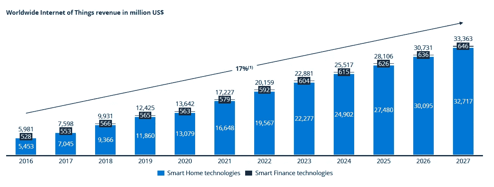
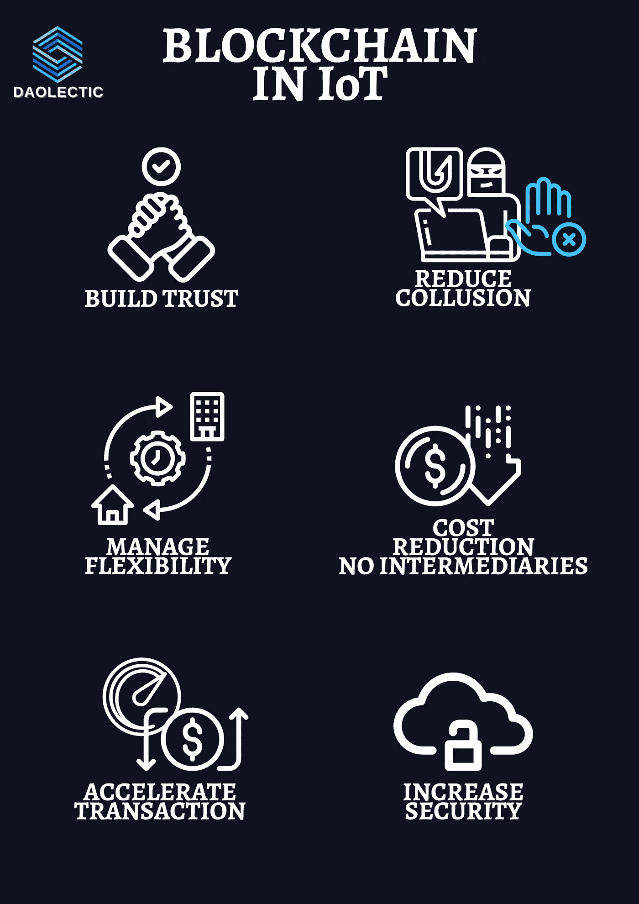
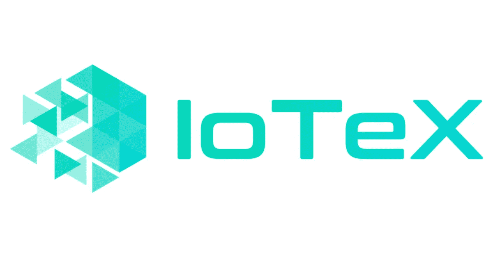
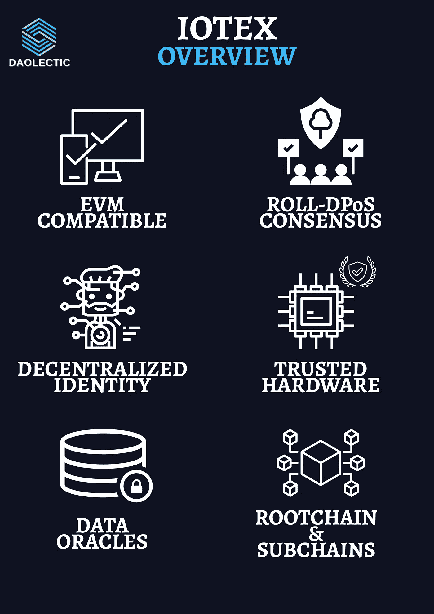
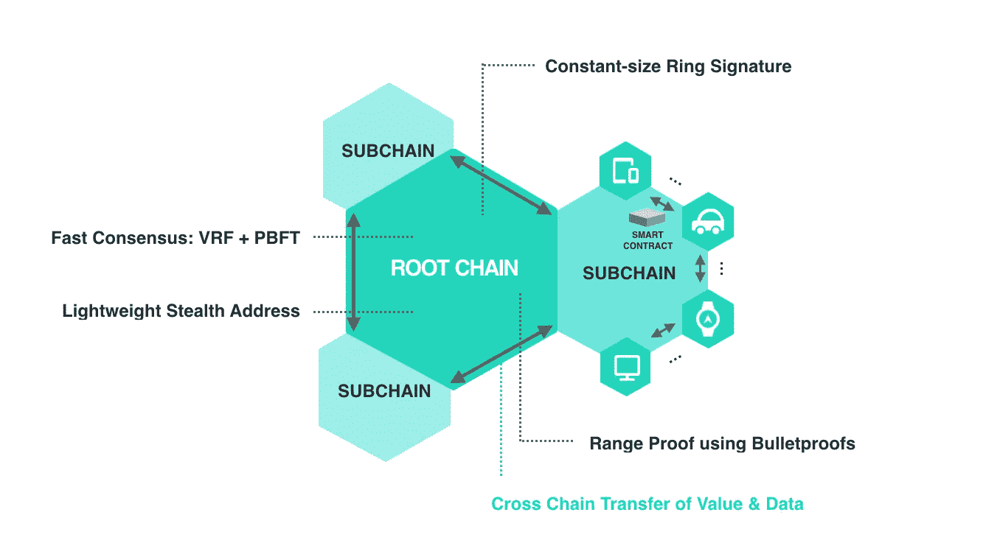
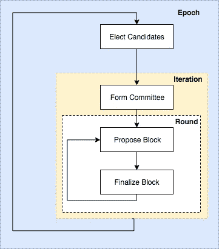
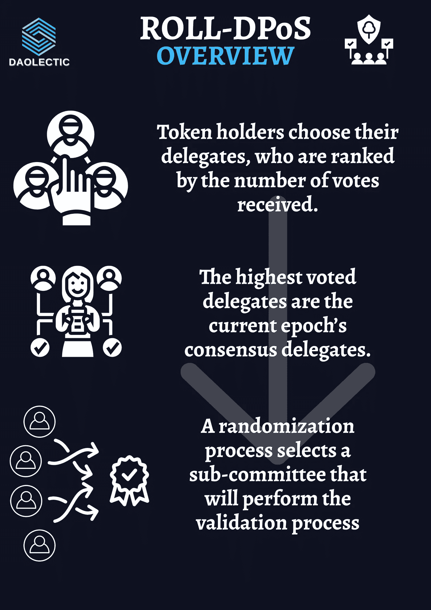
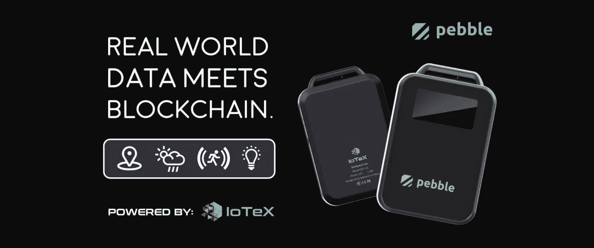
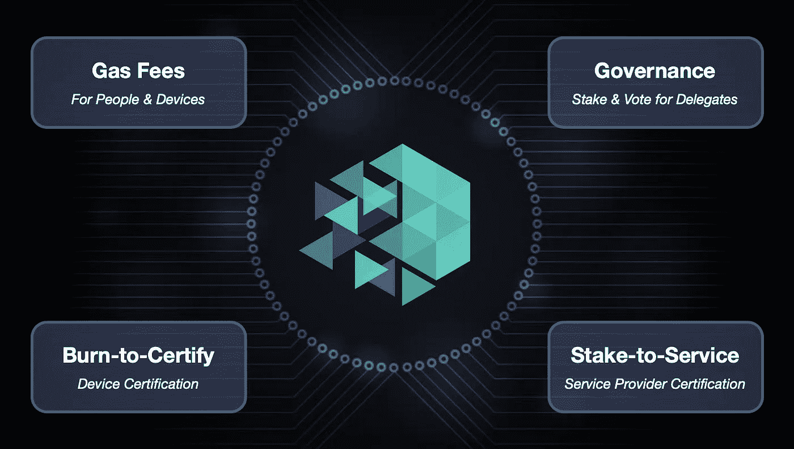
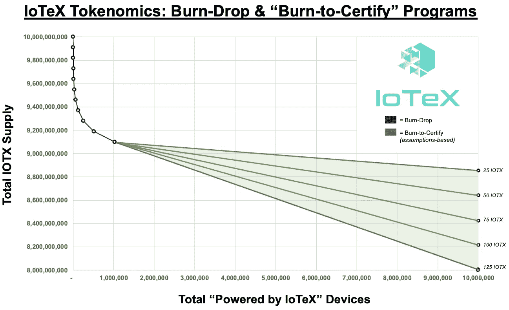

# io tex——当区块链遇上物联网

> 原文：<https://medium.com/coinmonks/iotex-and-the-internet-of-things-framework-97e934fb8efd?source=collection_archive---------4----------------------->

物联网产业是当今最有前途的技术发展之一。

*根据定义，物联网(* ***物联网*** *)是可以通过互联网协议(IP)进行交互的物理和虚拟对象的网络。*

应用包括 B2C [智能家居系统](https://www.investopedia.com/terms/s/smart-home.asp)和 B2B 物流监控和能源电网控制。因此，[物联网包括硬件、软件(称为“平台”)、服务和连接](https://en.wikipedia.org/wiki/Internet_of_things)。

在 **2021** 年，**全球物联网市场**已经达到**175 亿美元的总价值**。

消费者正在迅速使用智能家居技术，智能家居占全球销售额的 97%。与其他类别相比，智能房屋技术增长最快，这得益于新冠肺炎疫情期间的房屋升级。

无论是应用还是品牌，物联网行业都是多元的。物联网市场由纯粹的参与者(如 PTC)以及提供多样化商品和服务的大型整合组织形成。

5G 通信标准的引入改变了物联网设备之间的快速连接。使用边缘计算而不是云计算，通过在物联网设备级别收集和分析数据来加快流程。

利用物联网的自动化也有利于工业用例，从而产生一种新趋势:工业物联网(IIoT)。但随着物联网使用的增加，网络安全危险也在增加，因为这些设备成为黑客的目标。

区块链已被证明通过提高安全性和支持更多设备的集成，对物联网产生了重大影响。物联网设备安全性的改进加快了这一突破性发明的采用，并为企业带来了新的机遇。

迄今为止，很少有物联网系统利用区块链来传输数据。区块链技术允许不可变和分散的数据传输，物联网和区块链都需要有意识和无意识的风险管理。

出于这些原因，区块链技术可以解决物联网网络安全的几个需求，包括完整性、安全通信和弹性:它可能会为安全的小额支付系统带来额外的安全质量，如可用性和可访问性。

物联网领域的理想区块链实施必须没有或只有最低的交易成本、巨大的增长潜力和可扩展的身份管理程序。

然而，传统的区块链并不能解决所有的物联网安全问题:个人数据的机密性和保护需要额外的加密。

这就是 IoTeX 的突出之处。

# IoTeX

IoTeX 于 2017 年由 Raullen Chai、Qevan Guo 和创立。并于 2018 年 2 月部署。

IoTeX 是一个**全栈平台**，使得来自**可信** **设备**的**可信数据**能够在**可信 dapp**中使用。

它采用许可或无许可的区块链，通过快速的共识和即时的终结来增强隐私。

IoTeX 认为没有一个区块链解决方案可以满足所有物联网需求。为此，他们按照任务分离的思想，建立了与定义的物联网设备通信的特定平台。

事实上，特定级别的物联网结构只能由特定级别的区块链复杂性来管理。

IoTeX 平台由许多技术层组成:

*   ***Roll-DPoS 共识*** 超过 60 名分散代表
*   S ***安全硬件*** :使用可信执行环境(TEE)的防篡改设备，可与 IoTeX 完美协作
*   ***真实世界数据甲骨文:*** 将真实世界事件转化为 IoTeX DApps 的验证数据
*   ***分散式身份框架*** 允许用户/设备控制其数据和凭证

# IoTeX 根链和子链——快速达成一致意见，即时终结

**IoTeX** 有一个 ***公共无权限根链*** 以及许多子链。

子链可以是允许智能合约的许可或无许可区块链。

根链是一个公共区块链，专注于可伸缩性、弹性、隐私保护功能和子链协调:它已被部署为跨子链传输价值和数据，监督不同的子链以及结算和锚定支付。

为了简化事务排序，IoTeX 根链采用了 UTXO 概念。

另一方面，子链是一个区块链，可以是私有的，也可以是公共的，它使用根链与其他子链通信。

子链的关键特征是灵活性和可扩展性，因为它们是满足各种物联网应用所需的。为了发挥作用，子链通常由在根链中有很大利益的运营商管理。

此外，该系统允许用户选择一个或多个被委托的操作员来代表他们，有或没有绑定。为了密封新的块，代理器就像根链上的一个轻型客户端，又像子链上的一个完整节点。

> 共识机制

IoTex **根链** **共识**实时提供不可变的块，它采用所谓的 **Roll-DPoS(随机委托利益证明)**:令牌持有者为他们的代表投票，然后根据他们获得的票数排名。

获得最多投票的代表被称为当前纪元(1 小时)的“共识代表”。然后，随机化方法选择一个子委员会来保持一致，并为每个新的时期生成新的块。

块终结对于 IoTeX 跨区块链通信至关重要。这些交互基于简化支付验证(SPV ),这是一种允许轻量级节点使用 Merkle 树和块报头来认证交易而无需下载完整的区块链的机制。IoTeX 采用双向跟踪(TWP)来允许令牌与子链之间的传输。

# 安全硬件

该项目的核心理念是拥有并向最终用户提供可信的数据收集设备。

被认为是安全的和防篡改的硬件需要嵌入可信的执行环境，该环境是极其安全的并且与设备/主机的系统并行操作的隔离区域。

TEE 保护其中所有数据和流程的机密性和完整性。

IoTex 的目标是制造第一批能够自主参与可信物联网的去中心化机器。在这方面，该公司制造了第一个不能被操纵的硬件设备:Pebble Tracker。

> 卵石跟踪器

Pebble Tracker 有一个球座和许多传感器(GPS、气候、运动和光线)，可以从现实世界中获取信息，并将其转化为可验证的区块链数据。除了创造数字资产，智能合约还可以用来训练机器学习模型，并使众包气候指数带来可验证和可信的结果。

# **分散身份**

分散身份(DID)是 IoTeX 平台的“自我主权的根源”。与其他区块链网络不同，IoTeX 为个人和机器创建了一个 DID 系统。人和设备可以使用 IoTeX 直接交互，因为他们的 id 是可互操作的和标准化的。IoTeX DID 还使人们和设备能够通过 IoTeX 网络拥有/控制他们的数据和身份。

工业互联网联盟目前正在标准化 IoTeX 的 DID 技术和身份与访问管理(IAM)架构(IIC)。它可以链接各种应用层，并在拥有数十亿台物联网设备和数百万用户的全球物联网生态系统中实现以用户为中心的数据交换。

# 数据神谕

智能合同需要数据神谕来访问链外数据。对于区块链行业，IoTeX 正在构建世界上第一个数据神谕，专注于来自可信设备的已验证现实世界数据，使 IoTeX 成为这个方向的第一个推动者。

IoTeX 上的真实数据将支持数千个用例和由真实数据支持的新链上资产。作为一个被认可的数据中枢，IoTeX 现在可能会“服务”其他区块链的数据，比如 Ethereum 和 Polkadot。

# **团队**

劳伦·柴、郭其文、范欣欣和是 IoTeX 的创始人。

*   除了共同创建 IoTeX 外，**劳伦·柴** 是 BootUP Ventures 的顾问，也是工业互联网联盟工业分布式分类账任务组的成员。他曾担任优步密码货币研发和技术安全部门的负责人。
*   [**Qevan 郭**](https://www.linkedin.com/in/qevan/) 也是 Hyperconnect Lab 的联合创始人之一。他为脸书工作，担任研究员和技术总监。
*   [**范欣欣**](https://www.linkedin.com/in/xinxin-fan-crypto/) 在共同创立 IoTeX 之前是北美博世研究技术中心的高级研究工程师。他还在滑铁卢大学担任研究助理和项目经理。
*   [**孙静**](https://www.linkedin.com/in/cbetasun/) 为斯帕克兰资本的管理合伙人。她是 Polychain Capital 的有限合伙人，也是碧波荡漾的天使投资者。

整个 IoTex 团队由大约 30 人组成，包括科学家、研究人员以及来自谷歌、脸书、优步和博世等巨头的众多工程师。

# **Tokenomics**

$IOTX 令牌支持 IoTeX 区块链。IOTX 提供了许多实用工具来促进利益相关者之间值得信赖的交互，包括用户、代表(矿工)、应用程序开发者和服务提供商。

IOTX 令牌提供财务和声誉激励，以促进分散的 IOTX 网络治理/维护。参与者可能会花费、抵押或烧毁 IOTX 来访问网络资源。IOTX 需求和价值的增加将鼓励网络成员维护和扩展网络。

代表们持有 IOTX 股份，以获得参与共识的资格，而服务提供商持有/花费 IOTX 股份以向建筑商提供服务。

IOTX 的最大供应量为 100 亿英镑，而且具有通缩效应——IOTX 会因每一个注册到 IoTeX 网络的新设备和用户而被烧掉，从而奖励长期持有者。

在 100 万台“由 IoTeX 驱动”的设备投入使用后，将启用“烧录认证”令牌组学。从这一点开始，构建者将烧录 IOTX 来访问每个新设备的特定服务/功能。如下图所示，每增加一台“由 IoTeX 驱动”的设备，IOTX 的总供应量就会下降。

值得注意的是，这些是为 IoTeX 区块链提供动力的令牌组学，然而,“由 IoTeX 提供动力”的应用可以基于它们自己的激励/规则创建它们的令牌和令牌组学。

*   **最大供应量:**100 亿 IOTX
*   **总供应量:**88 亿 IOTX *(烧钱后)*
*   随着 100 万台设备在 IoTeX 上注册和确认，9 亿台 IOTX(最大供应量的 9%)将被逐渐烧毁
*   作为 [Mainnet GA 激活](https://community.iotex.io/t/burning-2-65-of-total-iotx-supply-from-iotex-foundation-funds/1261)的一部分，2020 年 6 月焚烧了 2.65 亿 IOTX(最大供应量的 2.65%)
*   **流通供给:**95.4 亿 IOTX

# MachineFi

MachineFi 是一个用来描述区块链和物联网(IoT)技术结合的概念。

*这个概念试图将物质世界与元宇宙联系起来*。

MachineFi 还定义了一个通过互联网在区块链上相互通信的智能设备网络。在许多方面，区块链为权力下放建立了一个强有力的框架。

IoTeX 2.0 旨在分散 MachineFi 部门，允许智能设备用户参与到不断增长的万亿美元经济中，不受集中式数据提供商的限制。

在 MachineFi 升级中会推出**“证明一切”**的想法。这将使物联网设备能够提供真实世界事件的链上证据，如健康测量和 GPS 位置。

# 结论

区块链技术可以满足物联网设备的几个网络安全需求，因为它是分布式的，不可更改的。

然而，没有其他方法来处理复杂性的单一区块链实施，如智能合同、edge 和云计算，无法满足物联网平台需要满足的所有安全要求。

身份和访问管理是建立强大防御故意风险的重要组成部分，IoTex 从第一天起就决定解决这一问题。

# 放弃

在任何情况下，这都不是财务建议，我研究的目标将永远是深入项目并从不同角度研究它们，我确实包括了基于我最近研究的类似项目的经验的个人意见。

我现在和将来都愿意接受讨论。

**在 Twitter 上关注我们:**

**@道辛**

在投资任何东西之前，请务必做好调查。