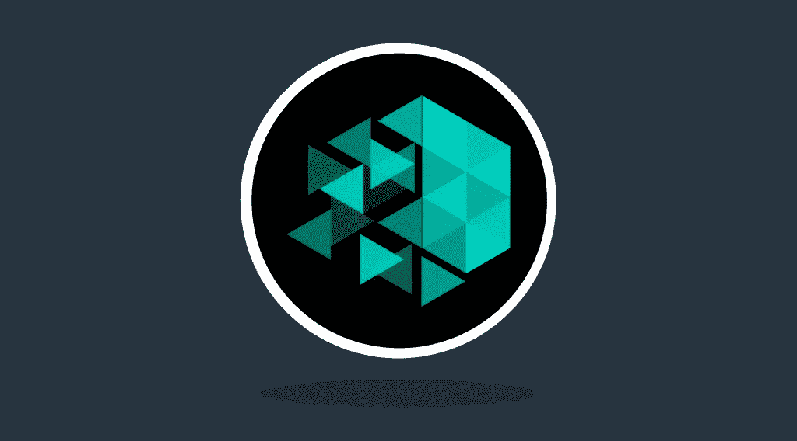

# io tex Crypto——你想知道的一切

> 原文：<https://medium.com/coinmonks/iotex-crypto-everything-you-wanted-to-know-4915ff2f9327?source=collection_archive---------92----------------------->

3 月 15 日，我们有机会了解了 IoTeX 在 AMA 上所做的一切。

IoTeX 是一个可扩展的区块链网络，将物联网(IoT)前景提升到了一个新的水平。

如果您错过了 Twitter Spaces live 会话，您可以随时收听以下录音:

在 [Medium](https://stealthex-io.medium.com/) 、 [Twitter](https://twitter.com/Stealthex_io) 、 [Telegram](https://t.me/StealthEX) 、 [YouTube](https://www.youtube.com/channel/UCeES_XBesX76ge7xf1meuSw) 和 [Reddit](https://www.reddit.com/user/Stealthex_io) 上关注我们，获取 [StealthEX.io](https://stealthex.io/) 更新和关于密码世界的最新消息。

## 如何购买 IoTeX 币？

欢迎在 [StealthEX](https://stealthex.io/) 上购买 IOTX crypto。

只需遵循这些简单的步骤:

1.  选择兑换的货币对和金额。例如， [BTC](https://stealthex.io/coin/btc) 到 [IOTX](https://stealthex.io/coin/iotx) 币。
2.  按下“交换”按钮。
3.  提供硬币将被转移到的收件人地址。
4.  移动你的加密货币进行交易。
5.  收到您的加密硬币！

如果您在兑换硬币方面有任何问题，我们随时准备为您提供支持。我们的团队尽最大努力保护所有成员并回答他们的问题。对于所有请求消息我们通过 [*支持@stealthex.io*](mailto:support@stealthex.io) *。*

*如果您对 StealthEX exchange 服务还有其他问题，您可以前往我们的* [*常见问题部分*](https://stealthex.io/faq) *，在那里找到所有必要的信息。*

**非常欢迎您访问**[**StealthEX exchange**](https://stealthex.io/)**，看看它有多快多方便。**

> 加入 Coinmonks [电报频道](https://t.me/coincodecap)和 [Youtube 频道](https://www.youtube.com/c/coinmonks/videos)了解加密交易和投资

# 另外，阅读

*   [Capital.com 审查](https://coincodecap.com/capital-com-review) | [港加密借贷平台](https://coincodecap.com/crypto-lending-hong-kong)
*   [如何在 Uniswap 上交换加密？](https://coincodecap.com/swap-crypto-on-uniswap) | [A-Ads 审核](https://coincodecap.com/a-ads-review)
*   [WazirX vs coin dcx vs bit bns](/coinmonks/wazirx-vs-coindcx-vs-bitbns-149f4f19a2f1)|[block fi vs coin loan vs Nexo](/coinmonks/blockfi-vs-coinloan-vs-nexo-cb624635230d)
*   [本地比特币审核](/coinmonks/localbitcoins-review-6cc001c6ed56) | [加密货币储蓄账户](https://coincodecap.com/cryptocurrency-savings-accounts)
*   [什么是保证金交易](https://coincodecap.com/margin-trading) | [美元成本平均法](https://coincodecap.com/dca)