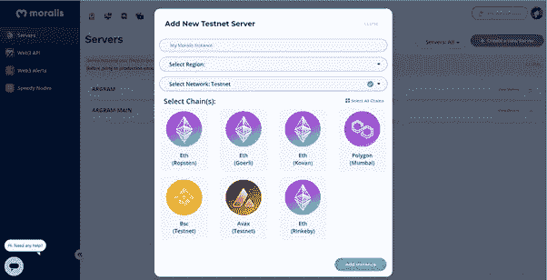

# IPFS 文件上传—使用 Moralis

> 原文：<https://medium.com/coinmonks/ipfs-file-upload-using-moralis-a24a9dff4368?source=collection_archive---------5----------------------->

## NFT 系列

## 使用 Moralis 服务器和云功能上传 IPFS 文件的指南


如果您还没有 Moralis 的帐户，请通过以下方式获得一个免费帐户:

**前往** [**道德家登录**](https://admin.moralis.io/login)


Moralis Sign Up or Sign In

**创建新的服务器**


Moralis Server

**选择要使用的链条**



Moralis Instance

**复制服务器详细信息(服务器 URL、应用程序 ID 和主密钥)**


Moralis Server Details

**启动 Moralis 服务器**

```
require(“dotenv”).config();const express = require(“express”);const Moralis = require(“moralis/node”);const app = express();const { PORT, MORALIS_SERVER_URL, MORALIS_APP_ID, MORALIS_MASTER_KEY,} = process.env;const port = PORT || 8000;const upload = multer({ dest: __dirname + “/public/uploads/” });app.use(express.urlencoded({ extended: true }));app.use(express.static(“public”)); app.listen(port, async () => { await Moralis.start({ serverUrl: MORALIS_SERVER_URL, appId: MORALIS_APP_ID, masterKey: MORALIS_MASTER_KEY, });});
```

。env 文件应该如下所示:

```
MORALIS_SERVER_URL = `moralis server url`
MORALIS_APP_ID = `moralis application Id`
MORALIS_MASTER_KEY = `moralis master key`
```

Moralis 提供了两种将文件上传到 IPFS 的方法:

1.  使用 ***saveIPFS()*** 方法的 Moralis 服务器
2.  使用**云功能**

## 1.使用 ***saveIPFS()*** 方法的 Moralis 服务器

## **文件上传**

```
const uploadFile = async (req, res, next) => {
    const { originalname: name, mimetype } = req.file;        
    fs.readFile(req.file.path, async (err, buffer) => { 
       const data = Array.from(Buffer.from(buffer, “binary”));
       const file = new Moralis.File(name, data, mimetype);
       await file.saveIPFS({ useMasterKey: true });
       return file.ipfs();
    });
}
------------------------------------------You will get a response of ipfs url like below:[https://ipfs.moralis.io:2053/ipfs/QmdPcF1r86v28PeJMxdxHbKQA17qBhW3W5s6DHGvxukdPv](https://ipfs.moralis.io:2053/ipfs/QmdPcF1r86v28PeJMxdxHbKQA17qBhW3W5s6DHGvxukdPv)
```

## Json 上传

```
const uploadJson = async (req, res, next) => {
    const jsonMetadata = {
        name: "Female Bust",
        description: "Female Bust 3D model",
        image:  
"[https://ipfs.moralis.io:2053/ipfs/QmdPcF1r86v28PeJMxdxHbKQA17qBhW3W5s6DHGvxukdPv](https://ipfs.moralis.io:2053/ipfs/QmdPcF1r86v28PeJMxdxHbKQA17qBhW3W5s6DHGvxukdPv)"}
   const toBtoa =      
       Buffer.from(JSON.stringify(jsonMetadata)).toString("base64"); 
   const file = new Moralis.File("FemaleBust.json", 
                { base64: toBtoa });
   await file.saveIPFS({ useMasterKey: true });
   return file.ipfs();
}
------------------------------------------You will get a response of ipfs url like below:[https://ipfs.moralis.io:2053/ipfs/QmdPcF1r86v28PeJMxdxHbKQA17qBhW3W5s6DHGvxukdPv](https://ipfs.moralis.io:2053/ipfs/QmdPcF1r86v28PeJMxdxHbKQA17qBhW3W5s6DHGvxukdPv)
```

## 2.使用云函数

普通云函数的格式应该如下:

```
Function Definition
-----------------------------Moralis.Cloud.define(*function_name*, async (request) => {});You can access the params like request.params.[key] Function call
------------------------------
const params = {"key": "value"};await Moralis.Cloud.run(*function_name*, params);
```

创建一个文件夹 ***/cloud*** 和一个文件 ***cloud.js*** 在里面。

在那个文件上写你的云函数。

```
Moralis.Cloud.define(“ipfsbinary”, async (request) => { const result = await Moralis.Cloud.toIpfs({ sourceType: “base64Binary”, source: request.params.image, }); return result;});Moralis.Cloud.define(“ipfsjson”, async (request) => { const result = await Moralis.Cloud.toIpfs({ sourceType: “object”, source: request.params.metadata, }); return result;});
```

现在我们可以从我们的文件中调用云函数了。

## 文件上传

```
const uploadFile = async (req, res, next) => {
    fs.readFile(req.file.path, async (err, buffer) => {
        const image = buffer.toString(“base64”);
        const ipfsImagePath = await Moralis.Cloud.run(“ipfsbinary”,    
                              { image });
        return ipfsImagePath;
    });
}------------------------------------------You will get a response like below:{
   path: "[https://ipfs.moralis.io:2053/ipfs/QmdPcF1r86v28PeJMxdxHbKQA17qBhW3W5s6DHGvxukdPv](https://ipfs.moralis.io:2053/ipfs/QmdPcF1r86v28PeJMxdxHbKQA17qBhW3W5s6DHGvxukdPv)"}
```

## Json 上传

```
const uploadJson = async (req, res, next) => {
      const metadata = {
        name: "Female Bust",
        description: "Female Bust 3D model",
        image:  
"[https://ipfs.moralis.io:2053/ipfs/QmdPcF1r86v28PeJMxdxHbKQA17qBhW3W5s6DHGvxukdPv](https://ipfs.moralis.io:2053/ipfs/QmdPcF1r86v28PeJMxdxHbKQA17qBhW3W5s6DHGvxukdPv)"
      };
      const ipfsJsonPath = await Moralis.Cloud.run(“ipfsjson”,  
                           { metadata});
      return ipfsJsonPath;
}------------------------------------------You will get a response like below:{
   path: "[https://ipfs.moralis.io:2053/ipfs/QmdPcF1r86v28PeJMxdxHbKQA17qBhW3W5s6DHGvxukdPv](https://ipfs.moralis.io:2053/ipfs/QmdPcF1r86v28PeJMxdxHbKQA17qBhW3W5s6DHGvxukdPv)"}
```

**谢谢:)**

> 加入 Coinmonks [电报频道](https://t.me/coincodecap)和 [Youtube 频道](https://www.youtube.com/c/coinmonks/videos)了解加密交易和投资

# 另外，阅读

*   [SmithBot 评论](https://coincodecap.com/smithbot-review) | [4 款最佳免费开源交易机器人](https://coincodecap.com/free-open-source-trading-bots)
*   [比特币基地僵尸程序](/coinmonks/coinbase-bots-ac6359e897f3) | [AscendEX 审查](/coinmonks/ascendex-review-53e829cf75fa) | [OKEx 交易僵尸程序](/coinmonks/okex-trading-bots-234920f61e60)
*   [如何在印度购买比特币？](/coinmonks/buy-bitcoin-in-india-feb50ddfef94) | [WazirX 评论](/coinmonks/wazirx-review-5c811b074f5b)
*   [隐料斗替代品](/coinmonks/cryptohopper-alternatives-d67287b16d27) | [HitBTC 审查](/coinmonks/hitbtc-review-c5143c5d53c2)
*   [CBET 回顾](https://coincodecap.com/cbet-casino-review) | [库科恩 vs 比特币基地](https://coincodecap.com/kucoin-vs-coinbase)
*   [折叠 App 审核](https://coincodecap.com/fold-app-review) | [Kucoin 交易机器人](/coinmonks/kucoin-trading-bot-automate-your-trades-8cf0ca2138e0) | [Probit 审核](https://coincodecap.com/probit-review)