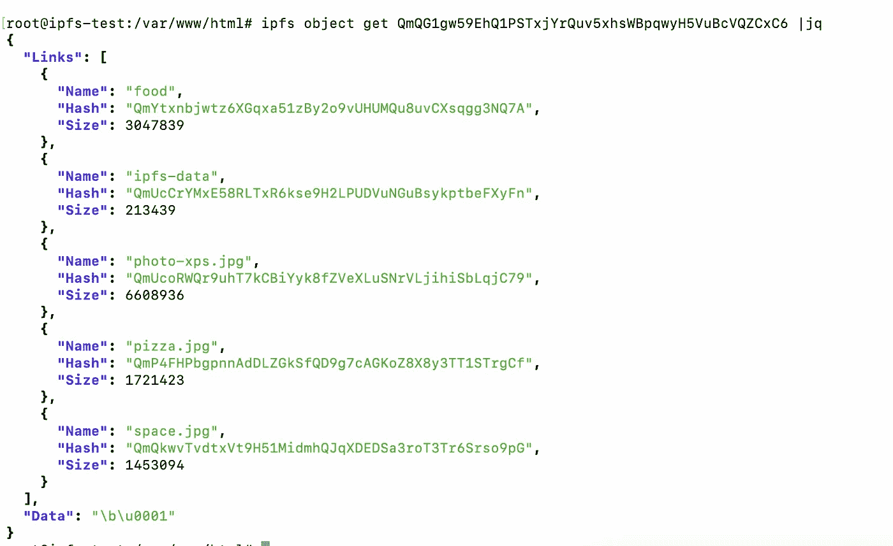

# IPFS 深度

> 原文：<https://medium.com/coinmonks/ipfs-in-depth-87cfef633f2b?source=collection_archive---------14----------------------->

# 首先，什么是 IPFS？

星际文件系统(IPFS)是由**协议实验室和** IPFS 的项目驱动的一系列子协议，旨在提高网络的效率，使网络**更加分散**和有弹性。

IPFS 使用基于内容的寻址，内容不是通过位置而是通过其内容来寻址。IPFS 利用其重复数据消除属性存储和寻址数据，从而实现数据的高效存储。它还可以用作补充区块链的存储服务，在 IPFS 的基础上实现不同的应用。

**为什么它被称为星际文件系统？它产生的原因是什么？**


IPFS 最初是为了允许从任何地方访问文件而创建的——无论是火星还是任何其他星球

好的，所以从火星到地球的通信是非常困难的，而且非常耗时，请求一个维基百科页面可能需要 48 分钟，非常耗时。([来源](https://blog.kalvad.com/myths-about-ipfs/Source%20https://marspedia.org/Internet))

所以这是创造 IPFS 的第一个原因，因为它的分布式存储系统可以弥补行星之间的差距。

例如，如果一个同事已经请求了 Wiki 页面 Mars，你可以很容易地从他们那里下载，就像在地球上一样快。

# 首先，我们需要理解几个概念:

**1/集中式与分散式网络**


**2/基于位置的寻址**


**3/基于内容的寻址:**


IPFS 是如何工作的？你到底是如何获取 IPFS 上的内容的？

IPFS 是用于在分布式文件系统上存储内容的对等网络。

称为**节点**的一组计算机/服务器，使用公共寻址系统存储和中继内容。

IPFS 节点使用点对点(P2P)架构通过互联网进行通信，**防止一个节点成为单点故障。**

libp2p 是一个由*协议*、*规范*和*库*组成的模块化系统，支持开发对等网络应用 [— libp2p 文档](https://docs.libp2p.io/introduction/what-is-libp2p/)。

这正是四个 IPFS 节点连接到 IPFS 网络所需要的。


我们与之保持连接的任何节点都是对等节点。

*   任何对等节点**都可以问它们的对等节点**，它们想要一个番茄🍅内容。
*   所以，如果你有，**你会给**🍅**交给他们**。
*   否则**你可以给出一些关于网络**的元数据来帮助他们找到可能拥有它的另一个对等点。
*   注意，每个节点选择它们想要保存和存储的资源**。**
*   示例:🍅将在不同的对等节点上可用，这些节点**专用资源来存储它**。
*   A🥔较少存在于网络中。所以，只有几个节点会提供它。

**介绍 IPFS 网关**


*   网关是到 IPFS 节点的 HTTP 接口。
*   在我们的网关上，我们将允许任何用户从 IPFS 网络检索任意内容。
*   如果用户要求一个🍅内容，节点用**与**🍅会提供。同样的例子也适用于🥔。

**IPFS 天体**

链接结构有三个数据字段:

*   ***名称*** —链接的名称。
*   ***哈希*** —链接的 IPFS 对象的哈希。
*   ***大小*** —链接的 IPFS 对象的累积大小

IPFS 对象通常通过它们的 Base58 编码哈希来引用。

例如:带 hash 的 IPFS 对象**qmeksf 9 pmph 4 lajyg 3 fcbqddjckuefc 8 lhs 67 wrg 59d 51**


# 发生了什么事？

正如我们在下图中看到的，我们的 Kalvad 照片将被转换成一个二进制文件，然后使用 IPFS 技术这个二进制文件将被分割成不同的块。

每个块都有自己的哈希，称为 CID(内容标识符)，按基本 CID 分组。


# 让我们动手吧，安装步骤:

所有的安装说明都可以在这里找到:[https://docs . ipfs . io/install/command-line/# official-distributions](https://docs.ipfs.io/install/command-line/#official-distributions)

```
wget [https://dist.ipfs.io/go-ipfs/v0.10.0/go-ipfs_v0.10.0_linux-amd64.tar.gz](https://dist.ipfs.io/go-ipfs/v0.10.0/go-ipfs_v0.10.0_linux-amd64.tar.gz)
```

解压缩文件:

```
tar -xvzf go-ipfs_v0.10.0_linux-amd64.tar.gz
```

移动到 go-ipfs 文件夹并运行安装脚本:

```
cd go-ipfssudo bash install.sh
```

测试 IPFS 安装是否正确:

```
ipfs --version
> ipfs version 0.10.0
```

# 创造我们的第一个 IPFS 物体

让我们介绍一下我们的文件夹:


pizza.jpg 复制的位置(在 food 文件夹和 ipfs-data 文件夹中

要将文件夹添加到 IPFS 网络中，我们必须运行以下命令:

```
ipfs add ipfs-data -r
```

标志-r 进行递归相加，结果应该是这样的:


qmp 4 fhpbgpnnaddlzgksfqd 9g 7 cagkoz 8 x 8y 3 TT 1 str GCF 是 ipfs-data/food/pizza.jpg 的 hash。

我们可以看到，两个 pizza.jpg 文件具有相同的哈希，这是因为我们使用基于内容的寻址，而不是基于位置的寻址，由于两张图片具有相同的内容，因此它们将具有相同的哈希。

让我们得到整个文件夹的 IPFS 对象:

```
ipfs object get QmQG1gw59EhQ1PSTxjYrQuv5xhsWBpqwyH5VuBcVQZCxC6 |jq
```



让我们深入了解我们的块是如何被分割的以及它们之间的联系，为此我们将使用 graphmd。

```
graphmd QmbFrXkhkYrgVSTTi6C4GbCofiyuDf2f8tMkxwrnyfHyfD | dot -Tpng > tree.png
```


从前面的模式中，我们可以看到两个 pizza.jpg 文件都有指向相同散列的链接，这证实了它们具有相同的内容。


现在让我们导航并查看我们的图片 space.jpg，它具有哈希:**qmqkwvtvdtxvt 9h 51 midmhqjqxdedsa 3 rot 3 tr 6 srso 9 pg**


```
ipfs object get QmQkwvTvdtxVt9H51MidmhQJqXDEDSa3roT3Tr6Srso9pG | jq
```


因此，space.jpg 被分成 5 个 256kb 的块，第 6 个块中有 142kb。

让我们使用 ipfs cat 只获取第一个带有 hash 的块**qmnudn 3 azr 2 mqqz 4 e 77 nu 6 qwzgj 3 dlbv 768 fpoplggdgdh**，并将其保存到 space-part1.jpg:

```
ipfs cat QmNuDn3azR2mQQZ4e77NU6qwZgJ3dLbV768fPopLGgdGDh > space-part1.jpg
```

当我们想象 space-part1.jpg 时，我们可以看到图像的一小部分，其余部分是空白的:


# IPFS 集群


IPFS 集群并不充当传统概念的集群，因为所有 IPFS 对等体都是独立的，而 IPFS 集群软件通过一致协议同步数据。

IPFS 集群通过分配、复制和跟踪分布在多个对等体中的全局 pin 集，跨一大群 IPFS 守护进程提供数据协调。

ipfs 集群使用一个名为 *ipfs-cluster-service* 的恶魔，它作为一个独立的服务运行，与 IPFS 守护进程的 API 进行交互。

以一种*火&忘记*的方式处理数百万个管脚到数百个 IPFS 守护进程的复制:异步跟踪管脚寿命

集群对等体负责要求 IPFS 以可持续的速率锁定 cid，并在失败时重试锁定。

集群附带了一个全功能的 API 和 CLI， *ipfs-cluster-ctl* 为全功能的集群 HTTP REST API 提供了一个命令行客户端。

集群对等体形成一个分布式网络，并维护一个全局的、复制的、无冲突的 pin 列表。

群集还带有内置权限，提供了一个嵌入式权限模型，支持标准对等端(具有更改群集 pin 集的权限)和追随者对等端(按照指示存储内容，但不能修改 pin 集)。

请注意，每个引脚都支持自定义复制因子、名称和任何其他自定义元数据。

# 什么是 Bitswap？

Bitswap 是 IPFS 的一个核心模块，用于交换数据块。它指导向网络中的其他对等体请求数据块和从网络中的其他对等体发送数据块。


Bitswap 是一个基于*消息的协议*，其中所有消息都包含[需求列表](https://docs.ipfs.io/concepts/bitswap/#want-list)或块。Bitswap 有一个 [Go 实现](https://github.com/ipfs/go-bitswap)

**Bitswap 有两个主要工作:**

*   从网络获取客户端请求的块。
*   将它拥有的块发送给需要它们的其他对等体。

# 误会！

IPFS 不是一个你上传文件的地方，它是一个网络，你是其中的一部分，同时在 IPFS 上传文件会神奇地让互联网永远保存这些文件。

**IPFS 是永久网:**你不应该把“永久”读成“永恒”，而应该读成“非临时”，和“永久地址”或“永久雇佣”是一个意思。
HTTP 是*临时的*，从这个意义上来说，你依靠一台服务器来*主动*继续为一个文件提供服务，使其保持可用。IPFS 是永久的，因为只要文件存在于网络中的某个地方，每个人都可以使用它。#

**IPFS 是 web 3.0，将取代 HTTP:** 首先，没有用户愿意设置一个完整的节点。IPFS 网络上的人们现在是技术爱好者，然而，没有用户会想要处理散列。

**在 IPFS 托管一个网站:**用 IPNS 在 IPFS 托管一个网站简直太可怕了，而且一点也不用户友好。即使所有节点都锁定了我的站点，像 Cloudflare 这样的 CDN 服务也会更加有效和高效。

**私人数据的 IPFS:**虽然你当然没有理由不能在 IPFS 上存储加密数据，但加密数据无法消除重复，也无法智能缓存，因为只有它的所有者知道它是什么。

结果是，在 IPFS 上访问加密数据并不比带有一些简单缓存的 HTTP 高效多少。

*   保证可用性
*   表演
*   安全性

# 同行说我有什么吗？

从一个节点请求被广告的内容的对等体可以检索该内容，并看到该节点具有该内容。

*   网络上的每个 IPFS 节点都有一个唯一的公共标识符，称为 **PeerID** 。
*   由于 PeerID 是长期存在的身份，因此有人可能会在存储公共 IPFS 元数据的分布式哈希表(DHT)中查找您的 peer id。
*   DHT 包含关于 PeerIDs 请求或提供的内容的元数据，

# IPFS 集群的成本

区块链上的存储非常昂贵。

***复制:*** 我们希望复制因子为 3，这意味着每个事务在 3 个不同的节点上至少有 3 个副本。

我们将使用 [Scaleway](https://www.scaleway.com/en/) 作为我们的云提供商。
要为区块链配置专用 IPFS 集群，我们将需要 3 个节点:

*   3 个虚拟机作为节点
*   专用负载平衡器
*   公共负载平衡器


**因此，1TB 的存储成本将为每月 99.25 欧元，此后为每月 255 欧元。**

# 安全风险

不要通过基于路径的网关访问 IPFS 托管的网站，因为这完全绕过了同源策略。

不要被公开的 [IPFS 网关检查列表](https://ipfs.github.io/public-gateway-checker/)上闪亮的✅误导。

CORS 旁边的✅意味着网关通配符允许所有的 CORS 访问。这可能是一个安全问题。


请注意，公共网关可能默认为所有域启用 CORS，允许一个 CID 与另一个 CID 的资源(以及为该 CID 存储的潜在数据)进行交互。

**您信任网关会交付您请求的内容。** - >您的浏览器无法验证收到的内容是否存储在 IPFS 分布式文件系统中。

*   您相信网关在将 CID 发送给您之前不会更改它。因此，我们只能**推荐运行自托管网关**。
*   网关可能会保留您的连接详细信息和您请求的数据的协议。

# 主要 IPFS 用户

*   [**Cloudflare**](https://developers.cloudflare.com/distributed-web/ipfs-gateway) **，**运行分布式 web 网关，无需本地节点即可加速并安全访问 IPFS。
*   [**微软 ION**](https://techcommunity.microsoft.com/t5/identity-standards-blog/ion-booting-up-the-network/ba-p/1441552) ，数字身份系统建立在比特币和 IPFS 的基础上，其目标是建立一种技术，允许在全球范围内创建一个安全且可扩展的数字身份系统。
*   [](https://brave.com/)**搜索引擎使用 Origin 协议和 IPFS 来托管其分散的商品商店。**
*   **[**Opera para Android**](https://blog.ipfs.io/2020-03-30-ipfs-in-opera-for-android/)默认支持 ipfs，允许移动用户通过 ipfs: //链接访问 IPFS 网络上的数据。**
*   **维基百科使用 IPFS 他们开发了一个他们网站的镜像，允许他们从被审查的司法管辖区访问维基百科。**
*   **[**Filecoin**](https://filecoin.io/) ，使用 IPFS 创建基于 IPFS 的协同存储云。**

# **在 IPFS 网络上部署卡尔瓦德的网站**

```
ipfs add -r ./sample_website
added QmaYZE5QQVR3TqQSL5WDcwuxUwBqczbMkmbHeoeNEAumbe sample_website/index.cssadded Qme5TzVW4en8HWP49N9nLHwUkAMhCn6zvWteoknmFDhwJg sample_website/index.htmladded QmThzr7LgYmUz6tfTArJK5tbrtidXSA12ZCL4ESy6HB8P2 sample_website/index.jsadded QmSYDncaMte6GPx5jC7kqeXWnrKsCp4nkLfQXPxiAKtECU sample_website/something.htmladded QmQ6HiGM7ikKgdyVuzfL7VukzaMCyxtNRnsnPu4nTPG9X3 sample_website 1.01 KiB / 1.01 KiB [=================================================] 100.00%
```

**最后一行打印的散列是整个目录的 CID，因此也是我们网站的 CID。我们可以看到托管在
[https://ipfs.io/ipfs/](https://ipfs.io/ipfs/QmeUG2oZvyx4NzfpP9rruKbmV5UNDmTQ8MoxuhTJGVZVTW/)QM ucf 47 vhn 8 pfuvjyfel 2 mwuaekn 2 twrqsfi 8 I 4 shcu 8 dz 上的样本网站**

**我们已经完成了，请在 IPFS 网络中找到 Kalvad 的网站:**

**[https://ipfs . io/ipfs/QM ucf 47 vhn 8 pfuvjyfel 2 mwuaekn 2 twrqsfi 8 I 4 shcu 8 dz](https://ipfs.io/ipfs/QmUCF47VHN8PfUVjYfeL2MWUaeKN2twrQSfi8i4Shcu8dz/)**

# **结论**

**在这篇文章中，我们讨论了 IPFS 是什么，它是如何工作的，以及它产生的原因和代价。**

**无论你是否是 IPFS 的粉丝，这都是一个新的去中心化互联网基础设施的雄心勃勃的愿景，它可以用于许多不同的领域，如区块链。**