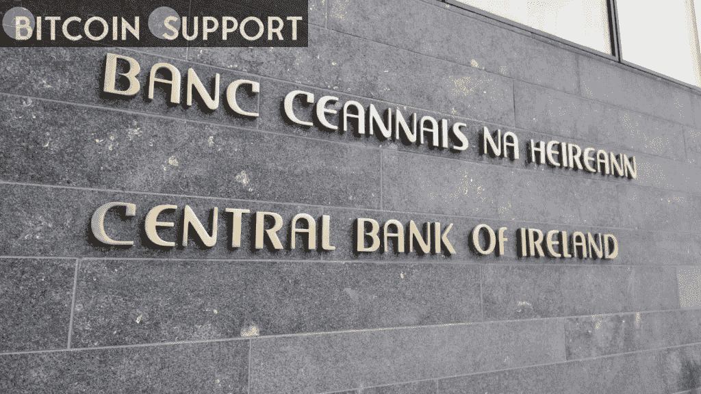

# 爱尔兰央行效仿英国，发布了关于加密货币广告的警告

> 原文：<https://medium.com/coinmonks/irelands-central-bank-has-followed-the-uk-s-lead-in-issuing-a-warning-about-cryptocurrency-ads-bd9e981d69e3?source=collection_archive---------65----------------------->

**Visit our website:-** [**https://bitcoinsupports.com/**](https://bitcoinsupports.com/)

根据央行的说法，人们应该意识到“欺骗性广告的风险，特别是在社交媒体上，有影响力的人被支付广告加密资产的费用”。爱尔兰中央银行向消费者发出警告，指出加密投资的危险，以及“误导”营销，如社交媒体影响者推广的营销。根据爱尔兰央行周二发布的一份通知，这一警告是欧洲监管机构组织的一项活动的一部分，其中包括欧洲证券和市场管理局、欧洲银行管理局以及欧洲保险和职业养老金管理局。爱尔兰央行建议，加密货币对散户投资者来说“极其危险和具有投机性”，并补充说，人们应该警惕“误导性广告，特别是在社交媒体上，有影响力的人获得报酬来推广加密资产。”

“在爱尔兰和整个欧盟，加密资产投资的广告和积极推广水平越来越高，”爱尔兰央行金融行为总监德维尔·罗兰(Derville Rowland)表示。“在投资加密资产之前，想想你是否能承受损失所有的钱。人们还应该意识到，如果出现问题，他们不会像投资受监管产品那样受到保护。”

[https://Twitter . com/central bank _ ie/status/1506233555998982147](https://twitter.com/centralbank_ie/status/1506233555998982147)

央行的警告类似于世界范围内正在打击加密货币影响者的监管者和立法者的警告。西班牙政府今年 1 月对加密投资和服务的广告设置了限制，称“通过影响者推广的项目或服务”将被禁止。英国广告标准管理局已经向加密企业发出警告，提醒他们在涉及数字资产的广告中存在潜在侵权行为。

2018 年报道的许多首次硬币发行欺诈都与美国的名人和有影响力的人有关。2021 年 6 月，金·卡戴珊(Kim Kardashian)的 Instagram 账户分享了一个推广 ERC-20 token EthereumMax (EMAX)的故事，导致价格飙升，然后暴跌 99%以上，使许多散户投资者陷入负面情绪。演员本·麦肯锡，至少是一位美国名人，已经利用他的平台公开反对高调代言。

尽管有无数关于加密货币投资和广告的警告，一些公司还是在爱尔兰开设了办事处。加密交易所 Gemini 在 2021 年初开设都柏林总部后，获得了在该国开展电子货币服务的牌照。2021 年 9 月，币安在爱尔兰开设了三家公司，而 Ripple 和北海巨妖选择爱尔兰作为其欧洲业务的基地。

**访问我们的网站:-**[**【https://bitcoinsupports.com/】**](https://bitcoinsupports.com/)

**免责声明:这些是作者的观点，不应被视为投资建议。读者应该自己做研究。**

> 加入 Coinmonks [电报频道](https://t.me/coincodecap)和 [Youtube 频道](https://www.youtube.com/c/coinmonks/videos)了解加密交易和投资

# 另外，阅读

*   [折叠 App 回顾](https://coincodecap.com/fold-app-review) | [本地比特币回顾](/coinmonks/localbitcoins-review-6cc001c6ed56) | [Bybit vs 币安](https://coincodecap.com/bybit-binance-moonxbt)
*   [加密保证金交易交易所](/coinmonks/crypto-margin-trading-exchanges-428b1f7ad108) | [赚取比特币](/coinmonks/earn-bitcoin-6e8bd3c592d9) | [Mudrex 投资](https://coincodecap.com/mudrex-invest-review-the-best-way-to-invest-in-crypto)
*   [WazirX vs CoinDCX vs bit bns](/coinmonks/wazirx-vs-coindcx-vs-bitbns-149f4f19a2f1)|[block fi vs coin loan vs Nexo](/coinmonks/blockfi-vs-coinloan-vs-nexo-cb624635230d)
*   [比斯勒评论](https://coincodecap.com/bitsler-review)|[WazirX vs coin switch vs coin dcx](https://coincodecap.com/wazirx-vs-coinswitch-vs-coindcx)
*   [7 大副本交易平台](https://coincodecap.com/copy-trading-platforms) | [BuyCoins 点评](https://coincodecap.com/buycoins-review)
*   [XT.COM 评论](https://coincodecap.com/profittradingapp-for-binance)币安评论 |