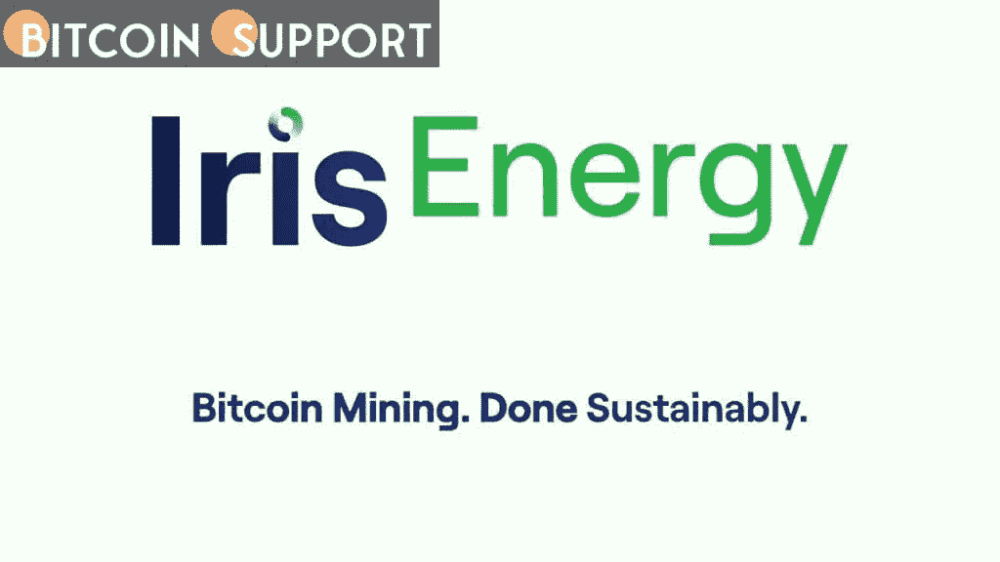

# Iris Energy 从 NYDIG 获得 7100 万美元的设备融资

> 原文：<https://medium.com/coinmonks/iris-energy-receives-71-million-in-equipment-financing-from-nydig-9d3c7cfd87d6?source=collection_archive---------96----------------------->

**Visit our website:-** [**https://bitcoinsupports.com/**](https://bitcoinsupports.com/)

该融资由 19800 名比特大陆 S19j Pro 矿工担保，每个矿工的哈希速率约为每秒 1.98 艾哈希。

澳大利亚比特币矿商 Iris Energy (IREN)已从机构比特币经纪商 NYDIG 获得 7100 万美元的设备融资。Iris Energy 周一在一份声明中表示，这笔融资由 19800 名比特大陆 S19j 专业矿工担保，哈希速率约为每秒 1.98 艾哈希(EH/s)，期限为 25 个月，年利率为 11%。2 月份，Iris Energy 的平均工作速度为 844 PH/s，该公司打算在 2023 年初达到 10 EH/s。此外，它还获得了价值 15 EH/s 的矿工。该矿商表示，其总库存中约 10 EH/s 的矿商仍未被占用，这为该公司提供了寻求进一步非稀释性资本的灵活性和选择权。Iris Energy 的联合创始人兼联合首席执行官丹尼尔·罗伯茨(Daniel Roberts)表示:“这是我们的第三个设备融资设施，我们期待着在矿工交付和安装后正式确定进一步的贷款设施。这笔融资是在矿商寻找新的融资方式之际进行的，包括通过比特币担保贷款和以公司采矿设备为担保的资产担保贷款。Iris Energy 的股票今年下跌了约 5.5%，而比特币下跌了约 1.2%。周一早盘，这家矿业公司的股价上涨了近 3%。

**访问我们的网站:-**[**https://bitcoinsupports.com/**](https://bitcoinsupports.com/)

**免责声明:以上为作者观点，不应视为投资建议。读者应该自己做研究。**

> 加入 Coinmonks [电报频道](https://t.me/coincodecap)和 [Youtube 频道](https://www.youtube.com/c/coinmonks/videos)了解加密交易和投资

# 另外，阅读

*   [最佳期货交易信号](https://coincodecap.com/futures-trading-signals) | [流动性交易所评论](https://coincodecap.com/liquid-exchange-review)
*   [南非的加密交易所](https://coincodecap.com/crypto-exchanges-in-south-africa) | [BitMEX 加密信号](https://coincodecap.com/bitmex-crypto-signals)
*   [MoonXBT 副本交易](https://coincodecap.com/moonxbt-copy-trading) | [阿联酋的加密钱包](https://coincodecap.com/crypto-wallets-in-uae)
*   [雷米塔诺评论](https://coincodecap.com/remitano-review)|[1 英寸协议指南](https://coincodecap.com/1inch) | [购买 Floki](https://coincodecap.com/buy-floki-inu-token)
*   [MoonXBT vs Bybit vs 币安](https://coincodecap.com/bybit-binance-moonxbt) | [Arbitrum:第二层解决方案](https://coincodecap.com/arbitrum)
*   [买 PancakeSwap(蛋糕)](https://coincodecap.com/buy-pancakeswap)|[matrix export Review](https://coincodecap.com/matrixport-review)