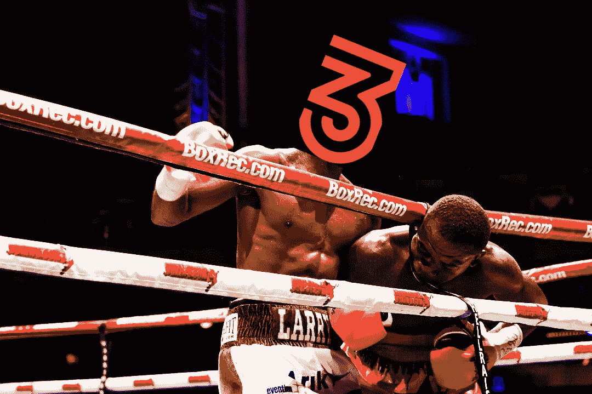

# 2 | 3omb 是迪菲的洛基巴尔博亚吗？

> 原文：<https://medium.com/coinmonks/is-2-3omb-the-rocky-balboa-of-defi-e8fa652a26eb?source=collection_archive---------25----------------------->

在古墓丽影中，没有一个受到的打击超过 2 | 3omb。现在看起来他们要卷土重来了。

Image: PixTeller

> 如果你做梦都想打败我，你最好醒来后道歉——穆罕默德·阿里

# 从坟墓到僵尸再回来

对于那些不熟悉的人，几周前我一头扎进了 DeFi on Fantom 的世界。我经常修改的协议之一是 2 | 3omb。你可以在这里[这里](/coinmonks/defi-101-how-to-make-money-by-not-being-a-baboon-7763ab69746f)，这里[这里](/coinmonks/tomb-zorks-from-defi-degen-to-defi-shark-12ddf66075c6)阅读所有关于经历的[。](/coinmonks/defi-conservative-goes-full-degen-ape-how-i-doubled-my-bag-in-a-week-b8efd9129df0)

看着 2 | 3omb 在过去几周挣扎是很艰难的，即使是作为旁观者。我听过开发者们在他们的 ama 中的演讲，他们总是给我留下真诚的印象。他们现在是 doxxed，他们的 LinkedIn 个人资料看起来是合法的。

也就是说，我想我可能说他们的灭亡太早了。

我仍然怀疑他们文件中的“印钞机坏了”废话。不管是谁说的，永远凭空变钱的想法对我来说都是空洞的。据我所知(目前的配置),古墓和分叉需要新的钱才能生存。

一旦资金枯竭，车轮就会快速脱落。Basis.io 源协议的基本财务结构具有基本的平衡限制。如果一个人要与一项资产挂钩，就必须有办法赎回这项资产，否则挂钩就没有价值。

每个挂钩方案都是如此，而且一直如此。无论是黄金对美元，纸币对猪，还是坟墓对金融时报，挂钩都必须是完全可兑换的。我认为各种坟墓分叉的简短而激烈的历史支持了这个论点。快速浏览一下[这些叉子](https://www.whatthefork.xyz/tomb)会让一个不经意的观察者洞察到这些叉子(有限的)生存能力。

那么，是什么改变了我对 2 | 3omb 的看法？救赎。

# 救赎

在 2 | 3omb 挂钩崩溃后不久，开发人员宣布与第三个坟墓“Zork”(Zomb)合作。我过去(现在仍然)觉得这个想法很荒谬。peg to a peg to a peg 是 Zomb 的简称及其与 2 | 3omb 的关系。

在我看来，Zomb 看起来像一个新的金钱骗局，就像基于[的](https://basedfinance.io/)是为了坟墓。从坟墓到僵尸，这些计划可能会存在一段时间。但是如果一只大熊再次潜伏过来…好吧，我们已经看到了那看起来像什么。坟墓可能有更多的填充物，但我很确定一只足够大的熊也会把它啃穿。

尽管如此，2|3omb 也提到了与魔鬼金融的合作关系。魔鬼金融是 Fantom 上的一个收益乐观主义者，还没有获得太多的关注。当时，在我看来，这次收购就像是开发者们争先恐后地抓住任何他们能抓住的分支来拯救自己免于跌落悬崖。

现在我已经探查了一点，我认为还有更多。恶魔现在被重新命名为救赎。更新的白皮书还没有出来，但我能告诉你的是，2 | 3omb |赎回开发人员正在调整一些奖励机制，实施互换，并将拥有自己的流动性。

作为一名投资者，这对我意味着什么，这是一个收入模式的坟墓。这是一种远远超出追逐 4 位数年利率的狒狒的收入模式。当然还是 DeFi，也就是说结果谁也说不准。

## 德根到重生

让我看好赎回主张的是:

1.开发人员只是被人欺负了，他们还在建设中

2.对 [**ve(3，3)**](https://andrecronje.medium.com/ve-3-3-44466eaa088b) 的一些变化似乎可能是赎回治理的因素(克罗尼的投票托管+博弈论治理奖励稳定解决方案)

4.财政部改革(财政部 2.0 版)

4.流动性将由协议所有和托管

5.收益率优化+自有流动性+流动性托管= *巨大的*收入机会

6.NFTs 和 Game-Fi 正在酝酿中，有人知道吗？)

7.菲亚特入口匝道(我不确定，但它会很酷)

8.多链扩展和桥接(尽管，这在[星际之门](https://coinmarketcap.com/currencies/stargate-finance/)之后就没那么有趣了)

别忘了，现在你可以用真正的最低价购买 2 | 3ombs 和 2 | 3 股股票。换句话说，如果赎回像宣传的那样有效，3omb 回收 peg，这将是一个轻松的 8-10 倍。

## 有什么条件？

这可能完全是一场空。我还没有看到足够的东西来知道开发者们到底在做什么。而且有可能 2300 万英镑的声誉会被恢复到无法修复的程度。但另一个完全崩溃的 T 型分叉是 Ripae，他们只是零创新地回收了 peg。

相比之下，2 | 3 MB+赎回正在建立一些真正看起来有希望的东西，我 100%关注。我第一次模仿了 2 | 3omb，因为我想玩一会儿德根狒狒，看看它是什么样子的。我赚了钱，所以没什么可抱怨的。

这次 2 | 3omb 看起来不像德根狒狒剧。随着赎回即将到来，23mb FUD 米深的红色区域，它看起来更像一个合法的，超卖的投资机会。

我仍然没有喝 3omb 的 Kool-Aid，但我肯定会让一些 ftm 在协议中重新工作。反正都是 T|2|3|Ripae 利润，所以不算什么风险。如果结果证明赎回都是空谈，我想我会把利润退回去。

但是自从我第一次用 2 | 3omb 运行以来，我听了很多开发者的话，现在我在 LinkedIn 上看到了他们的脸。路线图看起来很有希望，但我不会把赌注押在基本面上。这次我只是相信我的直觉，相信一支有斗志的球队。

即使失败了，我还是要向他们脱帽致敬。我不认为我能经受住他们过去两个月所经历的一切。我认为他们应该赢得一场胜利，我敢打赌他们会赢。

当然，这些只是我 ***的观点*。**我不是财务顾问，这不是财务建议，而且总是 [DYOR](/coinmonks/crypto-investing-how-to-dyor-1e6dabdb1de9) 。遵循这些想法中的任何一个都可能会让你失去所有的钱。我对此 100%认真。我喜欢摆弄这些东西，但我公开表现得像个彻头彻尾的狒狒。相应投资。

直到下一次，安全，聪明，一定要[绑骆驼](https://www.oxfordreference.com/view/10.1093/acref/9780199539536.001.0001/acref-9780199539536-e-2318)。

> 加入 Coinmonks [电报频道](https://t.me/coincodecap)和 [Youtube 频道](https://www.youtube.com/c/coinmonks/videos)了解加密交易和投资

# 另外，阅读

*   [如何在 Uniswap 上交换加密？](https://coincodecap.com/swap-crypto-on-uniswap) | [A-Ads 审查](https://coincodecap.com/a-ads-review)
*   [加密货币储蓄账户](/coinmonks/cryptocurrency-savings-accounts-be3bc0feffbf) | [YoBit 评论](/coinmonks/yobit-review-175464162c62)
*   [Botsfolio vs nap bots vs Mudrex](/coinmonks/botsfolio-vs-napbots-vs-mudrex-c81344970c02)|[gate . io 交流回顾](/coinmonks/gate-io-exchange-review-61bf87b7078f)
*   [CoinFLEX 评论](https://coincodecap.com/coinflex-review) | [AEX 交易所评论](https://coincodecap.com/aex-exchange-review) | [UPbit 评论](https://coincodecap.com/upbit-review)
*   [AscendEx 保证金交易](https://coincodecap.com/ascendex-margin-trading) | [Bitfinex 赌注](https://coincodecap.com/bitfinex-staking) | [bitFlyer 评论](https://coincodecap.com/bitflyer-review)
*   [Bitget 回顾](https://coincodecap.com/bitget-review)|[Gemini vs block fi](https://coincodecap.com/gemini-vs-blockfi)cmd |[OKEx 期货交易](https://coincodecap.com/okex-futures-trading)