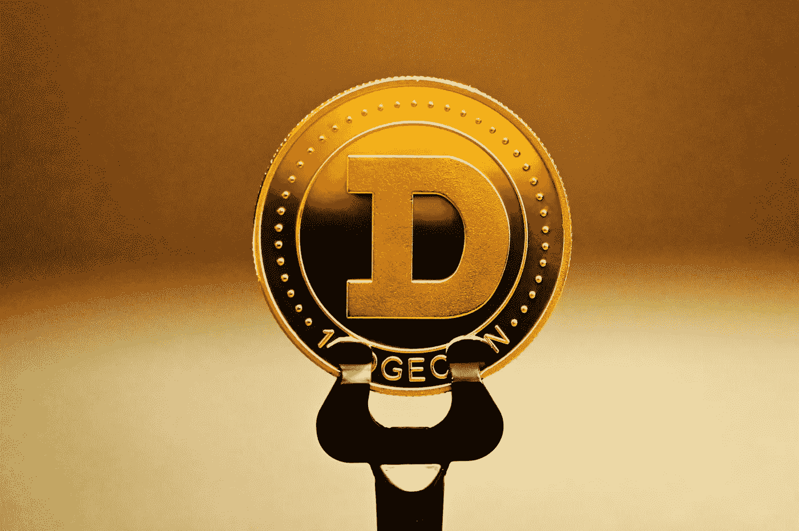

# DOGE coin(DOGE)6 月份买划算吗？

> 原文：<https://medium.com/coinmonks/is-a-dogecoin-a-good-buy-in-june-73927b93a8af?source=collection_archive---------50----------------------->

Source photo Unsplash.com

截至目前，Dogecoin (DOGE)的市值为 108.8 亿美元，按市值计算是第十大加密货币。6 月 4 日，它的交易价格为 8.2 美分，比年底的 17.3 美分下降了 52.6%。尽管事实似乎是负面的，但长期投资者会从中受益匪浅。