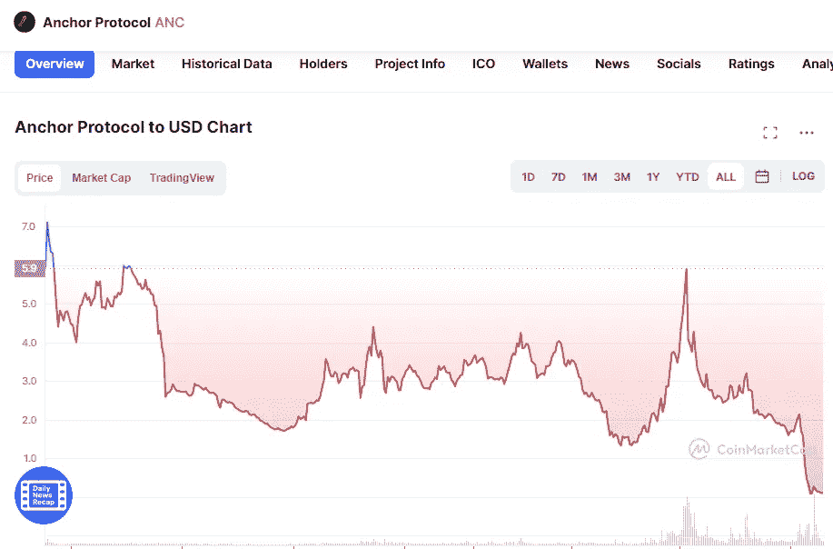

# 投资锚协议是个好主意吗？

> 原文：<https://medium.com/coinmonks/is-a-good-idea-to-invest-in-anchor-protocol-e00e76d077d?source=collection_archive---------40----------------------->

Source photo [Anchor Protocol price today, ANC to USD live, marketcap and chart | CoinMarketCap](https://coinmarketcap.com/currencies/anchor-protocol/)

## 什么是锚协议？

Terra 区块链是锚系统的基础，锚系统是一种借贷协议。币安 Launchpool 欢迎它成为第 29 个项目。借款人的数字资产可以用来获得贷款，并在此过程中赚取收入。使用锚定协议，稳定硬币的存款可能获得高达 19.5%的收益。