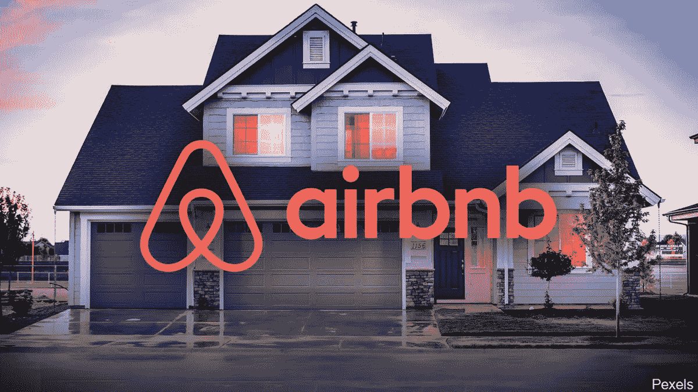

# Airbnb 五月投资好吗？

> 原文：<https://medium.com/coinmonks/is-airbnb-a-good-investment-in-may-f8179e2b4f9c?source=collection_archive---------67----------------------->

Source photo [airbnb company — Bing images](https://www.bing.com/images/search?view=detailV2&ccid=cG8KTNcd&id=F81467354D4CE8C97E66BF5B474A2134D98906DE&thid=OIP.cG8KTNcdPke0cVYsw7QskwHaEK&mediaurl=https%3a%2f%2fjayvas.com%2fwp-content%2fuploads%2f2020%2f11%2fairbnb-real-estate-company.jpg&cdnurl=https%3a%2f%2fth.bing.com%2fth%2fid%2fR.706f0a4cd71d3e47b471562cc3b42c93%3frik%3d3gaJ2TQhSkdbvw%26pid%3dImgRaw%26r%3d0&exph=675&expw=1200&q=airbnb+company&simid=608050773952455946&FORM=IRPRST&ck=58AF77ABE7F1AE28BA579BB078A27935&selectedIndex=0&ajaxhist=0&ajaxserp=0)

Airbnb 彻底改变了旅游行业，却没有一个出租单位。客户可以在它的平台上预订房间，这个平台将他们与全球数千个地方的本地主机连接起来。

这种轻资产的方法使 Airbnb 比传统酒店更加灵活，增强了推动该公司经济模式的网络效应。该组织可以迅速和…