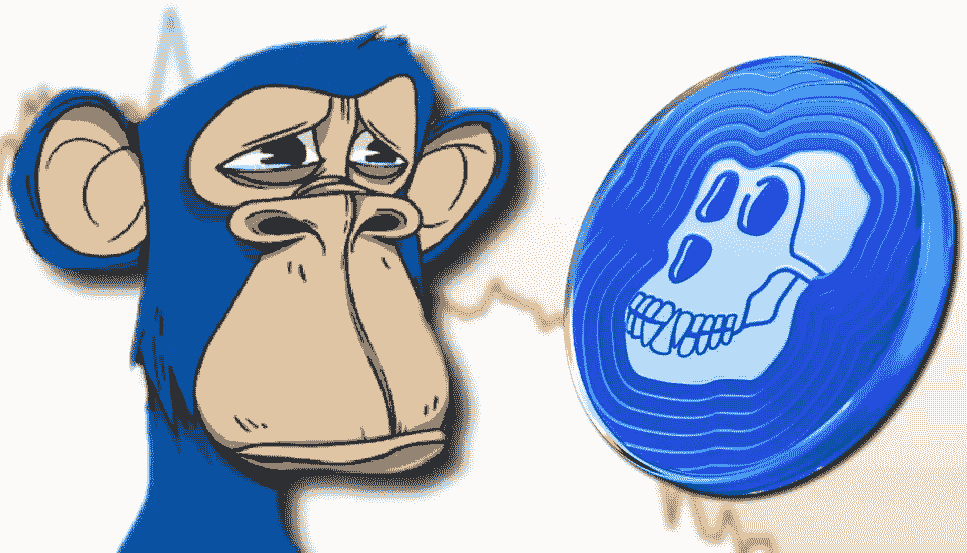

# ApeCoin (APE)是好的投资吗？

> 原文：<https://medium.com/coinmonks/is-apecoin-ape-a-good-investment-cac022acbeea?source=collection_archive---------4----------------------->

Source photo [apecoin — Căutare Google](https://www.google.ro/search?q=apecoin&sxsrf=ALiCzsZJ8XVDNIe2Qnkvci1RULeTgZciAQ:1653834586056&source=lnms&tbm=isch&sa=X&ved=2ahUKEwilkJP49YT4AhWuR_EDHbn_A0kQ_AUoAXoECAIQAw&biw=1366&bih=649&dpr=1#imgrc=iw6uqqRUwsZCNM)

## 猿是什么？

你可能想知道谁是硬币的幕后黑手。APE 生态系统由 ApeCoin 所有者以及使用该硬币的不同商品和服务组成。在 NFT 和数字收藏品领域，2021 年在迈阿密成立的宇迦实验室是一个知名品牌。