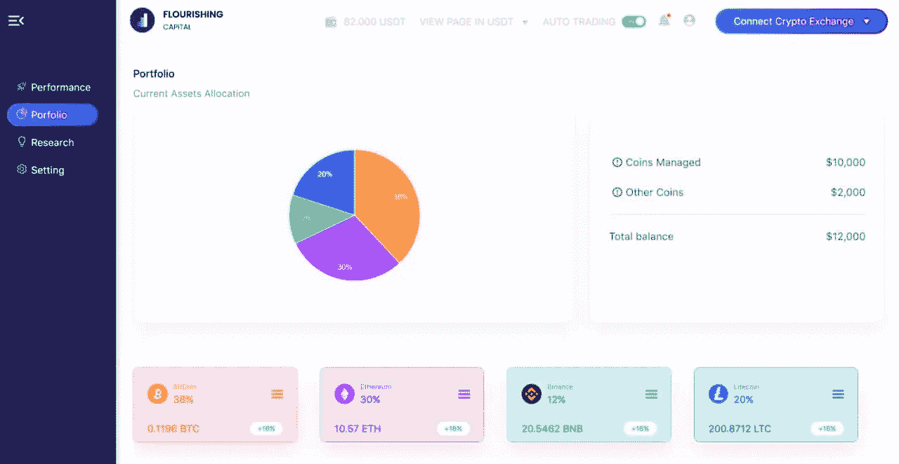
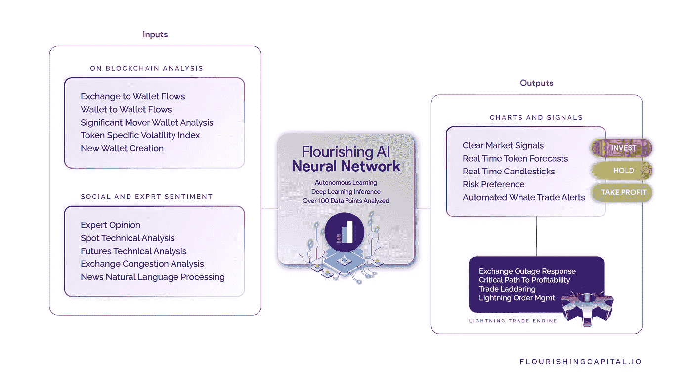

# 人工智能是加密货币交易的未来吗？

> 原文：<https://medium.com/coinmonks/is-artificial-intelligence-the-future-of-cryptocurrency-trading-8aa09108436d?source=collection_archive---------53----------------------->

# 虽然答案仍然有些猜测，但蓬勃发展的人工智能提供了一种独特的产品，可能会引领人工智能技术在加密领域的发展。

# 创造的力量

人工智能(AI)技术做出数学决策的速度颠覆了商业世界的传统。

人工智能承诺了一个未来，高度复杂单调的工作将从人类手中夺走，并转移到智能系统中。

虽然人工智能听起来可能很未来，令人兴奋，甚至可能很可怕，但事实是，自学机器人已经在商业世界中使用了一段时间。

摩根大通(JP Morgan)和高盛(Goldman Sachs)等大型金融机构多年来一直在使用交易算法，这提出了一个问题——如果自动化绩效管理器可以用于传统金融——想象一下它在去中心化金融世界中的用例。

# 投资组合管理——人工智能之路

**‍** 一个即将推出的名为“蓬勃发展的人工智能”的平台现在似乎正在应用人工智能和大规模数据挖掘来提供投资组合管理，这种管理是由市场的宏观运动和人类难以察觉的鲸鱼模式驱动的。

在我们与盛世资本首席执行官 Eric Gonzalez 的谈话中，他解释了盛世人工智能投资组合经理如何从区块链和情绪数据中收集的 100 多个数据点进行分析和学习，以在熊市或牛市发生之前预测它们。

它可以处理区块链内的相关性数据，并能够读取基于交易所拥挤价格范围的信息，以确定执行买入或卖出是否理想。

它还通过专家和影响者 NLP 与新闻和分析 NLP 的结合来考虑市场情绪。

其他自学机制包括鲸鱼警报、令牌预测以及风险概况和投资组合构成过滤器，该过滤器可以确定是否需要激进或更保守的方法。

他进一步解释说，蓬勃发展的人工智能将链上指标和人类情感收集到它的中性网络中。

然后，它分析这些数据，以提供模式检测、简单的市场信号(买入、持有、获利)，以及对市场动态的洞察，从而很快影响数字资产。

不同之处在于，蓬勃发展的人工智能每时每刻都在这样做，不断学习。

通常，交易机器人会假设过去的历史模式，但冈萨雷斯解释说，蓬勃发展的人工智能系统不会假设过去的模式成立。

> “系统不断地测试和再测试它的假设，假设过去的模式完美地预测了未来的模式。他声称:“人工智能会多次捕捉到表明市场波动中“不可预测性”的新模式。

# 基于人工智能的投资组合 Management‍市场

冈萨雷斯强调，有两类加密商品买家可以从人工智能驱动的投资组合再平衡中受益。

蓬勃发展的人工智能旨在为加密货币的资深人士和新的市场参与者提供服务。

对于新用户，AI portfolio management 提供了一种风险调整数字资产购买和销售的系统方法。

对于需要远离交易、将时间花在其他追求上的有经验用户来说，基于人工智能的系统提供了定义策略的能力，并让系统自动化投资组合再平衡的交易元素。

冈萨雷斯认为，到 2024 年，数字资产领域的人工智能投资组合管理部门将成为 20 亿美元的市场。

# 访问基于人工智能的风险调整投资组合再平衡

经过多年的发展和努力，盛世资本将于 9 月 21 日在 PancakeSwap 上推出其$AI 令牌。AI 令牌也可以在四个发射台提前购买；trust pad(9 月 20 日)、BSC pad(9 月 20 日)、safe launch(9 月 21 日)和 Bullperks(9 月 21 日)。

人工智能令牌可以用来访问蓬勃发展的人工智能的分析和自动投资组合再平衡功能。

# 关于繁荣的资本

蓬勃发展的人工智能是市场上最先进的人工智能、投资组合管理和洞察解决方案。

live 平台通过结合深度学习推理、主动区块链监控、高频交易、主动投资组合再平衡、自动化套利、目标价格概率分析以及牛市、熊市或意外市场事件的早期模式识别，支持投资组合风险调整后的回报。

蓬勃资本成立于 2020 年，由经验丰富的企业家领导，他们在高盛、英伟达、甲骨文和 Planview 担任重要职务。

该团队在数字资产研发、支付系统、可扩展平台部署以及收购 Paypal 等公司方面拥有三十年的丰富经验。

> 加入 Coinmonks [电报频道](https://t.me/coincodecap)和 [Youtube 频道](https://www.youtube.com/c/coinmonks/videos)了解加密交易和投资

# 另外，阅读

*   [OKEx vs KuCoin](https://coincodecap.com/okex-kucoin) | [摄氏替代品](https://coincodecap.com/celsius-alternatives) | [如何购买 VeChain](https://coincodecap.com/buy-vechain)
*   [币安期货交易](https://coincodecap.com/binance-futures-trading)|[3 commas vs Mudrex vs eToro](https://coincodecap.com/mudrex-3commas-etoro)
*   [如何购买 Monero](https://coincodecap.com/buy-monero) | [IDEX 评论](https://coincodecap.com/idex-review) | [BitKan 交易机器人](https://coincodecap.com/bitkan-trading-bot)
*   [CoinDCX 评论](/coinmonks/coindcx-review-8444db3621a2) | [加密保证金交易交易所](https://coincodecap.com/crypto-margin-trading-exchanges)
*   [红狗赌场评论](https://coincodecap.com/red-dog-casino-review) | [Swyftx 评论](https://coincodecap.com/swyftx-review) | [CoinGate 评论](https://coincodecap.com/coingate-review)