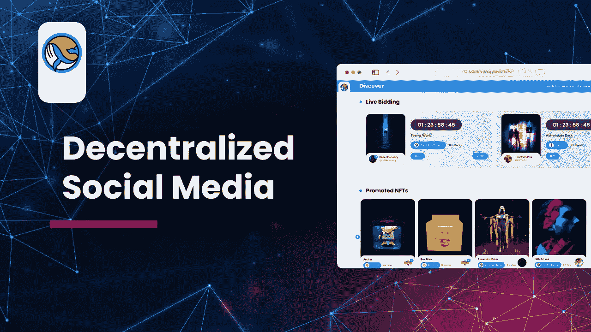

# ARTKIT 是去中心化的社交媒体吗？

> 原文：<https://medium.com/coinmonks/is-artkit-a-decentralized-social-media-c8d51dffdfab?source=collection_archive---------28----------------------->

# 什么是去中心化社交媒体？

分散式社交媒体(DSM)是指使用分布式账本技术(DLTs)的社交媒体平台，如区块链或 DAG。因此，与我们普通的集中式网络不同，这些平台上的活动不可逆转地记录在一个分散的协议上，没有中央机构可以管理或监督。

这些社交媒体网站，像分散金融一样，并没有真正的中央管理机构，可能会在未来为 Twitter、Instagram、脸书和抖音等成熟平台提供可行的替代方案。目前，该技术的发展刚刚超过发展的胚胎阶段

集中式社交媒体部门受到全球审查制度、缺乏定制、不公正的货币化、算法威权主义和网络效应垄断的阻碍，因为这些网络往往强调创收。结果，他们用吸引注意力的广告轰炸顾客，保证他们得到的是娱乐而不是教育。

对社区成员和内容创作者不公平是这些集中式社交媒体系统擅长的。“很明显，集中式社交网络容易受到许多可疑行为的攻击，神秘算法决定人们看到什么，人们因为任何原因被屏蔽或完全屏蔽，等等。”更糟糕的是，许多人依靠这些平台谋生，而这又受制于政府的一时兴起。"

用户可以在集中式和分散式社交媒体平台的前端相互交流，这些平台使用社交图——一种社交网络模型，可以映射平台上的每个人以及他们之间的关系。传统的社交媒体平台是独立的，数据服务器由托管公司控制。Twitter 的所有内容，包括你的内容，都归该公司所有和控制。Instagram、脸书、抖音和其他类似的应用程序都在同一条船上。在公共区块链上，建立了分散的社交媒体系统，任何地方的任何人都可以托管一个节点，访问后端，构建一个应用程序，并管理一个订阅源。

去中心化的社交媒体完全是为了“还权于民”。审查是集中式平台的问题之一；然而，分散的社交媒体网络上的用户可以灵活地参与，而不用担心审查，因为开发者通常只是给出指导性规则，将其余的交给分散的用户社区。然后是货币化。

它还防止未经授权的用户数据销售，这是集中式社交网络的一个有争议的问题。此外，区块链技术使用加密来提高用户隐私和数据安全性。

去中心化的社交媒体尽管好处多多，但也存在严重的问题。例如，在没有版主的情况下，用户可能会发布无法删除的不准确或攻击性的信息。此外，敌对行为者可能会控制超过一半的网络能力，允许他们以他们认为合适的方式操纵数据，从而危及系统的完整性。如果作者有义务在完全去中心化的平台上监控自己的内容，如何控制非法内容和错误信息？如果采用区块链验证，这些问题中的许多都可以避免。通过对个人资料的核实，你可以马上判断出一个人没有说实话
此外，当涉及到为每个人做决定时，适度是关键。Lens Protocol 有一个公共的社交图，其中所有用户信息都是主动链接的，而这个社交图是去中心化的，不像传统的社交媒体。将社交网络去中心化，让每个人都可以访问它，这扩大了更人性化的节制的前景。

由于易于互联，开发人员可以设计内容审核算法。它本质上迫使协议的前端，或应用程序，竞争提供准确，及时信息的权利。

# 那么 ARTKIT 是去中心化的社交媒体吗？

据其网站介绍， [Artkit](https://artkit.art/) 是一个新的社交媒体平台，该平台将与区块链相关联，并兼容 NFT 的买卖。与其他社交媒体平台不同， [ArtKit](https://artkit.art/) 社交媒体不仅让用户拥有个人和商业资料，还让最终用户能够自由创作他们想要展示的 NFT 背后的情节。

这是相对于 Opensea 等已知平台的一个竞争优势，在 Opensea 中，NFTs 背后通常没有故事。它将利用区块链市场在社交媒体和 NFT 空间执行交易，这些将与元宇宙相连，以确保采用综合方法优化数字博物馆、艺术和文化。

通过利用 NFT， [ArtKit](https://artkit.art/) 将允许用户创建、分享和协作故事情节。ArtKit 将创建一个 3D 数字平台，任何人都可以在这里享受艺术和文化。为了享受艺术，ArtKit 将开发自己的社交媒体 NFT 平台，并使用户能够创建故事&为创建的 NFT 添加特定的实用程序。因此，它将使 NFT 更具互动性&普通人将理解 NFT 背后的原因。用户还可以购买、出售、喜欢或评论 NFTs。他们也可以通过捐款或创建自己的社区页面来支持 NFT 创造者。

ArtKit 还将创建一个使用元宇宙技术的博物馆，如沙子、法力，或者也许是我们自己的元宇宙，以便游客可以欣赏 3D 艺术收藏。因此，艺术家将能够轻松展示他们的作品，并举办音乐会、单口喜剧和 3D 展览。为了让事情变得更加激动人心并鼓励社区凝聚力，ArtKit 将在网站(如 Arti Lucky Box)和元宇宙(如单口喜剧)举办活动。

# 最后

在平等和隐私方面，分散的社交媒体有可能改变权力平衡，使之有利于用户和内容创作者。它有能力颠覆社交媒体业务，并在 Web 3 时代开创一个数字自由言论的新时代。然而，要做到这一点，它肯定需要找到一个难以捉摸的解决方案来限制内容，并获得普遍接受。该领域的思想领袖正在展望未来。我们实际上还没有宣布我们的社交媒体完全去中心化，但我们希望随着时间的推移，白皮书上的所有内容都会更新，请确保您保持更新，购买并持有$Arti，并加入社区获取更新和问题。

阅读这篇文章，学习如何购买$ARTI 代币

[查看我们的网站](https://artkit.art/)

来源

[coin telegraph](http://cointelegraph.com)&[coin market cap](http://coinmarketcap.com)

[**在所有社交场合使用美工工具包**](https://linktr.ee/artkit_official)