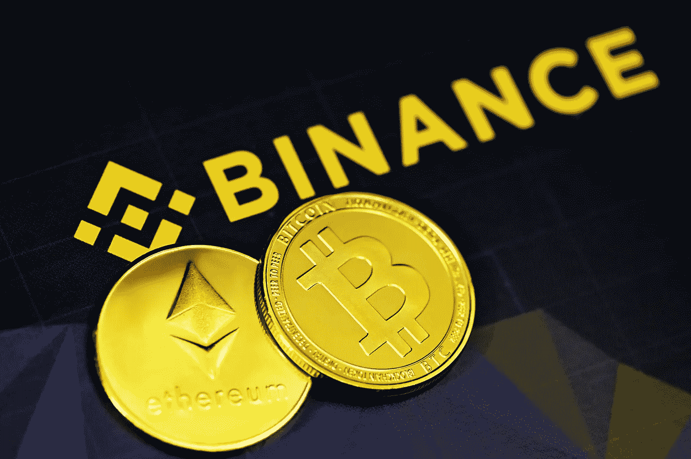
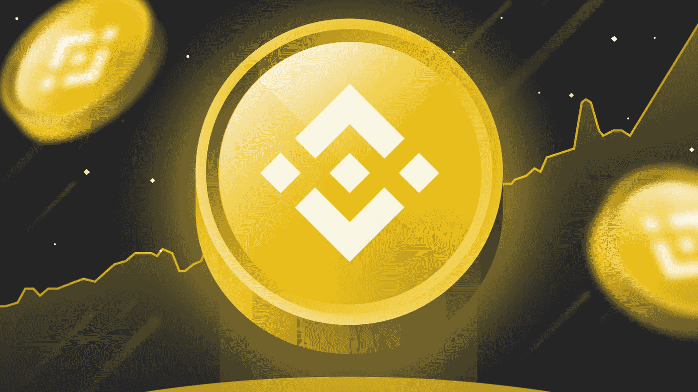
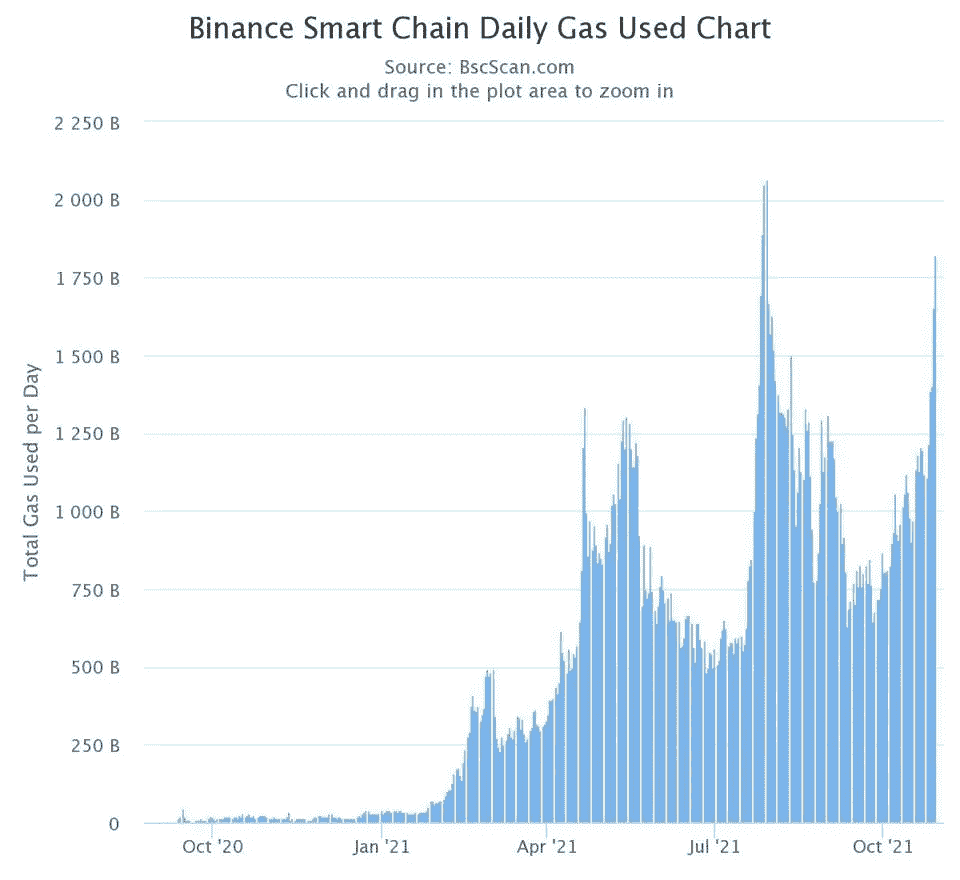

# 币安会成为秘密华尔街吗？

> 原文：<https://medium.com/coinmonks/is-binance-is-going-to-be-the-next-wall-street-6548d58dc16b?source=collection_archive---------17----------------------->

## 你应该加入这场加密竞赛吗？

Photo by [Executium](https://unsplash.com/@executium?utm_source=unsplash&utm_medium=referral&utm_content=creditCopyText) on [Unsplash](https://unsplash.com/s/photos/binance?utm_source=unsplash&utm_medium=referral&utm_content=creditCopyText)

币安是世界上最大的加密货币交易所之一，2021 年负责 7.7 万亿美元的加密交易量。币安每秒执行约 140 万笔交易，日均交易量为 20 亿笔。

币安是交易量最大的加密货币交易所，推动这一增长的因素是币安硬币(BNB)和币安智能链。让我们深入研究一下。

> 与其他交易所相比，币安的费用最低(仅为 0.1%)。此外，它还提供了使用币安硬币交易 50%的费用减免。如果你很乐意加入这场加密竞赛，你可以在几分钟之内在币安开设一个免费账户。**开户用此** [**下线**](https://accounts.binance.com/en/register?ref=VPZSLHC8) **链接拿回 5%佣金:-**

# **什么是币安硬币(BNB)？**

****

**Source:- [Binance.com](https://www.binance.com)**

**币安硬币是币安交易所发行的加密货币，交易时使用 BNB 符号。BNB 最初是基于以太坊网络，但现在是币安区块链的本地货币，币安链。**

**币安硬币减少 50%的费用。这意味着，如果你使用 BNB 完成交易，你只需支付 5 美分，而不是为 100 美元的交易支付 10 美分。**

**币安币现在拥有 840 亿美元的庞大市值，市值仅次于比特币、以太坊和 USD Tether，并且还在持续增长。**

**币安币的表现明显优于其两大竞争对手:比特币和以太坊。根据 Arcane Research 的数据，BNB 在 2021 年增长了大约 1，300%。相比之下，市场领导者比特币上涨了 65%，而以太坊上涨了 408%。**

**它有更多的好处以及更低的费用，例如:**

*   **提供闪电般的交易**
*   **可以用来买卖各种各样的加密货币**
*   **是安全可靠的**
*   **被一些服务提供商接受为货币，主要是在酒店/旅游行业**
*   **由于价格不断上涨，可作为投资:)**

# **什么是币安智能链(BSC)？**

**币安宣布了其新的 DeFi 平台，币安智能链(BSC)，随后于 2020 年 4 月推出。其目的是为以太坊和其他领先的 DeFi 平台提供一种替代方案。**

**BSC 具有智能合约功能，并且与以太坊虚拟机(EVM)兼容。BSC 的双链架构允许其用户在一个区块链上构建[分散应用(dapp)](https://ethereum.org/en/dapps/)和数字资产，并使用区块链的高速交易在另一个上进行交换。其交易时间大致为 3 秒。**

**这是一项非常复杂的技术，因为加密货币还处于初级阶段。让我们来看看币安智能链的好处。**

****

**Source:- [BscScan.com](https://bscscan.com)**

> ****燃气费**是用户为补偿处理和验证区块链交易所需的计算能量而支付的费用。**

**正如我们所知，一些平台和应用程序正在以太坊上开发，如 Brave、Rarible、Opensea、Audius 等。同样，平衡记分卡提供了一种替代方法。BSC 慢慢流行起来。因此，如果 BSC 的总用气量增加，很可能会对 BNB 值产生积极影响。**

**币安智能链的一些优势包括:**

*   **由领先的分散式交易所币安 DEX 提供支持的丰富且不断增长的数字资产生态系统**
*   **低至 1 美分的廉价交易费**
*   **高性能，网络能够每 3 秒产生一个数据块**
*   **提高 DeFi 互操作性的跨链 DeFi 机制**
*   **一个支持性的币安生态系统，资助并启动了许多 DeFi 项目**
*   **跨越 Binance.com 和币安 DEX 的数百万用户的不断增长的生态系统**
*   **已经与 BSC 合作的主要加密项目网络**

# **结尾注释**

**币安提供各种各样的服务，几乎所有的服务都可用于加密货币。我们讨论了币安硬币和智能链，从中我们可以看到未来的潜力。**

**加密货币仍处于初级阶段，有待广泛采用。现在加入它，你也可以成为早起的鸟儿。**

> **与其他交易所相比，币安的费用最低(仅为 0.1%)。此外，它还提供了使用币安硬币交易 50%的费用减免。如果你很乐意加入这场加密竞赛，你可以在几分钟之内在币安开设一个免费账户。【https://accounts.binance.com/en/register?ref=VPZSLHC8】开户带此 [**下线**](https://accounts.binance.com/en/register?ref=VPZSLHC8) **链接拿 5%佣金回来:****

****如果你觉得这篇文章有用，请鼓掌并分享这篇文章:)****

> ****加入 Coinmonks [电报频道](https://t.me/coincodecap)和 [Youtube 频道](https://www.youtube.com/c/coinmonks/videos)了解加密交易和投资****

## ****另外，阅读****

*   ****[8 大加密联盟项目](https://blog.coincodecap.com/crypto-affiliate-programs) | [eToro vs 比特币基地](https://blog.coincodecap.com/etoro-vs-coinbase)****
*   ****[最佳以太坊钱包](https://blog.coincodecap.com/best-ethereum-wallets) | [电报上的加密货币机器人](https://blog.coincodecap.com/telegram-crypto-bots)****
*   ****[交易杠杆代币的最佳交易所](https://blog.coincodecap.com/leveraged-token-exchanges) | [购买 Floki](https://blog.coincodecap.com/buy-floki-inu-token)****
*   ****[3Commas 诉 Pionex 诉 crypto hopper](https://blog.coincodecap.com/3commas-vs-pionex-vs-cryptohopper)|[Bingbon Review](https://blog.coincodecap.com/bingbon-review)****
*   ****[加密复制交易平台](/coinmonks/top-10-crypto-copy-trading-platforms-for-beginners-d0c37c7d698c) | [如何在 WazirX 上购买比特币](/coinmonks/buy-bitcoin-on-wazirx-2d12b7989af1)****
*   ****[硬币评论](https://blog.coincodecap.com/coinloan-review)|[Crypto.com 评论](/coinmonks/crypto-com-review-f143dca1f74c)****
*   ****[最佳网上赌场](https://blog.coincodecap.com/best-online-casinos) | [币安评论](/coinmonks/binance-review-ee10d3bf3b6e) | [BitMEX 评论](https://blog.coincodecap.com/bitmex-review)****
*   ****[麻雀交换评论](https://blog.coincodecap.com/sparrow-exchange-review) | [纳什交换评论](https://blog.coincodecap.com/nash-exchange-review)****
*   ****[美国最佳加密交易机器人](https://blog.coincodecap.com/crypto-trading-bots-in-the-us) | [经常性评论](https://blog.coincodecap.com/changelly-review)****
*   ****[在印度利用加密套利赚取被动收入](https://blog.coincodecap.com/crypto-arbitrage-in-india)****
*   ****[Godex.io 审核](/coinmonks/godex-io-review-7366086519fb) | [邀请审核](/coinmonks/invity-review-70f3030c0502) | [BitForex 审核](https://blog.coincodecap.com/bitforex-review)****
*   ****[最佳比特币保证金交易](/coinmonks/bitcoin-margin-trading-exchange-bcbfcbf7b8e3) | [萝莉点评](/coinmonks/lolli-review-e6ddc7895ad8) | [比特币保证金交易](https://blog.coincodecap.com/bityard-margin-trading)****