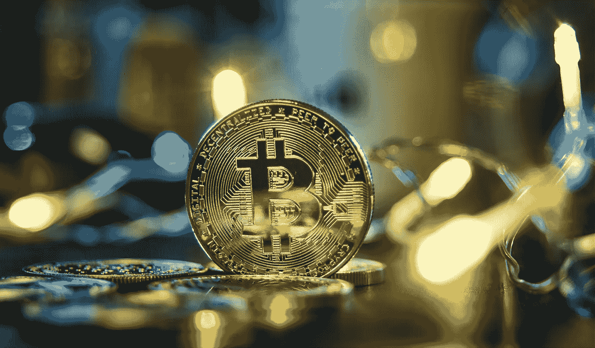

# 比特币是买入并持有的加密货币吗？

> 原文：<https://medium.com/coinmonks/is-bitcoin-a-buy-and-hold-cryptocurrency-da04c1337b3e?source=collection_archive---------29----------------------->

Source photo Unsplash.com

正如 Ark Invest 首席执行官凯西·伍德(Cathie Wood)多次表示的那样，比特币是有史以来第一个世界范围的、私有的、去中心化的货币系统。在人类历史上，从来没有一种货币不受任何政府或有组织实体的管辖。仅此一点就足以提供一个强有力的投资案例。