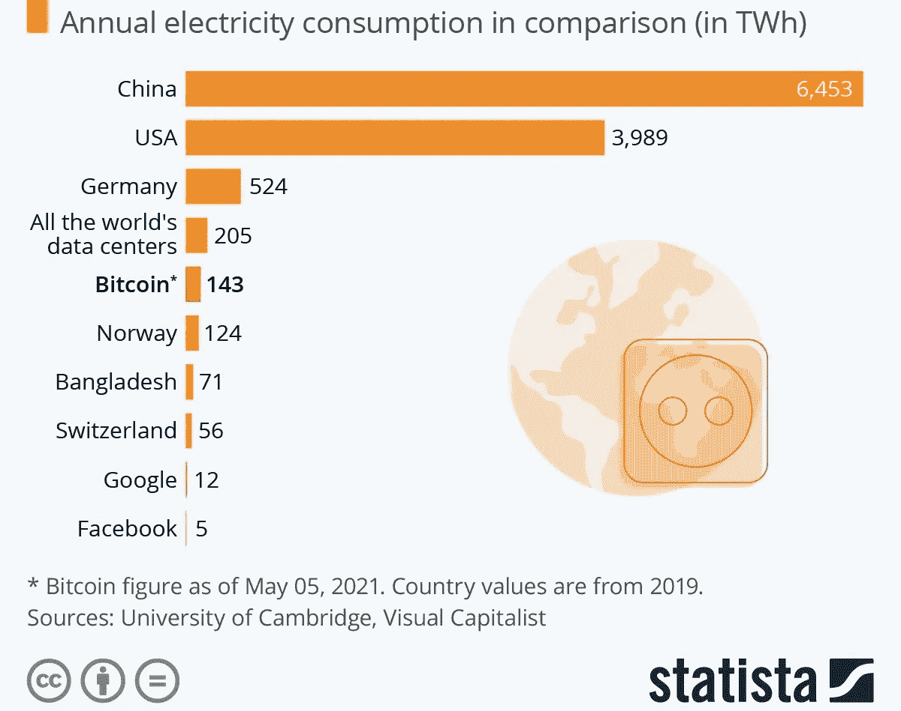

# 比特币是环境的朋友还是敌人？

> 原文：<https://medium.com/coinmonks/is-bitcoin-a-friend-or-foe-of-the-environment-ad4a1b73650b?source=collection_archive---------47----------------------->

经济学，能源，我的文章都是不涉及政治的。不管你在政治光谱中属于左还是右，你都需要能量来驱动你的设备。无论你是自由派还是保守派，你都用经济中的钱来购买燃料或电力来为你的汽车提供动力。我的文章并不适合所有人，但它们旨在吸引广泛的人群。世界日益两极分化，以至于我们无法尊重彼此的差异。我宁愿搭建桥梁来统一观点，而不是助长我们之间的分歧。当我们意见一致时，争论的时间就会减少，更多的时间可以用来解决对各方都重要的问题。能源安全和气候变化等问题。

全球变暖不是某个政党、种族或宗教的选择，它影响到每个人。事实上，我们使用的能源类型不是加速就是减缓气候变化。目前的说法是化石燃料是问题，可再生能源是解决方案，但事情没那么简单。我们如何确保今天的地球人口拥有足够的电力，环境状况良好，造福子孙后代？这个问题的答案是‘只是过渡’。全球、地区和国家经济还不够强大，不足以一次性转换能源。当可再生能源部门稳定时，必须分阶段进行。否则，这将使许多在煤矿、石油钻塔等工作的人失去可持续的生计来源。

> 你可能想知道我是否有资格深入讨论这些话题。我有一个气候变化的硕士学位，在我的论文(研究项目)中有一个发现，增加了温度分析的准确性。我的发现可以在这里引用，并将发表在欧洲地球科学联盟(EGU)的“过去气候杂志”上。我们都面临的一个主要挑战是管理我们所拥有的缓解气候变化和浪费能源的时间。

Global Energy generated, wasted/lost, and Bitcoin mining consumption by the BMC

我们浪费了大量的能源，50，000 太瓦时，占全球经济总量 160，000 太瓦时的 31%。像我这样的环保主义者，支持一种臭名昭著的能源昂贵的加密货币确实令人惊讶。我想澄清归因于比特币的不可持续的叙事是否是真的，并使其他人也能这样做。从而肯定了比特币对于我们为了生存而需要保护的环境是朋友还是敌人。

# **Just-Transition 和能源安全**

Just transition 是一个由社会干预组成的计划，随着世界转向更绿色的经济以应对气候变化，该计划需要维护工人的权利和生计。几十年来，全球排放量一直在上升，但能源匮乏和经济通胀也是如此。它可能发生在发达国家和发展中国家的任何地方。能源贫困和膨胀的经济会使人们缺乏能源保障。当人们难以负担公共设施(电和煤气)或发现很难给汽车加油时，就会出现这种情况。

在人口密集的地区，如郊区和城市，公共交通是一个合适的选择(当它的标准很高的时候)。尽管如此，农村地区的交通选择并不理想。农村人口依靠可靠的交通工具出行，比如开车。当汽油、柴油和煤炭价格上涨时，他们是首当其冲受到显著影响的群体。价格上涨是稀缺的结果。

> 在过去的一个月里，我们讨论了供求的本质。俄罗斯供应欧洲约 40%的石油和天然气。俄罗斯和欧洲之间的紧张局势减少了供应。需要燃料的人数没有太大变化，但可用的燃料数量明显下降。由于高需求，能源供应冲击提高了价格。

多年来，欧洲对俄罗斯能源的依赖一直是人们谈论的话题。它给了俄罗斯太多的权力，而欧洲的北约盟友美国对此并不高兴。俄罗斯是世界第三大石油生产国，所以每个人都和他们做生意，是的，甚至是美国。由于东欧最近的事态发展，欧盟已经构建了一个框架，要求欧洲在 2027 年前摆脱对俄罗斯能源的依赖，这比预期提前了三年。公正过渡和可再生能源可以使欧洲恢复能源独立。

3 out of Europe’s Top 10 oil suppliers are Russian companies. Graph by Laura Buffett of T&E.

可再生能源可以被认为是分散的能源。化石燃料可以被描述为集中能源。俄罗斯的能源是集中的，他们拥有完全的控制权。没有人能打开或关闭太阳和风，这种分散的能量属于每个人。适当投资可再生能源可以对能源安全、全球和平和生计产生深远影响。当大部分能源不在单一权力机构控制之下时，各地区可以维持其主权和影响力。

# **比特币和其他行业的能源成本**

比特币(BTC)可以成为环境的盟友，如果它比它的同行产生更少的碳排放。相反，BTC 比其他行业产生更多的碳排放，使其成为环境的敌人。请注意我是如何测量 BTC 的二氧化碳(CO2)排放量的，而不是它的能源消耗。这是一个常见的误解，认为它们是一回事。**使用的能源种类比使用的能源数量对环境的影响更大。**碳中和是指产生的碳被储存的碳抵消，使净排放量为 0。

Annual electricity consumption for countries and economic activities by Statista

假设开柴油车是+3 CO2，开电动车是+1 CO2。电动汽车产生的碳更少，但用于补充燃料的电力类型很重要。如果风力发电被用来给电动汽车充电，那就是-1 CO2，因为发电不会产生碳，反而会节省碳。由可再生能源驱动的电动汽车是碳中性的(+1–1 = 0)，没有新的碳加入到臭氧中。柴油或汽油(内燃机)汽车不可能做到这一点，它们只会向大气中排放更多的二氧化碳。

> 比特币确实使用了大量的能源，平均 143 TWh (terrawatt hours)。这超过了挪威消耗的 124 太瓦时。人们经常忽略的是，75%的比特币开采使用可再生能源。这是 BTC 矿工最便宜的选择。这意味着比特币在能源生产和消费两个方面减少了大气中的二氧化碳排放。这保护了地球正在消耗的臭氧层。臭氧对于防止来自太阳的破坏性紫外线(UV)到达地球表面至关重要。

世界上大部分浪费的能源是可持续能源，这使得它很便宜。比特币矿工选择廉价的可再生能源来补偿其他成本。可再生能源被浪费了，因为冬季是能源需求的高峰期，而风能、太阳能和水能的产量在夏季很高。我们的电池也不够环保或高效，不足以长时间储存能量。大多数其他经济实践，如银行业、金矿和数据中心，都依赖于化石燃料能源的一致性，但这种情况正在开始改变。尽管如此，由于去中心化，比特币仍遥遥领先。

Bitcoin Mining vs Other Economic Activities depicted by the BMC

> BTC 的构成让哈希力量(矿工和装备)遍布全球。一个地方的散列率下降会在其他地方出现。中国曾数次禁止比特币挖矿，每次都是哈希力量转移。俄罗斯是重启 BTC 散列率的一个网站。冰岛、瑞典和挪威是 BTC 矿业的其他新目的地，原因是天气寒冷，地热、水力和太阳能过剩。然而，统计学家和研究人员没有想到将环境应用于比特币的能源消耗。

不管你认为比特币有用还是无用，它在全球范围内消耗的能量微乎其微。由于其高度的可再生能源组合，BTC 仅使用了世界发电量的 0.1%和世界浪费能源的 0.4%。比特币的对手是全球金融系统、黄金开采业和数据中心，它们都消耗更多的能源，可持续能源更少。最重要的问题不是比特币的能源消耗，而是减少能源浪费，然后改善其他行业的可再生能源组合。

# **(我的)结论**

我认为比特币采矿的主要论点是，与其他行业相比，它对环境的影响相形见绌。我意识到这场辩论还有更多层面。现在我们知道，BTC 56–75%的能源消耗来自 50，000 TWh 的浪费能源。这种浪费的能源来源于需求较低且无法完全利用的非高峰时段产生的可再生能源过剩。比特币推动了廉价可持续能源的盈利能力和吸引力。当我们试图减少能源浪费和气候变化时，比特币的能源组合是其他行业在全球从化石燃料向可再生资源过渡中可以效仿的榜样。

The energy mix of countries where Bitcoin miners are based illustrated by Coin Telegraph

> 我像一个流言终结者一样对待这篇文章，揭穿虚假的叙述，让我的读者做出他们的决定。你可能已经决定比特币仍然不适合你。我是一个说话算数的人，我说过我的文章是为各种各样的人写的，所以不要担心，我也会为你写的。比特币和以太坊(ETH)是工作区块链的证明，挖掘一个数字，这是交易总数的计算，一旦完成，就铸造一个块。仅仅生产 1 个 BTC 或 ETH 是很耗能的。不是比特币的硬币被称为 altcoins(或 alts)。以太坊是一个替代硬币更新到一个股权协议的证明，但它还没有出现。木桩替代能源消耗更少，但请记住，重要的不是能源的数量，而是使用的能源类型。

卡尔达诺(ADA)和币安硬币(BNB)都使用股权证明。我两者兼而有之，已经与这些生态系统互动了一年多，并推荐它们。在我之前的文章中，我给出了一个指南，告诉你如何用一个账本的冷钱包来赢得利息。你也可以成为一个赌注池的验证者，运行一个计算机网络，并获得报酬。也许接下来我会为 BNB 和信托钱包写一篇关于赌注的文章。

你在社会上做的每一件事都需要一个契约性的协议，比如从学校毕业，考驾照，开始工作。这些相同的合同可以在区块链网络中制定。它们可以在本地开发和部署。没有办法像你能激励或诱惑一个人那样去激励或诱惑那台机器去对抗社会，因为区块链是一个分布式的机器网络。这些智能合约是向合格的股东支付利息的方式。它还能让智能合同抵御腐败，而这正是我们在当今世界所需要的。

*   **如果你能走到这一步，为你写作是我的荣幸。我希望你喜欢它，并在此过程中有所收获。我想简化复杂的事物，包括可持续性、经济学和密码学。请关注，喜欢，分享，因为它对我帮助很大。[订阅](https://samoawe.substack.com/)独家获得加密奖品和本文的音频版本。请每周收听，了解更多见解。

> 加入 Coinmonks [电报频道](https://t.me/coincodecap)和 [Youtube 频道](https://www.youtube.com/c/coinmonks/videos)了解加密交易和投资

# 另外，阅读

*   [用信用卡购买密码的 10 个最佳地点](https://coincodecap.com/buy-crypto-with-credit-card)
*   [最好的卡达诺钱包](https://coincodecap.com/best-cardano-wallets) | [Bingbon 副本交易](https://coincodecap.com/bingbon-copy-trading)
*   [印度最佳 P2P 加密交易所](https://coincodecap.com/p2p-crypto-exchanges-in-india) | [柴犬钱包](https://coincodecap.com/baby-shiba-inu-wallets)
*   [8 大加密附属计划](https://coincodecap.com/crypto-affiliate-programs) | [eToro vs 比特币基地](https://coincodecap.com/etoro-vs-coinbase)
*   [最佳以太坊钱包](https://coincodecap.com/best-ethereum-wallets) | [电报上的加密货币机器人](https://coincodecap.com/telegram-crypto-bots)
*   [交易杠杆代币的最佳交易所](https://coincodecap.com/leveraged-token-exchanges) | [购买 Floki](https://coincodecap.com/buy-floki-inu-token)