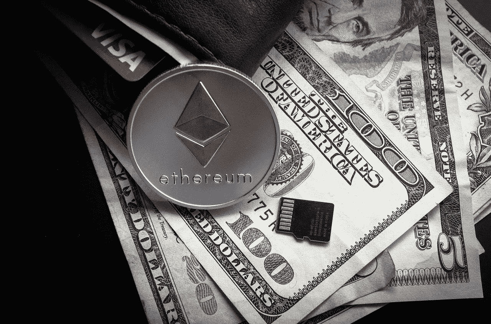

# 比特币是通胀的避风港吗？

> 原文：<https://medium.com/coinmonks/is-bitcoin-a-haven-from-inflation-7a05e709aaf3?source=collection_archive---------78----------------------->

Source: [https://bxmi.io/](https://bxmi.io/)

比特币经常被加密货币爱好者吹捧为对冲通胀的工具。随着世界各国政府开始向其经济注入数万亿美元，疫情创造了检验这一观点的理想条件。在全球经济努力稳定之际，比特币会给投资者提供避风港吗？

> **参见:** [**加密货币是如何工作的？加密货币初学者指南。**](/@bitxmiblog/how-do-cryptocurrencies-work-beginners-guide-to-cryptocurrencies-b1915189fd4f)

**简介**

Source: Unsplash.com

货币有两种基本类别:**通货膨胀和通货紧缩**。通货膨胀的货币有无限的供给，而通货紧缩的货币有有限的供给。保持其他变量不变，通货膨胀货币的购买力下降，因为更多的单位被生产。相比之下，通货紧缩货币的价值随着时间的推移而增加，因为它们变得越来越稀缺。

法定货币是通货膨胀的，而大多数加密货币在某种程度上是通货紧缩的。

**通货膨胀和通货紧缩的根本区别**

法定货币的汇率是自由浮动的(它们的价值是相对于其他货币的)。法定货币可能会在任何时候被创造出来，这使得它具有内在的通货膨胀性。流通中的单位越多，贬值的可能性就越大。固定货币与实物挂钩或受代码限制。它们本质上是通货紧缩的，因为它们不可能是一时兴起制造出来的。它们通常会因为固定或下降的供应和持续的需求而涨价。

**浮动与固定货币**

历史上，货币是固定的。它们的价值由实物决定，最常见的是中央银行的黄金储备。这种储备根据一种货币可以购买的黄金数量来定义其价值。如果一个公民愿意，他或她可以去中央银行要求用黄金来交换他们的钱。

另一方面，国家银行在 20 世纪 70 年代开始放弃黄金储备。到二十世纪初，绝大多数国家已经完全废除了死刑。他们的货币变得浮动，这意味着他们的价值取决于他们与其他货币的汇率。传统货币现在的价值完全建立在一个广泛认同的基础上。这就是为什么它们被称为法定货币(拉丁语意为“许可”)。

放弃金本位的一个重要副作用是，法定货币导致了通货膨胀。中央银行现在可以随心所欲地印钞票，而不用公开披露他们的行为。流通中的货币数量持续增长，削弱了其购买力。

**加密货币可以被认为是通货紧缩**

另一方面，加密货币是分散的数字资产，不受任何政府或组织的管辖。他们的算法经常为他们的供给设定一个永远无法超越的极限。一旦达到这样的上限，加密货币的供应就会停止。如果感知需求保持不变，价格可能会上涨。

比特币是第一种也是最大的加密货币，永远不会生产超过 2100 万枚硬币。在这个池耗尽之后，将不会再有比特币被创造出来。事实上，大部分硬币(在撰写本文时将近 1800 万枚)已经被开采。由于采矿激励的减少，比特币已经可以被认为是通货紧缩的。当达到这个极限时，经济将回到真正的通货紧缩状态。类似的限制也适用于莱特币和比特币现金。

**加密货币如何获得通缩特性**

然而，某些其他加密货币走了一条不同的道路。通过一种不同的技术，Ripple 让本国货币 XRP 出现了通货紧缩。当 Ripple 最初开始时，团队分发了他们的全部 XRP(1000 亿)。其中的 550 亿已经被托管(保存在一个特殊的账户中)，而剩余的部分每天都在消耗，因为每笔交易都会消耗(或破坏)一点 XRP。

并非每种加密货币都有可生成单位数量的硬编码限制。基于利害关系证明(PoS 是以太坊的开发策略)的加密平台不存在最大供应限制。然而，这并不意味着 ETH 等加密货币会引发通胀。与可以随心所欲发行货币的央行相比，创建新加密单位的过程是清晰且可预测的。由于区块链的开放性，市场甚至可以在变化发生之前进行调整。

**以太坊有供应上限吗？**

如今流通的以太坊代币数量与 2015 年夏天以太坊网络刚起步时相差甚远。当时流通的 ETH 总量约为 7200 万。到 2021 年 1 月，有 1.135 亿枚代币在流通，现在大约有 1.2 亿枚。

> **另见:** [**需要用 Bitxmi 交易所交易的 8 个理由。**](/@bitxmiblog/8-reasons-you-need-to-trade-with-bitxmi-exchange-c4bff2ab3096)

**通货膨胀与法定货币**

Source: Pixabay.com

在法定货币经济中，通货膨胀是不可避免的。因此，投资者、经济专家和个人一直在寻找可行的解决方案来长期摆脱它。例如，黄金、股票和房地产在历史上为担心投资因通胀而贬值的投资者提供了安慰。

作为世界上最大的加密货币，比特币在过去五年中一直是最好的金融资产之一，涨幅超过 4700%。

除了潜在的巨额财务收益，投资者可能会求助于比特币来对冲通胀。然而，比特币是对冲经济价格上涨的现实钱包补充吗？

什么是通胀对冲？

与消费价格指数同向变动且变动幅度大于消费价格指数的金融产品被称为通胀对冲(CPI)。因此，随着商品和服务价格的上涨，基础资产的价值也应该上涨。因此，投资者的价格力量不会随着时间而下降。

**比特币作为电子黄金的一种形式**

从历史上看，投资者转向黄金来保护自己免受通货膨胀的影响。其概念是，如果消费者价格上涨，由于美元(或欧元)贬值，黄金等硬资产的成本也应相应增加。然而，黄金作为通胀对冲工具的过去是可疑的。曾有过严重通胀的时期，最明显的是上世纪 80 年代，在此期间，持有黄金会产生负回报。

与黄金一样，比特币因其稀缺性和与其他金融资产缺乏相关性而与众不同。世界上的黄金供应量是有限的，永远不会超过 2100 万个比特币。由于供应受限，价格会随着资产需求的增加而上涨。

然而，由于比特币是一种新的资产类别，其价格目前完全由投机而非通胀控制。或许随着加密货币的采用增加和波动性下降，在投资者看来，比特币将成为黄金的一个重要竞争对手。

**比特币最近的表现如何？**

在此前的两个月里，这种加密货币已经贬值了 23%。因此，即使存在实际的历史通胀，比特币也不符合真正通胀对冲的标准。

然而，当我们使用不同的方法时，一个更重要的概念出现了。抵御物价上涨威胁的最关键方法是拥有价值增长快于通胀率的资产，这是一个健康、运转良好的经济体的特征。因此，随着时间的推移，你保持了你的购买力。的确，你可以提高你的购买力。这就是比特币作为对冲通胀的亮点所在。

**稳定作为一种选择**

加密货币通常会经历剧烈的价格波动，对许多人来说，这使它们成为一种没有吸引力的价值储存手段。虽然在股票等传统市场中，24-48 小时内价格下跌 30%被视为罕见和灾难性的，但这种事件在加密货币市场中非常常见。如果你担心比特币的波动性，可以考虑采用稳定的比特币，比如 BUSD。

**结论**

比特币经常被加密货币爱好者吹捧为对冲通胀的工具。在全球经济努力稳定之际，比特币会给投资者提供避风港吗？有两种基本的货币:通货膨胀和通货紧缩。通货膨胀货币的购买力随着更多单位的生产而下降，而通货紧缩货币的价值随着其变得稀缺而上升。加密货币是分散的数字资产，不受任何政府或组织的管辖。

他们的算法经常为他们的供给设定一个永远无法超越的极限。一旦达到这样的上限，供应就会停止，价格可能会上涨。作为世界上最大的加密货币，比特币在过去五年里一直是最好的金融资产之一。通货膨胀套期保值是一种金融产品，其走势与消费价格指数相同，且幅度大于消费价格指数，称为通货膨胀套期保值。在过去的两个月里，比特币已经损失了 23%的价值。

作为一种新的资产类别，其价格目前完全由投机而非通胀控制。比特币作为一种对冲通胀的工具大放异彩，因为它的价值增长往往快于通胀率。

> *加入 Coinmonks* [*电报频道*](https://t.me/coincodecap) *和* [*Youtube 频道*](https://www.youtube.com/c/coinmonks/videos) *了解加密交易和投资*

# 另外，阅读

*   [3 商业评论](/coinmonks/3commas-review-an-excellent-crypto-trading-bot-2020-1313a58bec92) | [Pionex 评论](https://coincodecap.com/pionex-review-exchange-with-crypto-trading-bot) | [Coinrule 评论](/coinmonks/coinrule-review-2021-a-beginner-friendly-crypto-trading-bot-daf0504848ba)
*   [莱杰 vs n rave](/coinmonks/ledger-vs-ngrave-zero-7e40f0c1d694)|[莱杰 nano s vs x](/coinmonks/ledger-nano-s-vs-x-battery-hardware-price-storage-59a6663fe3b0) | [币安评论](/coinmonks/binance-review-ee10d3bf3b6e)
*   [Bybit Exchange 审查](/coinmonks/bybit-exchange-review-dbd570019b71) | [Bityard 审查](https://coincodecap.com/bityard-reivew) | [Jet-Bot 审查](https://coincodecap.com/jet-bot-review)
*   [3 commas vs Cryptohopper](/coinmonks/3commas-vs-pionex-vs-cryptohopper-best-crypto-bot-6a98d2baa203)|[赚取加密利息](/coinmonks/earn-crypto-interest-b10b810fdda3)
*   最好的比特币[硬件钱包](/coinmonks/hardware-wallets-dfa1211730c6) | [BitBox02 回顾](/coinmonks/bitbox02-review-your-swiss-bitcoin-hardware-wallet-c36c88fff29)