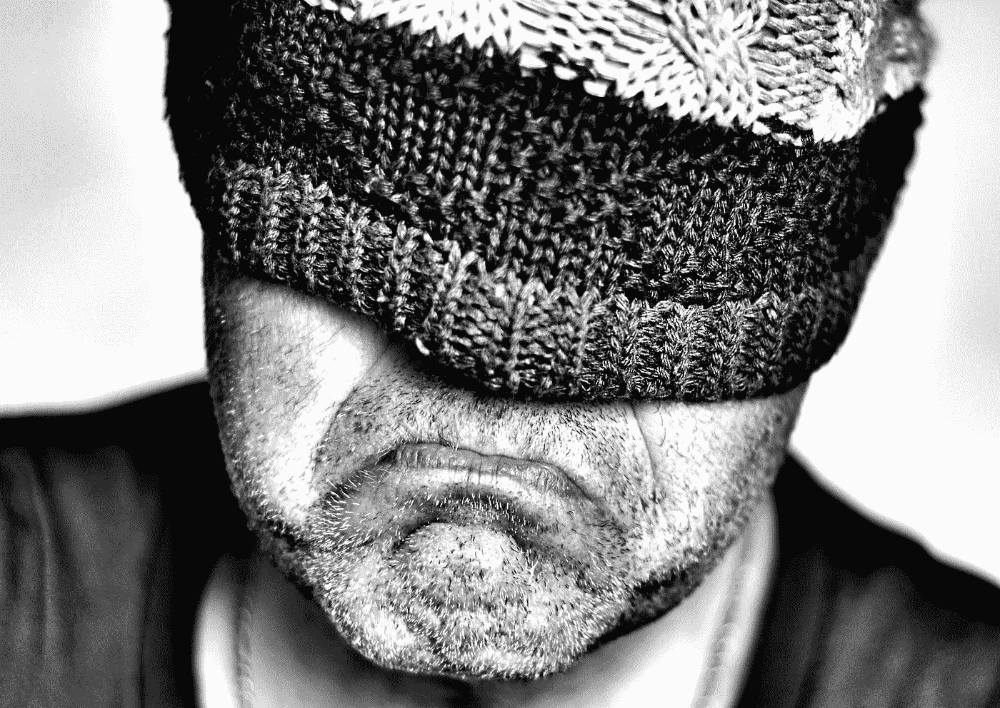
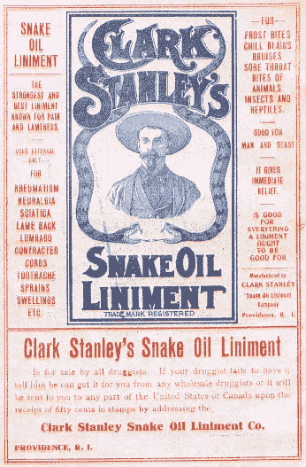

# 比特币是泵&转储吗？

> 原文：<https://medium.com/coinmonks/is-bitcoin-a-pump-dump-af31584209b4?source=collection_archive---------25----------------------->

Image credit: [CJS*64](https://www.flickr.com/photos/16210667@N02/16588216798)

Game Stock (GME)的股票丑闻在一个名为 [Wall Street Bets](https://www.reddit.com/r/wallstreetbets/) (WSB)的 subreddit 频道公开上演，最初被媒体称为的[是历史上最大的泵和转储骗局之一。这个标签后来被前 SEC 主席 Jay Clayton 和其他人质疑，他们称之为空头挤压。不管怎样，在 GME 购买狂潮最高潮的时候，我和其他人都很难不关注围绕 WSB 的新闻。这就像每天看着一辆汽车即将坠毁。然而，这不是一个泵和倾倒计划。](https://www.cnbc.com/2021/01/28/gamestop-now-called-a-pump-and-dump-scheme-what-you-need-to-know.html)

在接受美国消费者新闻与商业频道采访时，克莱顿说，“如果你看看这方面的整体参与情况，这里发生的事情是相当透明的。人们对于他们在做什么以及为什么要这么做非常透明，这相当有趣。我认为，从理论上讲，你提出了一个很好的论点，即一群人决定他们喜欢这只(同一只股票)并没有什么不同。我不认为他们会像《华尔街之狼》中的[斯特拉顿·奥克蒙特](https://en.wikipedia.org/wiki/Stratton_Oakmont)那样聚在一起一起做这件事。

我认为加密货币及其相关产品，如 NFTs，可能存在一个实际的泵和转储骗局。crypto 背后的大肆宣传令人难以置信。尽管自去年 11 月中国关闭加密大门以来，比特币的价格已经下跌，但加密背后的噪音仍在继续增长。每个月似乎都有新的以加密货币为重点的出版物突然出现。有影响力的科技记者现在正在报道主流商业出版物的加密技术。结果呢？他们发表的关于 crypto 和 NFT 的文章充斥着我们的 Google 新闻。

该泵不限于新闻馈送。事实上，它无处不在。也许你错过了今年的秘密超级碗？

为即将到来的垃圾场做好准备。我预测这将在年底前发生。很多人将一无所有，只有损失。我们是不是被历史上最大的泵和倾倒骗局陷害了？让我们坦率地说，对加密的渴望——这是非常难以抗拒的，因为它利用了人们对错过(FOMO)一些重大事情的恐惧，这些事情甚至可能改变生活。我也不能幸免于 FOMO，因为它与当前的分权产物有关。没有人是，甚至我们的总统也不是。

然而，当比特币最终达到长期预测的每枚 10 万美元的价格时，会发生什么呢？你会成为 dump 俱乐部的一员，还是真正相信比特币的俱乐部的一员，玩长线游戏的 Redditor 认为比特币会在永久下跌后反弹？他们或许还是那些仍持有毫无价值的 GME 股票的 Redditors？每个骗子都需要一个傻瓜，Reddit 上到处都是。然而，加密泵的力量远远超出了 Reddit。正如我上面提到的，炒作无处不在。甚至有加密“产品”，如 NFT，几乎看起来像泵和转储游乐场。

## **蛇油&NFT**

你知道[流行短语“蛇油推销员”背后的真实故事吗？如果是这样，那么你知道真正的东西，来自中国的真正的蛇油，做了它被泵送去做的事情——它是治疗疼痛的奇迹。在 19 世纪，许多中国移民带着蛇油来到美国从事铁路建设工作。他们与美国同事分享了这种神奇的混合物，消息传开了。然而，获得更多的原始酊剂是不可能的。](https://imhm.org/blog/10252600)

然而，这并没有阻止有事业心的美国人从蛇油的流行中获利。许多人制作他们自己的混合物，称之为蛇油，并在城镇间出售。镇上的人听说了这个奇迹的故事后，会成群结队地出现，想要得到一些。他们会买下蛇油卖家的股份。然后他会制造更多的钱，然后转移到下一个城镇，重复这个过程。等到镇上的人试了酊剂，发现他们被骗了，蛇油推销员和他们的钱早就不见了。

把 NFT 想象成蛇油，记住这个传说。最初的蛇油来自中国，理论上是可以复制的。然而，随着旅行和物流发展到 19 世纪，想象一下试图大量复制只能在中国生产的东西。从理论上讲，有可能让一个人变得富有的非技术产业是存在的。NFT 的一次拍卖或许有可能复制最初 300 只无聊猿的力量，但这在现在看来就像 1800 年的中国一样遥远。

以太坊的联合创始人维塔利克·布特林在最近接受《时代》杂志采访时说:“危险在于，你拥有了这些价值 300 万美元的猴子，这变成了一种不同的赌博。”。

布特林指的是 Bored Ape 游艇俱乐部，这是迄今为止第一个也是最受欢迎的 NFT 系列，迄今为止交易总额超过[14.1 亿美元](https://dappradar.com/ethereum/collectibles/bored-ape-yacht-club)。它让一些最初的买家变得异常富有。BAYC 和整个 NFTs 的问题在于，如今大多数 BAYC 的 NFT 所有者都是富裕阶层，他们花了数百万美元购买看起来无聊的猿类图片，这些图片除了充当洗钱工具之外，除了它们的“稀有性”之外没有任何价值。除此之外，自那以后，没有一笔 NFT 的交易能模仿出售 BAYC 的投资力量。有点像最初的蛇油，对吧？

现代版的蛇油推销员——那些为 crypto 及其相关产品(如 NFTs)注入投资力量的人，包括名人、前政治家、运动员、企业品牌、技术和社交媒体影响者，以及拥有重大社会影响力的任何人或任何事物。

在我看来，这是一个滑坡。如今购买 NFT 就像购买美国蛇油一样安全。你很可能会失去你所有的投资，要么是通过刑事地毯拉，在这种情况下，NFT 的创造者得到了你的现金和运行，或者因为你购买的 NFL NFT 是一个哑弹。

小心水泵。害怕垃圾场。

比特币是泵和转储吗？我们很快就会知道了。

*   结束

> 加入 Coinmonks [电报频道](https://t.me/coincodecap)和 [Youtube 频道](https://www.youtube.com/c/coinmonks/videos)了解加密交易和投资

# 另外，阅读

*   [币安 vs FTX](https://coincodecap.com/binance-vs-ftx) | [最佳(SOL)索拉纳钱包](https://coincodecap.com/solana-wallets)
*   [如何在 Uniswap 上交换加密？](https://coincodecap.com/swap-crypto-on-uniswap) | [A-Ads 审查](https://coincodecap.com/a-ads-review)
*   [加密货币储蓄账户](/coinmonks/cryptocurrency-savings-accounts-be3bc0feffbf) | [YoBit 审核](/coinmonks/yobit-review-175464162c62)
*   [Botsfolio vs nap bots vs Mudrex](/coinmonks/botsfolio-vs-napbots-vs-mudrex-c81344970c02)|[gate . io 交流回顾](/coinmonks/gate-io-exchange-review-61bf87b7078f)
*   [CoinFLEX 评论](https://coincodecap.com/coinflex-review) | [AEX 交易所评论](https://coincodecap.com/aex-exchange-review) | [UPbit 评论](https://coincodecap.com/upbit-review)