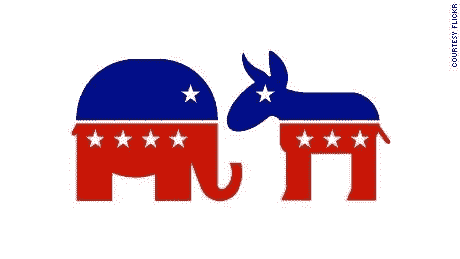

# 比特币是右翼的东西吗？

> 原文：<https://medium.com/coinmonks/is-bitcoin-a-right-wing-thing-b613384439ce?source=collection_archive---------7----------------------->

比特币玩家都戴 MAGA 帽子吗？

> *“比特币宣传是 1 月 6 日华盛顿美国国会大厦袭击的续集”。”—戴夫·特洛伊，作家，演说家。*

是吗？

美国人分化严重。右对左。保守派对自由派。似乎比以往任何时候都更加如此。这种超党派精神在对金钱和货币的看法中盛行吗？其实也不太清楚。

