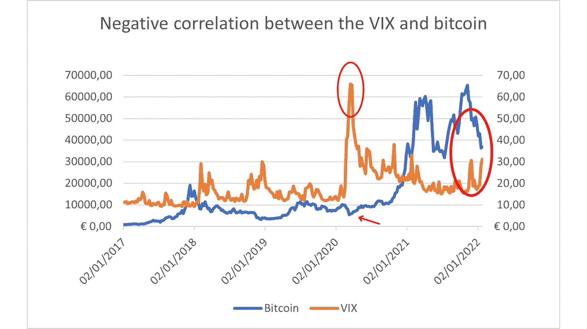
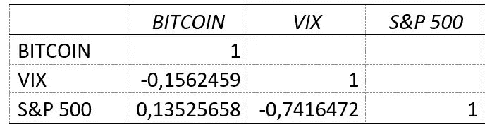
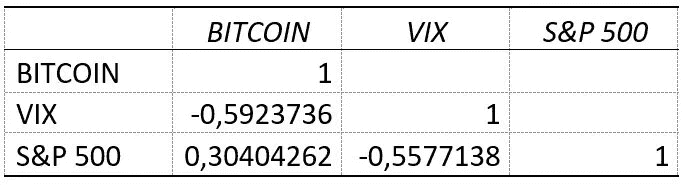
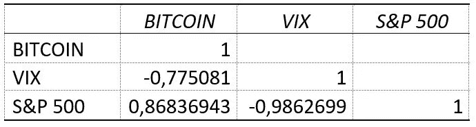

# 比特币是避风港吗？相关分析及其他思考

> 原文：<https://medium.com/coinmonks/is-bitcoin-a-safe-haven-d13bea73edab?source=collection_archive---------5----------------------->

比特币应该有许多不同的属性。在这篇文章中，我们将重点关注比特币作为一个避风港。

根据 Baur 和 Lucey 的说法，安全港是“在市场压力或动荡时期，与另一种资产或投资组合不相关或负相关的资产”。因此，**是一种在熊市期间有望保值甚至增值的资产**。举个例子，黄金通常被认为是安全的避风港。

关于比特币，加密货币的**去中心化特性使其独立于货币政策。这导致一些投资者认为比特币与经济的一般节奏无关。换句话说，[将比特币视为潜在的避风港](https://www.aranca.com/knowledge-library/articles/investment-research/is-bitcoins-a-safe-haven)。**

为了对比这一假设，我们将研究比特币、VIX 和标准普尔 500 之间的相关性。相关系数**衡量两个变量**之间关系的强度和方向。其值介于-1 和 1 之间，其中-1 表示完全负相关，1 表示完全正相关。因此，**比特币应该与标准普尔 500 指数负相关**,从而被认为是一种安全的避风港。这意味着，每当标准普尔 500 指数下跌时，比特币的估值就会上升。数字越接近-1，相关性越强。

与 VIX 相关的是所谓的华尔街恐惧指数。由于 VIX 是使用标准普尔 500 指数期权的价格计算的，它通常被用来预测未来 30 天的波动性。因此，它与投资者情绪相呼应。例如，VIX 价值的增加意味着投资者对金融市场的未来越来越担忧。因此，标准普尔 500 指数应该会下跌。

## **免责声明**

重要的是要认识到*相关性并不意味着因果关系*。这意味着，从两个变量之间的相关性，你不能推断出因果关系。标准普尔 500 和 VIX 正相关的事实并不一定意味着标准普尔 500 的变化是由 VIX 的变化引起的，反之亦然。

另一方面，请注意，有经验的统计学家肯定会告诉你，在这种情况下，相关系数不是最准确的统计工具。然而，这可能是最方便的一种。有更合适的工具来分析关系的强度，但它们也更难使用。因此，为了对问题有一个总体的了解，相关系数应该足够好。

还要记住，这种分析仅限于确定比特币是否可以被视为安全港。它不打算预测未来的估值，也不打算研究比特币背后的技术。

## **一瞥图形**

下面我们用下图开始分析比特币和 VIX 的相关性:

正如你所见，**这两个变量似乎是负相关的**。一般来说，如果 VIX 上涨，比特币价格就会下跌。反之亦然:当比特币看涨时，VIX 指数下跌。你可能还会注意到，在某些时期，这条规则似乎特别准确。这是在 2020 年 3 月股市崩盘期间和 2022 年 1 月。

所有这些给了我们一个总的印象，但是这并没有超越直觉，直觉可能是错误的。我们也不知道这种关系的强度。是的，这两个变量似乎是负相关的。但是，要确定关系的强弱，需要计算这一时期的相关系数。

## 做数学

上表是一个相关矩阵，显示了比特币、VIX 和标准普尔 500 的相关系数。用于计算系数的数据集是 2014 年 9 月 22 日至 2022 年 1 月 24 日之间的每周数值变化。以下是一些结论:

*   首先，我们可以肯定的是**比特币与 VIX 指数**存在负相关关系。但是，这种关系是**弱**。记住相关系数的范围在-1 和 1 之间。在这种情况下，即使数字是负数，它也更接近于 0。只要看看标准普尔和 VIX 之间的相关系数:a -0.74，它们有更强的相关性。
*   总的来说，**比特币的表现似乎与 S & P 500** 相似。尽管相关关系较弱，但事实证明比特币与 VIX 呈负相关，就像标准普尔 500 指数一样。你可以看一下比特币和 S & P 500 的相关系数，发现它们是正相关的。然而，这种关系再次变得脆弱。

我们已经看到比特币和标准普尔 500 的波动方式有一些相似之处。因此，就目前而言，比特币远未被视为避风港。然而，这不能被认为是一个结论性的声明:关系比预期的更弱。

在图表中，我们显示比特币和 VIX 指数之间的负相关性在两个特定时刻似乎更强:疫情崩盘和 2022 年 1 月的熊市。所以，让我们来看看这几个时期的相关性，看看是否能有更确凿的结论。

Data set: 24–02–2020 to 20–04–2020

Data set: 03–01–2022 to 24–01–2022

我们的直觉是有根据的！用-0.59 和-0.77 我们现在可以肯定，**在这两个时期，比特币与 VIX 指数有很强的负相关性。在第一个时期，即 2020 年股市崩盘期间，这种关系甚至比标准普尔 500 指数和 VIX 之间的关系还要牢固。同样值得一提的是，比特币和 S & P 500 也有很强的关系，尤其是在第二个时期。**

## 最后的想法

这一分析让我们得出结论，在过去的几年里，**比特币并没有表现得像一个避风港**。尤其是在市场压力时期——事实上，这是将一种资产归类为安全港的最相关的时刻。

然而，另一个考虑是值得注意的。用于与比特币进行比较的指数都是与美国相关的指数。然而，我敢打赌，如果我们拿欧洲或日本的其他指数作比较，结果会非常相似。相关性更强的时期是**全球**事件、**全球危机时刻**。这让我想到，比特币作为一种全球货币，是与全球经济联系在一起的，而不是与地方或国家经济联系在一起的。

比特币的国际特性符合其本质:它是一种加密货币，一种数字资产，世界上的每个人都可以不受限制地使用。因此，比特币会受到全球变化的影响，但不会受到国家事务的影响，只要它们是国家事务，并且不会成为全球关注的问题。因此，尽管我们的结论是比特币并不像美国的避风港，但研究这种说法是否会在卷入更多冲突或本币贬值的国家发生变化将是有趣的。

*在*[*LinkedIn*](https://www.linkedin.com/in/samuel-aleksander-sanchez/)*上联系我。*

# 关于这个话题的一些其他资源:

*   [为什么加密货币永远不会是避风港](https://mises.org/wire/why-cryptocurrencies-will-never-be-safe-havens)。马克·斯皮兹纳戈尔。
*   [比特币、货币和脆弱性](https://www.fooledbyrandomness.com/BTC-QF.pdf)。纳西姆·尼古拉斯·塔勒布。

> *加入 Coinmonks* [*电报频道*](https://t.me/coincodecap) *和* [*Youtube 频道*](https://www.youtube.com/c/coinmonks/videos) *了解加密交易和投资*

# 另外，阅读

*   [有哪些交易信号？](https://coincodecap.com/trading-signal) | [Bitstamp vs 比特币基地](https://coincodecap.com/bitstamp-coinbase) | [买索拉纳](https://coincodecap.com/buy-solana)
*   [ProfitFarmers 回顾](https://coincodecap.com/profitfarmers-review) | [如何使用 Cornix Trading Bot](https://coincodecap.com/cornix-trading-bot)
*   [十大最佳加密货币博客](https://coincodecap.com/best-cryptocurrency-blogs) | [YouHodler 评论](https://coincodecap.com/youhodler-review)
*   [my constant Review](https://coincodecap.com/myconstant-review)|[8 款最佳摇摆交易机器人](https://coincodecap.com/best-swing-trading-bots)
*   [MXC 交易所评论](/coinmonks/mxc-exchange-review-3af0ec1cba8c) | [Pionex vs 币安](https://coincodecap.com/pionex-vs-binance) | [Pionex 套利机器人](https://coincodecap.com/pionex-arbitrage-bot)
*   [我的密码交易经验](/coinmonks/my-experience-with-crypto-copy-trading-d6feb2ce3ac5) | [比特币基地评论](/coinmonks/coinbase-review-6ef4e0f56064)
*   [CoinFLEX 评论](https://coincodecap.com/coinflex-review) | [AEX 交易所评论](https://coincodecap.com/aex-exchange-review) | [UPbit 评论](https://coincodecap.com/upbit-review)
*   [AscendEx 保证金交易](https://coincodecap.com/ascendex-margin-trading) | [Bitfinex 赌注](https://coincodecap.com/bitfinex-staking) | [bitFlyer 评论](https://coincodecap.com/bitflyer-review)
*   [麻雀交换评论](https://coincodecap.com/sparrow-exchange-review) | [纳什交换评论](https://coincodecap.com/nash-exchange-review)