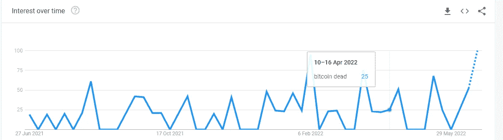
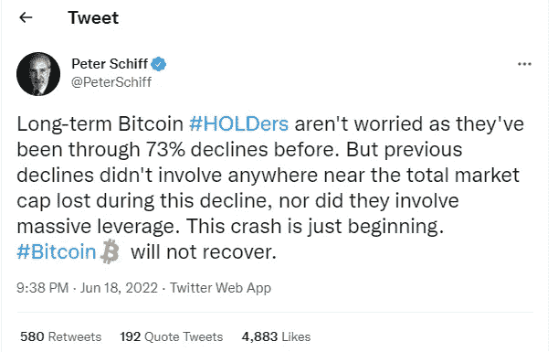
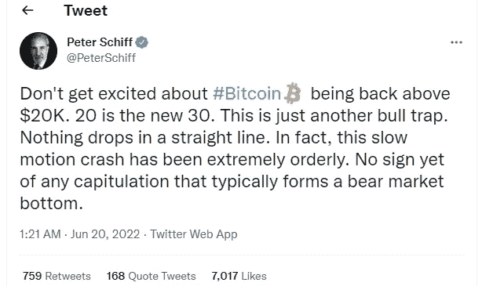
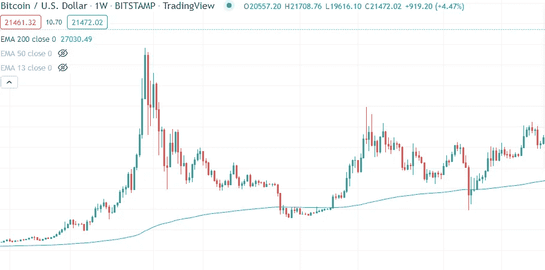
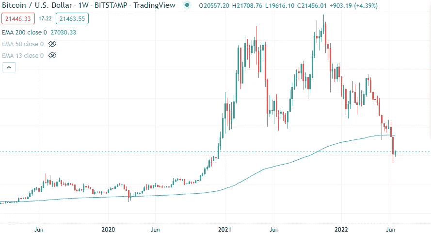

# 比特币死了吗？

> 原文：<https://medium.com/coinmonks/is-bitcoin-dead-88f46d034024?source=collection_archive---------45----------------------->

2022 年 6 月 25 日星期六

过去几周，在谷歌上搜索“比特币已死”和“比特币已死”这两个词的数量激增。作为顶级货币的加密货币的担忧，比特币已经下跌超过 65%，在投资者中有所上升。交易价格大约在 21000 美元左右，评论家声称它永远不会从下跌中恢复。

[**图片来源:谷歌趋势**](https://trends.google.com/trends/explore?q=bitcoin%20dead&geo=DE)

根据 99Bitcoin.com 上列出的比特币讣告，比特币已经死了 450 多次。Euro Pacific Bank 的所有者彼得·希夫(Peter Schiff)说，长期投资者很清楚波动性，因为它已经下跌了 73%，但这次暴跌中的市值跌幅远不及上次的下跌，也没有像这次暴跌那样涉及大规模杠杆。除了讣告，他[在 6 月 18 日发推文](https://twitter.com/PeterSchiff/status/1538191943561359361)说,“这次崩溃只是开始，比特币最糟糕的还在后面，它不会恢复。

比特币从 18k 美元支撑到 20k 美元短暂回升后。Peter Schiff 在 6 月 20 日写了另一条推文,他认为没有什么可兴奋的，这是一个牛市陷阱，因为任何东西都不会直线下跌，这次崩溃更是有序的，没有投降的迹象，这通常会形成熊市底部。

[Ku 钱币公司首席执行官 Johnny Lyu](https://www.financialexpress.com/digital-currency/kucoin-ceo-johnny-lyu-exclusive-interview-crypto-crash-impact-india-plans/2570209/) 对加密货币持乐观态度，他在给《金融快报》的一封邮件中表示，即将到来的世界经济危机正在推动市场进入调整期。在 10 多年的历史中，比特币经历了几次大起大落，在某些时候，空头压倒了多头，但大多数时候，多头压倒了空头。因此，市场低迷是暂时的，未来是光明的。

专家表示，尽管比特币拥有约 2 万美元的支撑，并且市场出现了为期 2 天的短暂复苏，但投资者仍处于极度恐惧之中，因为没有看涨趋势的迹象。

> 交易新手？尝试[加密交易机器人](/coinmonks/crypto-trading-bot-c2ffce8acb2a)或[复制交易](/coinmonks/top-10-crypto-copy-trading-platforms-for-beginners-d0c37c7d698c)

“比特币在几天内大约恢复了 9%，但由于市场极度恐惧，趋势没有逆转，”Wazirx 交易台的分析师在一份报告中分享道。

持有 19k 美元的支撑，阻力位似乎是 22k 美元。比特币的交易价格远低于 200 均线，根据数据，这是新资金进入并扭转趋势的最佳时机。

比特币经历了多次崩溃，以下按时间顺序列出了三次主要的崩溃。

2011 年 6 月:— 99%

2011 年，比特币从 32 美元飙升至 2 美元。由于犯罪分子在 6 月 19 日入侵了世界上最大的比特币交易所 Mt.Gox，比特币的价值跌至一分钱。数据显示，数百个账户遭到入侵，损失了价值数百万美元的比特币。

2013 年 4 月:— 83%

2013 年 4 月，比特币从 260 美元跌至 50 美元，成为其成功的受害者，因为投资者试图过度利用主流媒体中令人兴奋的机会。交易量如此之大，以至于 Mt.Gox 无法处理交易量，这为黑客创造了突破的机会，迫使 Mt.Gox 前所未有地关闭。

2017 年 12 月-2018 年 12 月:-84%

2017 年，比特币的价值出现了巨大的飙升，在 10 个月内从大约 1000 美元飙升至 20000 美元的峰值。很明显，泡沫产生了，随着投资者开始获利，泡沫破裂，价格升至 12000 美元。整个 2018 年，随着来自韩国和日本的主要黑客攻击的影响，市场仍处于低迷状态，在紧张的投资者退出市场后，有关这些国家计划禁止比特币的传言导致价格大幅下跌。

最近，2022 年 6 月，由于经济危机、地缘政治紧张局势和特拉-UST 稳定硬币崩溃，比特币从 68000 美元的峰值跌至 21000 美元，但币安等大型交易所寻求这种情况作为机会之门，从而[雇用许多新人才](https://www.binance.com/en/careers/job-openings)。

专家表示，监管市场非常重要，研究人员正在[致力于开发](https://www.mdpi.com/1999-5903/14/6/162)比特币将如何以积极和消极的方式影响全球社会，以增强金融生态系统。

根据 Indeed(美国全球就业网站)的数据，加密货币工作岗位在过去 4 年增长了 1457%。

比特币在其短暂的历史中，即使在遭到严厉批评并多次宣布死亡后，也挺过了最糟糕的情况。这种顶级货币的未来到底有多神秘，还有待观察。

> 加入 Coinmonks [电报频道](https://t.me/coincodecap)和 [Youtube 频道](https://www.youtube.com/c/coinmonks/videos)了解加密交易和投资

# 另外，阅读

*   [BigONE 交易所评论](/coinmonks/bigone-exchange-review-64705d85a1d4) | [CEX。IO 审查](https://coincodecap.com/cex-io-review) | [Swapzone 审查](/coinmonks/swapzone-review-crypto-exchange-data-aggregator-e0ad78e55ed7)
*   [最佳比特币保证金交易](/coinmonks/bitcoin-margin-trading-exchange-bcbfcbf7b8e3) | [比特币保证金交易](https://coincodecap.com/bityard-margin-trading)
*   [加密保证金交易交易所](/coinmonks/crypto-margin-trading-exchanges-428b1f7ad108) | [赚取比特币](/coinmonks/earn-bitcoin-6e8bd3c592d9)
*   [WazirX vs CoinDCX vs bit bns](/coinmonks/wazirx-vs-coindcx-vs-bitbns-149f4f19a2f1)|[block fi vs coin loan vs Nexo](/coinmonks/blockfi-vs-coinloan-vs-nexo-cb624635230d)
*   [BlockFi 信用卡](https://coincodecap.com/blockfi-credit-card) | [如何在币安购买比特币](https://coincodecap.com/buy-bitcoin-binance)