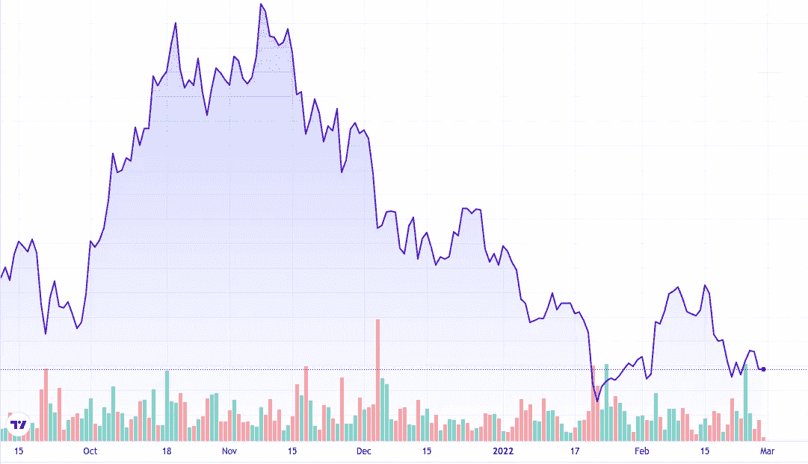

# 比特币在走下坡路吗？比特币崩盘了吗？

> 原文：<https://medium.com/coinmonks/is-bitcoin-going-down-is-bitcoin-crashing-6e6f1082cec8?source=collection_archive---------20----------------------->

对于加密货币投资者来说，这是艰难的几个月，尽管他们现在应该已经习惯了极端的波动性。加密市场崩溃始于去年 11 月，持续 3 个月的加密下跌导致旗舰比特币跌至 6 个月低点，从市场上抹去了数十亿美元的价值。这里是你需要知道的关于加密崩溃的事情，以及保护你自己免受任何即将到来的加密崩溃的最好方法。

# 加密崩溃有多严重？

在编写时，加密货币的总市值约为 1.56 万亿美元，比 2021 年 11 月的历史高点 2.9 万亿美元下降了近 50%。

仅在本周，随着俄罗斯全面入侵乌克兰，欧洲传来令人不安的消息，超过 5000 亿美元的资金从联合加密市场中消失。目前 50%的下降仍然有很长的路要走，以匹配 2017 年比特币崩盘，从 2017 年 12 月的峰值下跌了令人瞠目的 80%。

# 比特币为什么会崩盘？

很难定义任何加密崩溃的确切细节，但分析师们一直在讨论几种理论。最近加密市场的下跌可能是一个更大难题的一部分，因为传统的股票和证券市场也处于下行趋势，新冠肺炎限制抑制了全球供应链，美联储计划比预期更早结束刺激计划。现在，随着全世界的目光聚焦于欧洲日益加剧的紧张局势，如果情况继续升级，全球金融市场可能会经历艰难的几年。

随着加密货币获得更多主流吸引力，更多传统投资者参与其中，加密和证券市场的联系越来越紧密，比特币作为“数字黄金”的声誉受到最近比特币崩溃的严重损害，这与通货膨胀相关的宏观经济新闻和地缘政治紧张局势直接相关。

# Cavallo Capital 的中性 beta 策略如何在加密崩溃时保护资本？

我们利用在我们的低延迟分布式计算网络上运行的机器学习 AI 算法来自动识别和构建具有一定程度可预测性的均值回复利差的投资组合。我们的交易策略最好被描述为一种统计套利形式，其设计是利用资产之间长期均衡的短期偏差。根据对最有可能超过投资组合中可用资产的横截面中位数的资产的识别，建立多头头寸，同时对预测表现低于横截面中位数的资产建立空头头寸，通过这种方式，最终的投资组合对广泛的市场波动具有最小的风险。

对我们的平台在过去 12 个月中执行的 300，000+交易的实证分析显示，平均夏普比率为 2.768，贝塔系数为 0.113，阿尔法世代超过比特币多头头寸 18.119%，我们相信这代表了我们在 Cavallo Capital 的研究人员和开发人员团队的非凡合作成就，我们很自豪地开始扩大我们的运营规模，并为更广泛的零售客户服务。

联系加密保本专家 [Cavallo Capital](http://cavallo.capital) ，不再担心比特币下跌或崩溃。

> *加入 Coinmonks* [*电报频道*](https://t.me/coincodecap) *和* [*Youtube 频道*](https://www.youtube.com/c/coinmonks/videos) *了解加密交易和投资*

# 另外，阅读

*   [3 商业评论](/coinmonks/3commas-review-an-excellent-crypto-trading-bot-2020-1313a58bec92) | [Pionex 评论](https://coincodecap.com/pionex-review-exchange-with-crypto-trading-bot) | [Coinrule 评论](/coinmonks/coinrule-review-2021-a-beginner-friendly-crypto-trading-bot-daf0504848ba)
*   [莱杰 vs n rave](/coinmonks/ledger-vs-ngrave-zero-7e40f0c1d694)|[莱杰 nano s vs x](/coinmonks/ledger-nano-s-vs-x-battery-hardware-price-storage-59a6663fe3b0) | [币安评论](/coinmonks/binance-review-ee10d3bf3b6e)
*   [Bybit Exchange 审查](/coinmonks/bybit-exchange-review-dbd570019b71) | [Bityard 审查](https://coincodecap.com/bityard-reivew) | [Jet-Bot 审查](https://coincodecap.com/jet-bot-review)
*   [3 commas vs crypto hopper](/coinmonks/3commas-vs-pionex-vs-cryptohopper-best-crypto-bot-6a98d2baa203)|[赚取加密利息](/coinmonks/earn-crypto-interest-b10b810fdda3)
*   最好的比特币[硬件钱包](/coinmonks/hardware-wallets-dfa1211730c6) | [BitBox02 回顾](/coinmonks/bitbox02-review-your-swiss-bitcoin-hardware-wallet-c36c88fff29)
*   [BlockFi vs Celsius](/coinmonks/blockfi-vs-celsius-vs-hodlnaut-8a1cc8c26630)|[Hodlnaut 点评](/coinmonks/hodlnaut-review-best-way-to-hodl-is-to-earn-interest-on-your-bitcoin-6658a8c19edf) | [KuCoin 点评](https://coincodecap.com/kucoin-review)
*   [Bitsgap 审查](/coinmonks/bitsgap-review-a-crypto-trading-bot-that-makes-easy-money-a5d88a336df2) | [Quadency 审查](/coinmonks/quadency-review-a-crypto-trading-automation-platform-3068eaa374e1) | [Bitbns 审查](/coinmonks/bitbns-review-38256a07e161)