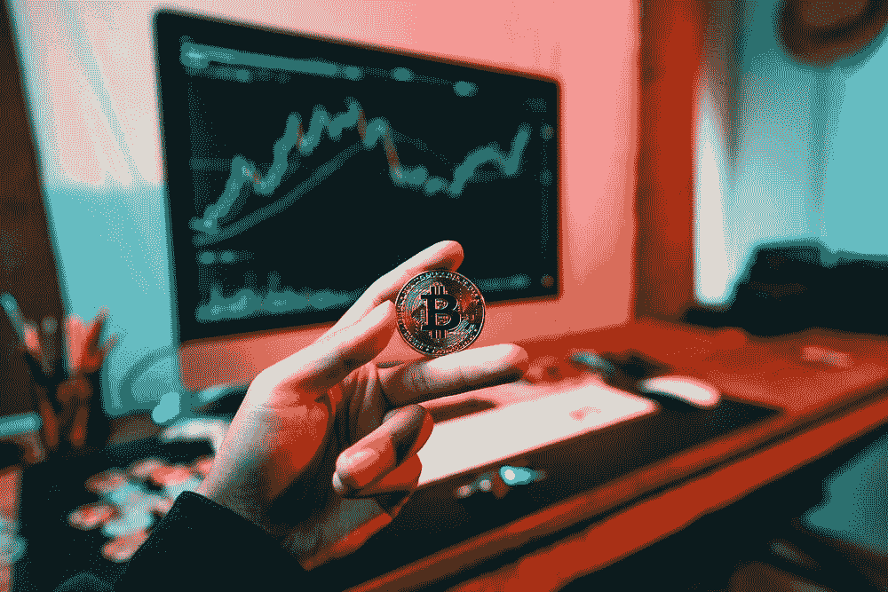
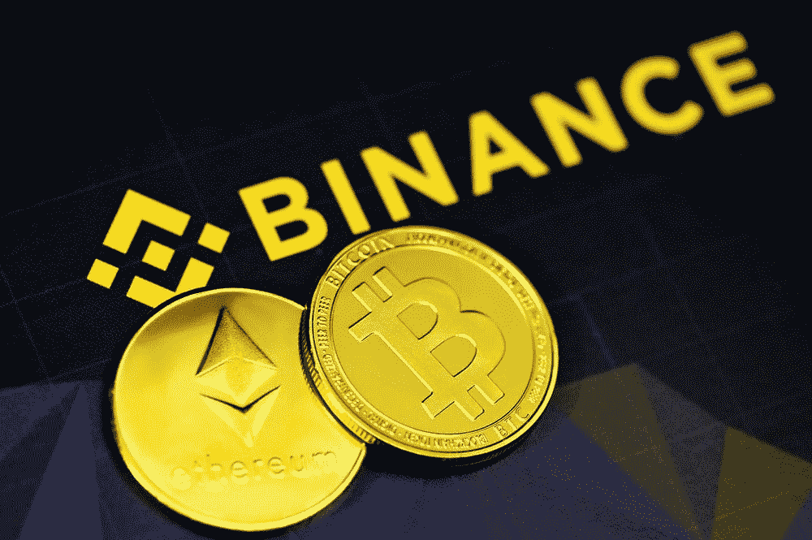

# 比特币在加纳合法吗？

> 原文：<https://medium.com/coinmonks/is-bitcoin-legal-in-ghana-d84923ff8466?source=collection_archive---------41----------------------->

过去十年中，加密货币和区块链的兴起是全球金融活动的主要改变者。由于这项有前途的技术的便利性和巨大的机会，世界各地数百万人开始接受使用比特币。然而，在一些国家，使用比特币被视为犯罪，在这些国家使用比特币是被禁止的。中非共和国和萨尔瓦多接受比特币作为法定货币，而其他一些国家则对其是否成为法定货币漠不关心。许多国家属于第三类，加纳就是其中之一。它不是该国的法定货币，但处理比特币也不犯法。
在加纳，处理比特币完全取决于任何选择使用比特币的人的选择，只要比特币不被用于便利犯罪活动，就不被视为犯罪。

如果你想在加纳用比特币兑换现金，而不用担心被骗，Dart Africa 是你的最佳选择。Dart Africa 是加纳最好的加密货币交易平台之一。你可以很容易地卖掉你的比特币，并获得加纳塞地的现金。

> 交易新手？试试[密码交易机器人](/coinmonks/crypto-trading-bot-c2ffce8acb2a)或者[复制交易](/coinmonks/top-10-crypto-copy-trading-platforms-for-beginners-d0c37c7d698c)

**如何在 Dart Africa 上出售比特币** 出售您的比特币从未如此简单，有了 DART AFRICA，您可以在 3 分钟内出售您的比特币，并将现金存入您的账户！听起来很棒？让我们开始吧！Dart Africa 的入门非常简单明了。遵循这些简单的步骤；

1.  [在 Play store](https://play.google.com/store/apps/details?id=com.dartafrica&gl=US) /App Store 获取应用程序或访问 [dartafrica.io](http://dartafrica.io)
2.  创建一个帐户，并填写您的银行信息。
3.  创建一个交易 pin，该 pin 将用于您随后的所有取款。
4.  选择比特币作为您要出售的硬币。输入金额，然后点击“立即出售硬币”进行出售。
5.  向系统生成的钱包地址付款。
6.  确认后，您的现金将被支付到您的钱包，然后您可以提取到您的银行账户或手机钱；Dart 非洲平台目前支持七种加密货币；、USDT、、戴、瑞士联邦理工学院、和 LTC。

购买比特币也很容易，在加纳还有其他几个交易所可以买到比特币，其中一个交易所是币安。目前，币安是全球领先和最大的密码交易平台之一。这个平台在包括加纳在内的世界上几乎所有国家都得到支持。如果你是加密货币交易的新手，币安是一个很好的起点，因为它有一个易于使用的平台，有令人印象深刻的硬币选择。

在币安上市的加密货币超过 500 种；该交易所提供多种交易选择和存款选择，这有助于其灵活性。这一惊人的特性使它在加密领域声名大噪。想探索币安吗？遵循这些步骤；
1。下载应用程序或使用他们的[网站](http://binance.com)。
2。注册一个账户。注册帐户时，会要求您提供姓名、电子邮件地址和密码。
3。一旦您激活了您的帐户，您将需要通过上传政府颁发的带照片的身份证和您的身份证明文件的扫描件来验证您的身份。
4。充实你的钱包。币安为其客户提供了多种融资选择。选择对你方便的。
5。继续购买密码。

此外，为了增强您的交易体验，币安提供了多种功能来帮助您扩大投资组合。这些资源包括教育视频和教程、市场分析工具和技术分析工具。

> 加入 Coinmonks [电报频道](https://t.me/coincodecap)和 [Youtube 频道](https://www.youtube.com/c/coinmonks/videos)了解加密交易和投资

# 另外，阅读

*   [投资印度的最佳加密软件](https://coincodecap.com/best-crypto-to-invest-in-india-in-2021)|[WazirX P2P](https://coincodecap.com/wazirx-p2p)|[Hi Dollar Review](https://coincodecap.com/hi-dollar-review)
*   [加拿大最佳加密交易机器人](https://coincodecap.com/5-best-crypto-trading-bots-in-canada) | [库币评论](https://coincodecap.com/kucoin-review)
*   [密码交易信号为 Huobi](https://coincodecap.com/huobi-crypto-trading-signals) | [HitBTC 审查](/coinmonks/hitbtc-review-c5143c5d53c2)
*   [TraderWagon 回顾](https://coincodecap.com/traderwagon-review) | [北海巨妖 vs 双子星 vs BitYard](https://coincodecap.com/kraken-vs-gemini-vs-bityard)
*   [如何在 FTX 交易所交易期货](https://coincodecap.com/ftx-futures-trading)