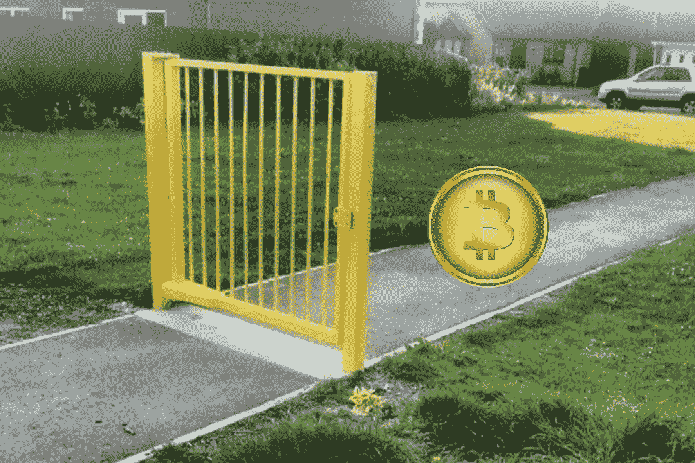
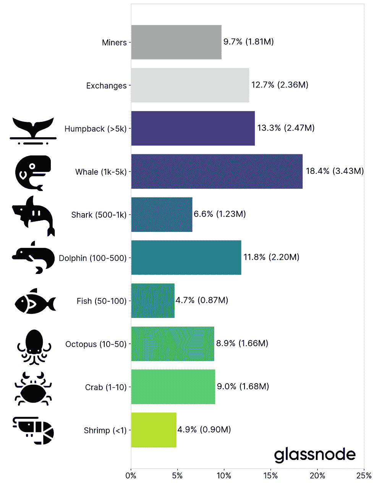

# 比特币是完美货币吗？没有。

> 原文：<https://medium.com/coinmonks/is-bitcoin-perfect-money-nope-fb05d29a1603?source=collection_archive---------12----------------------->

最近，Crypto Banter 上的知名嘉宾认为比特币是“完美”的货币。这就是为什么这种分析是有缺陷的。

Image: PixTeller/ImgFlip

> 如果金钱是你独立的希望，你永远不会拥有它。一个人在这个世界上唯一真正的保障是知识、经验和能力的储备——亨利·福特

# 我❤比特币马克西

我见过的最好的一集[秘密戏谑](https://www.youtube.com/watch?v=HHbxPpEHEZk)就在几天前播出。这部电影由[迈克尔·塞勒](https://www.michael.com/)、[马克·尤斯科](https://www.morgancreekcap.com/our-team/)和[安东尼·斯卡拉穆奇](https://www.cnbc.com/anthony-scaramucci/)主演。这三个人都是非常著名的比特币拥护者。

我对这些人只有尊敬。他们都有自己的才华。他们，以及像他们一样的人，是我，或者我们中的任何一个人，拥有一个秘密空间的唯一原因。

如果没有这些传道者，比特币对于电脑呆子来说仍将是一个新奇的实验。反过来，如果没有比特币和流入的资金，就不会有我们今天所知的加密市场。我真的喜欢❤的 BTC 马克西。

我也知道他们经常表现出相当多的夸张、[最近偏差](https://www.schwabassetmanagement.com/content/recency-bias)和[有限理性](https://www.schwabassetmanagement.com/content/recency-bias)。例如，Saylor 先生[说](https://www.youtube.com/watch?v=HHbxPpEHEZk)(引用@ 40:42:00):

> …理性、聪明的人已经得出结论，认为(比特币)是经过设计的完美货币

我想起了一条法律公理，即“理性的头脑可以有所不同。”我认为自己是合理的，但在这一点上我有很大的不同。比特币很酷。然而，作为货币，它远非“完美”。

这些客人的主要论点是:

1.  大规模采用比特币是不可避免的，最好现在就上船，以免被落下；和
2.  菲亚特至高无上的日子屈指可数了。

这些我可以 100%认同。事实上，我在去年 11 月的一篇[文章](/coinmonks/the-rise-and-fall-of-financial-empires-8e4bc3d7d5f8)中写了一些非常相似的东西，我在那里说过:

> 如果当前的(货币)体系能够在生命维持系统上再坚持几年，他们可能会成功。但是，如果在他们到达之前发生了特别灾难性的金融事件，这个系统这次可能无法恢复。
> 
> 或者，当中央银行家们尝试越来越绝望的措施来重振遗留的全球经济时，大部分金融活动可能会全部转变为加密。如果出现这种情况，我担心银行业和金融业在一段时间内会像西部蛮荒一样，但我认为事情最终会自行解决。

我仍然对比特币的“完美”本质犹豫不决。它肯定是不完美的。原因如下。

## 比特币是去中心化的！是啊，那又怎样？

我反对比特币完美的观点是基于以下四个大规模采用比特币的风险，这些风险基本上没有得到解决:

1.  基础设施脆弱性
2.  主权俘获
3.  钱包集中度
4.  比特币估值

## 基础设施脆弱性

塞勒认为黄金是一种不完美的货币，因为:

1.  它正以每年 2%的速度膨胀(没错)
2.  它可以被君主贬低(没错)
3.  它会被扣押/捕获(真)

所有有效的观点。因此，在这些特定的点上，比特币只容易受到一种攻击——被捕获。事实上，美国政府已经例行公事地从任何数量的罪犯那里缴获了比特币，包括最近备受瞩目的[年轻女士和她的情郎的案件。](https://www.justice.gov/opa/pr/two-arrested-alleged-conspiracy-launder-45-billion-stolen-cryptocurrency)

如果主权者(政府)能从他们手中夺走，他们也能从你手中夺走。它可能比黄金更难追踪或找到，但这并不意味着*不能*追踪或找到。

鉴于 KYC 对美国客户的广泛授权，除非你一直在使用虚拟机、VPN、匿名网络，并亲自用现金交易加密，否则你 100%都在地图上。

除此之外，比特币还有几个问题我还没有看到解决:

1.  比特币需要电力
2.  比特币需要网络接入
3.  比特币需要计算资源

在任何地方，这些东西都没有以任何明显的方式(从军事意义上)得到强化。是的，比特币算法已经被强化并得到了很好的证明。

但是，支持算法执行的东西有如此多的开放攻击媒介，我实际上更惊讶的是基础设施攻击还没有发生。

如果有人知道你的采矿设备在哪里，他们只需要一把点 22 口径的步枪就可以切断你的电源，打掉一个通向你的财产的变压器。或者拿一把钢丝钳和一把铲子或梯子切断你的网络连接。

如果一个人真的很有创造力并且一心想要破坏，他们可以很容易地把一辆装满炸药的货车开进你的停车场。有人对俄克拉荷马州的一座联邦建筑做了同样的事情，造成了毁灭性的后果。

在德克萨斯州一个工业园区的服务器仓库旁，没有什么能阻止某人做同样的事情。

## 天啊，谁会做这种事？

1.  生态恐怖分子(所有的电！)
2.  宗教狂热者(野兽的数量！)
3.  敌对民族国家(他们所有的钱现在都这么容易砸！)
4.  主权统治者(这个比特币的事情搞砸了我的计划！)

天空才是真正的极限。谁也说不准什么会让一个疯子发疯。显然，零星攻击不会以任何明显的方式影响比特币等去中心化网络。

但是，正如尤斯科先生在采访中正确指出的，颠覆性技术的*常规*业务是为即将被取代的人而战。我认为真正的战斗还没有开始。

这场战斗可能看起来像这样:

1.  美元自由落体
2.  比特币成为替罪羊
3.  比特币对国家安全构成威胁

美国比特币挖矿一夜之间被关闭。这相当于 [35%的比特币杂凑率](https://ccaf.io/cbeci/mining_map)被几份 FISA 认股权证和一些吓人的字母/穿着海军服的人买走了。然后，这封信发给美国的安全伙伴和谅解备忘录:

> 亲爱的伙伴:
> 
> 我们已经认定比特币是对美国国家安全的威胁。请帮助我们关闭您所在国家的所有比特币挖矿网络，否则我们将切断您的银行业务。
> 
> 请和谢谢你，
> 
> 山姆大叔

和山姆大叔没有合作关系，比如伊朗？没问题。美国军方在寻找分散资源并将其炸毁方面是世界领先的专家。他们可以在内华达州的空调房里完成这一切。

当然，这很可能不会发生，但它*可能*。如果没有 crypto 的 75%的美国人站在领取面包的队伍中，并被源源不断的反比特币宣传所吸引，政治风向可能会转变得相当快。

问题是，你不需要完全瘫痪网络。你只需要蹒跚而行。如果 BTC 的市值从 1 万亿美元上升到 10 万亿美元，然后杂凑率由于外部因素下降了 50%，我很确定这对 BTC 来说是利空的。

## 钱包集中度

虽然许多 BTC 的憎恨者会鹦鹉学舌一些版本的“百分之二拥有 95%的 BTC”，但事实更接近百分之二拥有 70%的 BTC。这是更好的，但仍然不是很好。它看起来是这样的:

Image: Glassnode Insights

我不清楚 2%的 BTC 网络实体控制着 71%的 BTC 电力供应是如何“分散”的。BTC 是分散的，但在我看来是非常集中在最终掌管钱的同一阶层的人中间——而且比例大致相同。

正如所有喜欢开玩笑的客人似乎都同意的那样，机构收养正在快速增长。看起来是这样的:

Image: Glassnode Insights

我完全同意，发行不负责任的主权债券并控制 70%的世界储备货币是一个非常糟糕的想法。18 世纪的经济学家理查德·坎蒂伦非常清楚地展示了在这样一个系统下会发生什么。

但是，至少目前的全球货币主权国家有一部*原则上的*宪法，保证保护和维护某些权利。很快就一窝蜂*涌入比特币的早期采用者、银行家和对冲基金却没有这么做。*

关键是，不管他们有多聪明(或者不聪明)，我都不清楚将如此巨大的经济权力转移到私人盈利部门对社会有什么净效益。至少现在，那些在遗产金融领域拥有最大影响力的人不得不做出向君主请愿的样子。

简而言之，我们真的希望文克莱沃斯双胞胎，或者事实上是塞勒本人，来制定全球经济政策吗？我不认识他们，他们可能是很棒的人。但如果这听起来像个好主意，我肯定会被诅咒的。

## 比特币估值

不管你喜不喜欢，黄金已经在近一万年的时间里证明了它的价值。它无反应、稳定、可无限回收，看起来和拿起来都非常酷。如果你从未持有过真正的金币，我建议你试一试。

直到给自己抱了一个我才相信。这种金属有种东西能在深层次上与人类产生共鸣。反过来，数学也非常有价值。

凡是可以衡量的都可以理解，总的来说。这其中有巨大的社会价值。但我会给你一个挑战。去问任何一个青少年以下问题:

> 嘿，如果你洗我的车，我会解决一个非常复杂的数学问题，你可以和别人交换。

显然，这不会是一个有效的激励因素。如果这些计算有一个市场*,那可能会影响结果。但是，没有这样一个市场，青少年的核心“价值”是零。*

*换个场景:*

> *嘿，如果你帮我洗车，我会给你一枚纯金币。*

*10，000 年的人类历史非常可靠地证明，即使没有正式的黄金市场，这种主张也具有激励性影响。这可能并不总是奏效，但肯定经常奏效。*

*别搞错了，我不是什么黄金虫。然而，我承认黄金具有可识别的内在价值。比特币没有。比特币市场是零和的。除去所有的利润和损失，结果是零。*

*公平地说，我认为可以给运行系统的计算机和网络硬件赋值。那肯定加起来也不到 1 万亿美元。差远了。*

## *结论*

*我非常相信，总体而言，加密将成为人类历史上最具变革性的创新之一。我还认为，在短期内，比特币绝对会成为背后的主要驱动力。*

*如果你是一名加密投资者，现在拥有比特币是绝对必要的。赋予它神秘的属性(也许)对于推动采用也是必不可少的。毫无疑问，大规模采用即将到来。*

*但在这种情况下，我们不能允许或接受比特币以某种方式解决所有货币问题的想法。这无疑改变了他们，有些变得更好，有些可能变得更坏。*

*从我的角度来看，全世界的密码开发者的一个合理的、理性的和负责任的目标是创建一个系统:*

1.  *激励主权参与；*
2.  *抵制主权掠夺；*
3.  *具有全球公认的价值；和*
4.  *确保公平获取和参与*

*黄金和大宗商品的作用很明显。股票有一个明确的角色。劳动有明确的作用。文化(如 NFTs)有明确的作用。税务机关有一个明确的角色。主权保护和参与具有明确的作用。福利和社会安全有明确的作用。公平的全球分配有着明确的作用。*

*在我看来，这就是一种理性、聪明、负责任的加密储备货币的样子。我认为区块链可以提供这样的解决方案。我只是不知道该怎么做，或者我会。*

*我希望比特币的传播者看到同样的事情，因为如果不是这样，我担心我们都在走向一个新的金融混乱，随意取代当前的金融混乱。直到我们支付了很久以后，我们才知道它的代价。*

*简而言之，我们需要非常小心密码领域的发展，尤其是在资金方面。我们现在所做的将会对未来几代人产生经济上的决定性影响。*

*我们最好把它做好，因为我们可能不会再有机会了。*

> *加入 Coinmonks [电报频道](https://t.me/coincodecap)和 [Youtube 频道](https://www.youtube.com/c/coinmonks/videos)了解加密交易和投资*

# *另外，阅读*

*   *[氹欞侊贸易评论](https://coincodecap.com/anny-trade-review) | [火币保证金交易](/coinmonks/huobi-margin-trading-b3b06cdc1519)*
*   *[分散交易所](https://coincodecap.com/what-are-decentralized-exchanges) | [比特 FIP](https://coincodecap.com/bitbns-fip) | [Pionex 评论](https://coincodecap.com/pionex-review-exchange-with-crypto-trading-bot)*
*   *[用信用卡购买密码的 10 个最佳地点](https://coincodecap.com/buy-crypto-with-credit-card)*
*   *[最好的卡达诺钱包](https://coincodecap.com/best-cardano-wallets) | [Bingbon 副本交易](https://coincodecap.com/bingbon-copy-trading)*
*   *[印度最佳 P2P 加密交易所](https://coincodecap.com/p2p-crypto-exchanges-in-india) | [柴犬钱包](https://coincodecap.com/baby-shiba-inu-wallets)*
*   *[8 大加密附属计划](https://coincodecap.com/crypto-affiliate-programs) | [eToro vs 比特币基地](https://coincodecap.com/etoro-vs-coinbase)*