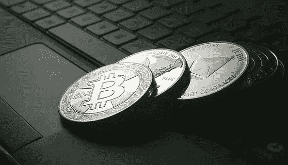

# 比特币真的在推动 Altcoin 市场吗？

> 原文：<https://medium.com/coinmonks/is-bitcoin-really-driving-the-altcoin-market-85bf07fecaa9?source=collection_archive---------24----------------------->

比特币是加密行业的黄金。然而，比特币不是加密货币的全部和终结；在加密领域的第一个十年，加密货币的数量大幅增加。目前 CoinMarketCap 上有超过 5000 种替代硬币。它们有广泛的应用，从治理到驱动数据 oracles。然而，很少有替代币的价值与比特币的价格紧密相连，同甘共苦。为什么？

## **比特币在加密市场称王**

无论任何人说什么，比特币是推动加密货币成为主流的硬币。最初的加密资产周围可能有超过 3000 家竞争对手，但它仍然控制着加密货币市值的一半以上。

此外，大多数代用币不能用法定货币直接购买；相反，大部分用户首先获得一些比特币，然后将其兑换成他们喜欢的加密货币。因此，如果拥有替代币的人想完全退出加密业务，他们最有可能首先出售资产换取比特币，然后将比特币转换回法定货币。由于这种关系，许多加密货币的价值经常与比特币联系在一起。

## **并非所有的山寨币都遵循相同的规则。**

去年比特币涨了，但大部分 altcoins 没有涨。因此，比特币的势头并不总是代表整个市场的动态，而是反映了领先数字资产的先发优势。

2020 年最有趣的比特币与比特币之战可能是 BTC 与渴望之战。金融(YFI)，一个完全创新的 DeFi 协议，最终产生了所谓的“翻转”，超过比特币的价格，达到 40，000 美元。这部分是由于 DeFi 的快速扩张和该项目的最低总供应量。此后，比特币重新夺回了头把交椅，尽管 YFI 仍紧随其后，但 BTC 保持了价格优势。在大多数情况下，比特币的牛市与替代币并不一致。

此外，一些较小的货币对 BTC 的依赖程度要高得多，因为交易所只提供 BTC 货币对，而较大的货币则有各种配对。随着越来越多的人/机构开始将加密货币用于投机/交易以外的目的，与 BTC 的默认初始配对无疑将发生变化。

## **遗言**

密码行业仍然是新的和不成熟的，人们更喜欢把所有的密码放在一起，所以它们是紧密相连的。此外，比特币曾被要求购买一些密码，这导致了价格耦合。然而，随着加密行业的发展，这些变量将变得无效，加密货币的价值将不再与替代硬币的价值相关。

> 加入 Coinmonks [电报频道](https://t.me/coincodecap)和 [Youtube 频道](https://www.youtube.com/c/coinmonks/videos)了解加密交易和投资

## 也阅读

 [## 杠杆代币[多头代币]终极指南

### 杠杆化令牌是具有杠杆化风险敞口的 ERC20 令牌，不考虑保证金、要求、管理…

medium.com](/coinmonks/leveraged-token-3f5257808b22)  [## 最佳加密交易所| 2022 年十大加密货币交易所| CoinCodeCap

### 哪一个是最好的加密交换？在本文中，我们将根据多种加密货币列出 10 大加密货币交易所

coincodecap.com](https://coincodecap.com/crypto-exchange)  [## 2022 年最佳加密交换平台| CoinCodeCap

### 随着时间的推移，我们大多数人将转向 dex 以获得更好的安全性和隐私。因此。在这里，我们将讨论…

coincodecap.com](https://coincodecap.com/best-swap-platforms)  [## 2022 年最佳加密和比特币赌场(美国批准，存款奖励)

### 接收、支付和赚取加密货币| |有各种各样的最佳在线赌场可供选择，有可能…

coincodecap.com](https://coincodecap.com/best-online-casinos)  [## 2021 年最佳加密借贷平台| 6 大比特币借贷平台

### 获得比特币和其他加密货币的最佳贷款利率

medium.com](/coinmonks/top-5-crypto-lending-platforms-in-2020-that-you-need-to-know-a1b675cec3fa)  [## 2021 年 6 大最佳硬件钱包|顶级加密硬件钱包[更新]

### 最好的加密货币硬件钱包是绝对必要的。我们将在 NGRAVE、Ledger Nano X 和…

medium.com](/coinmonks/the-best-cryptocurrency-hardware-wallets-of-2020-e28b1c124069)  [## 加密交易机器人——19 款最佳免费加密交易机器人

### 2022 年币安、比特币基地、库币和其他密码交易所的最佳密码交易机器人。四进制，位间隙…

medium.com](/coinmonks/crypto-trading-bot-c2ffce8acb2a)  [## 最佳 4 个加密交易信号电报通道

### 这是乏味的找到正确的加密交易信号提供商。因此，在本文中，我们将讨论最好的…

medium.com](/coinmonks/best-crypto-signals-telegram-5785cdbc4b2b)