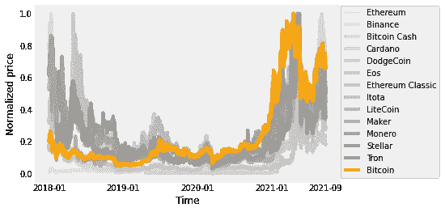
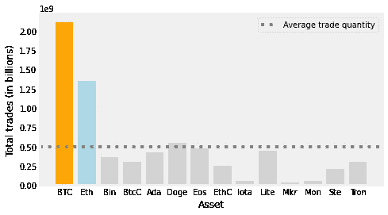
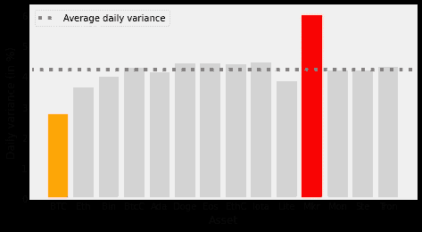
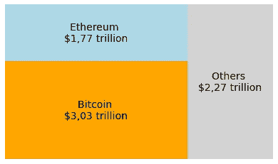
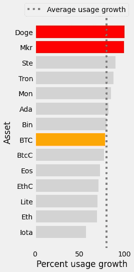
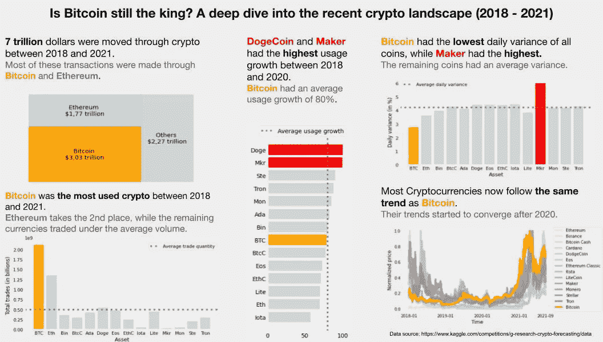

# 比特币还是王者吗？深入探讨最近的加密领域(2018–2021)

> 原文：<https://medium.com/coinmonks/is-bitcoin-still-the-king-a-deep-dive-into-the-recent-crypto-landscape-2018-2021-1b849eb704fd?source=collection_archive---------22----------------------->

这个项目将深入研究加密数据，以比较不同的硬币，并对加密市场的现状进行全面分析。


image source: [https://everydaycryptonews.com/top-5-cryptocurrencies-for-april/](https://everydaycryptonews.com/top-5-cryptocurrencies-for-april/)

近年来，加密货币越来越受欢迎。从萨尔瓦多等国采用比特币作为官方货币，到元宇宙等新技术，其金融支柱基于以太坊和索拉纳。最近可用性的增长导致许多不同的货币被创造出来，曾经由比特币统治的市场现在是一个多样化的景观，有多种硬币可用。在这篇文章中，我将研究与比特币相比，其他密码的相关性如何，以及在不久的将来，其他硬币是否会占据主导地位。

为了回答这些问题，我将利用 G-Research 加密数据集，该数据集位于:
[https://www . ka ggle . com/competitions/G-Research-Crypto-forecasting/data](https://www.kaggle.com/competitions/g-research-crypto-forecasting/data)。

这些数据是由英国金融研究公司 G-Research 收集的，并通过一场机器学习比赛在 Kaggle 上公开，参赛团队将使用这些数据训练 ML 模型，以预测未来的加密价格。虽然这些数据是为训练模型而优化的，但我相信它可以用来产生关于加密以及不同硬币如何相互关联的伟大可视化。

主数据集(train.csv)包含 24，236，806 行和 10 列。每行代表某个硬币的分钟时间戳(总共有 14 个硬币)。每一列都包含关于该分钟时间戳的信息。

该数据集包含 14 种不同加密货币的收盘价和开盘价，包括比特币、以太坊、莱特币、Monero 等。它也有关于在给定的一分钟内有多少硬币和交易的信息，这将允许我们找到每种货币移动了多少钱，以及每种硬币使用了多少钱。

我将在 Python 中创建不同的可视化来分析所有可用硬币的不同方面。本文将介绍 python 笔记本，其中涵盖了用于从数据中提取相关信息并绘制这些信息的所有代码。所有的数字被组合成最后一张幻灯片，讲述了当前加密领域的故事。

笔记本可以在这里找到:
[https://colab . research . Google . com/drive/1 goc xzh 6 upk 8 orhikbvotzbpc 31 viirju？usp =分享](https://colab.research.google.com/drive/1GocXzh6UpK8ORhIkBVoTzBPC31VIirjU?usp=sharing)

# **初始设置**

这里，我们只是导入所需的库，并通过 pandas 读取 csv 文件格式的数据。

```
import matplotlib.pyplot as plt
import squarify
import numpy as np
import pandas as pd
plt.style.use(‘fivethirtyeight’)train = pd.read_csv(‘train.csv’)
```

数据集包含 10 列。下面是写在 kaggle 上的每个列的描述:

*   `timestamp` -该行覆盖的分钟的时间戳。
*   `Asset_ID` -加密资产的 ID 代码。
*   `Count` -这一分钟发生的交易数量。
*   `Open` -分钟开始时的美元价格。
*   `High` -一分钟内最高的美元价格。
*   `Low` -一分钟内的最低美元价格。
*   `Close` -一分钟结束时的美元价格。
*   `Volume` -一分钟内交易的加密资产单位数。
*   `VWAP` -该分钟的成交量加权平均价格。
*   `Target` - 15 分钟剩余收益。有关如何计算目标的详细信息，请参见本笔记本的“预测和评估”部分。

对于本项目，我们将重点关注`timestamp`、`Count`、`Open`、`Close`和`Volume`列。

请注意，所有硬币的数据都组合在“train.csv”文件下。为了解决这个问题，我们必须为对应于每个资产 ID 的数据分配一个变量。我们可以通过以下方式实现这一点:

```
#Assigns each variable to its respective asset
bin = train[train[“Asset_ID”]==0].set_index(“timestamp”) #Binance
btc = train[train[“Asset_ID”]==1].set_index(“timestamp”) #Bitcoin
btcC = train[train[“Asset_ID”]==2].set_index(“timestamp”) #BtcCash
ada = train[train[“Asset_ID”]==3].set_index(“timestamp”) #Cardano
doge = train[train[“Asset_ID”]==4].set_index(“timestamp”) #Dogecoin
eos = train[train[“Asset_ID”]==5].set_index(“timestamp”) #Eos
eth = train[train[“Asset_ID”]==6].set_index(“timestamp”) #Etherium
ethC = train[train[“Asset_ID”]==7].set_index(“timestamp”)#EthClassic
iota = train[train[“Asset_ID”]==8].set_index(“timestamp”) #iota
lite = train[train[“Asset_ID”]==9].set_index(“timestamp”) #Litecoin
mkr = train[train[“Asset_ID”]==10].set_index(“timestamp”) #Maker
mon = train[train[“Asset_ID”]==11].set_index(“timestamp”) #Monero
ste = train[train[“Asset_ID”]==12].set_index(“timestamp”) #Stellar
tron = train[train[“Asset_ID”]==13].set_index(“timestamp”)#Tron
```

然后，我们可以创建一个包含所有资产的列表，以及它们的名称和缩写的列表。这将有助于创建地块。

```
asset_list = [btc, eth, bin, btcC, ada, doge, eos, ethC, iota, lite, mkr, mon, ste, tron]asset_names = [“Bitcoin”, “Ethereum”, “Binance”, “Bitcoin Cash”, “Cardano”, “DodgeCoin”, “Eos”, “Ethereum Classic”, “Iota”, “LiteCoin”, “Maker”, “Monero”, “Stellar”, “Tron”]asset_names_abr = ["BTC", "Eth", "Bin", "BtcC", "Ada", "Doge","Eos", "EthC", "Iota", "Lite", "Mkr", "Mon", "Ste", "Tron"]
```

# 数据可视化

设置完成后，我们可以开始创建一些图表来分析我们的数据。

**分析所有硬币的趋势**

一个好主意是看看所有硬币的趋势有多相似。我们可以用所有的资产做一个线图。为此，我们首先需要使它们的价格正常化。下面的函数将处理这个问题:

```
def normalize(data):
   return (np.array(data/max(data), dtype=’float’))
```

我们现在可以使用 matplotlib 创建所有硬币的组合图:

```
f = plt.figure(figsize = (6,4))#Creates a list of colors with grey shading 
greys= plt.get_cmap(‘Greys’) 
colors = iter(greys(np.linspace(0.2,0.5,13)))#Creates arrays with the dates and its specific timestamp 
#The date to timestamp calculator can be found at: 
dates = [‘2018–01’, ‘2019–01’, ‘2020–01’, ‘2021–01’, ‘2021–09’] 
ticks = [1514764860, 1546300800, 1577836800, 1609459200, 1632182400]#Plots the normalized price trend of each coin 
counter = 1 
for i in asset_list[1:]:
   plt.plot(i.index, normalize(i[‘Close’]), c = next(colors),
            label = asset_names[counter])
   counter += 1plt.xticks(ticks, dates)
plt.plot(btc.index, normalize(btc[‘Close’]), c = ‘Orange’, label = “Bitcoin”)
plt.legend(bbox_to_anchor=(1.33, 1), loc=’upper right’, borderaxespad=0)
plt.xlabel(‘Time’)
plt.ylabel(‘Normalized price’)
plt.grid(False)
plt.show()
```

这应该会导致如下结果:



Line plot of all the 14 coins available in the dataset

我们可以清楚地看到 2020 年后他们的剧情如何衔接。更有趣的是，似乎许多硬币在 2018 年价格暴跌。这可能是因为大多数密码都在 2018 年初左右“公开发布”。我的理论是，在他们的炒作逐渐消失后，他们的价格开始暴跌。

通过将上面代码的最后 9 行放入 for 循环中，可以很容易地获得每个资产的单独线图。你会发现它们的趋势非常相似。

**分析每枚硬币的使用量**

“计数”栏可以让我们对每枚硬币的使用量有一些有价值的了解，因为这一栏给出了给定时刻的交易计数。我们可以将它的值相加，找出每项资产发生了多少次交易，并以此绘制一个柱状图。

以下代码对所有交易计数值求和:

```
#Creates an array with the sum of all total trades for each asset
total_trades = []
for i in asset_list:
   total_trades.append(np.sum(i[‘Count’]))
```

下面是我们如何绘制它:

```
fig = plt.figure(figsize = (6, 3))
ax = fig.add_axes([0, 0, 1, 1])#Creates a list of colors to be used in the barplot
colors = [‘orange’, ‘lightblue’]for i in range(0, 12):
   colors.append(‘lightgray’)#Plots the data
ax.bar(asset_names_abr, total_trades, color=colors)
plt.axhline(y=np.average(total_trades), label = ‘Average trade               quantity’, c = ‘gray’, ls=’:’)
plt.ylabel(‘Total trades (in billions)’)
plt.xlabel(‘Asset’)
plt.legend()
plt.grid(False)
plt.show()
```

代码生成了这张图片:



Bar plot of the trade count of each asset

这个情节非常简单，展示了比特币和以太坊是如何成为迄今为止使用最多的硬币。

**差异分析**

我们可以很容易地处理数据，以获得每个硬币在给定时间范围内的平均方差。我将分析平均每日方差，因为从短期投资的角度来看，这是最相关的。为此，我将使用下面的函数:

```
def get_average_variance(data, tf):
   variance = []
   for i in range(0, len(data)-tf, tf):
      variance.append((abs(data.iloc[i, 2]
                      -data.iloc[i+tf, 2])
                      /data.iloc[i+tf, 2])*100) return np.average(variance)#Gets daily average variance (in %) from all coins
asset_variance = []for i in asset_list:
   asset_variance.append(get_average_variance(i, 1440))
```

要更改时间范围，请更改“tf”参数。调用以 1440 为参数的函数将得到每日方差，因为 1 天有 1440 分钟。

最后，我们可以绘制数据:

```
fig = plt.figure(figsize = (6, 3))
ax = fig.add_axes([0, 0, 1, 1])#Creates color map for the plot
#Manually color the relevant assets
colors = [‘orange’, ‘lightgrey’]
for i in range(0, 12):
   if i == 8:
      colors.append(‘red’)
   colors.append(‘lightgray’)#Plots data
ax.bar(asset_names_abr, asset_variance, color=colors)
plt.axhline(y=np.average(asset_variance), label = ‘Average daily         variance’, c = ‘gray’, ls=’:’)
plt.ylabel(‘Daily variance (in %)’)
plt.xlabel(‘Asset’)
plt.legend()
plt.grid(False)
plt.show()
```



Average daily variance per coin.

另一个直截了当的情节，展示了比特币是波动性最小的硬币，而 maker 是波动性最大的。此外，其他资产都有类似的差异，这是意料之中的，因为它们都有类似的价格趋势。

**交易总金额**

通过将“开放”和“体积”两列相乘，我们可以得到在给定的硬币上移动了多少钱。

```
def get_total_transaction_values(data):
    total_money = (np.sum( data[‘Open’] * data[‘Volume’]))return total_money#Creates a list of money traded per coin
total_money = []for i in asset_list:
    total_money.append(get_total_transaction_values(i))print(total_money)
```

如果我们对“total_money”的值进行排序，我们会发现通过比特币和以太坊转移的资金明显多于所有其他硬币。为了使我们的可视化更清晰，我们可以将其他资产分组，并仅绘制值:

```
total = []
total.append(total_money[0])
total.append(total_money[1])
total.append(sum(total_money[2:]))#Plots area graph of the data
plt.rc('font', size=14)
squarify.plot(sizes=total,
label=['Bitcoin \n$3,03 trillion', 'Ethereum \n$1,77 trillion', 'Others \n$2,27 trillion'],
color = ['Orange', 'Lightblue', 'Lightgray'])
plt.axis('off')
plt.show()
```



Area plot of the total money moved through different crypto assets.

在图上，我们可以看到比特币比其他硬币移动了更多的钱，显示出它仍然是多么受欢迎和重要。

【2018 年至 2020 年的使用增长

对于我们的最后一个地块，我想看看从 2018 年到 2020 年每个硬币增长了多少。为此，我将对 2018 年和 2020 年的“计数”列求和，并将它们的差值转换为百分比值。

我们可以通过以下方式做到这一点:

```
def get_count_sum_2018(data): #timestamp at 2019/01/01, 8:00:00 PM
   df = data.loc[data.index < 1546390800] return np.sum(df[‘Count’])def get_count_sum_2020(data): #timestamp at 2021/01/01, 8:00:00 PM between
   #timestamp at 2019/01/01, 8:00:00 PM
   df = data.loc[(data.index < 1609549200) & (data.index >      1546390800)] return np.sum(df['Count']) count_2018 = []
for i in asset_list:
   count_2018.append(get_count_sum_2018(i))count_2020 = []
for i in asset_list:
   count_2020.append(get_count_sum_2020(i)) percent_difference = {}
for i in range(len(count_2020)):
    percent_difference[asset_names[i]] = (((count_2020[i]-count_2018[i])  /count_2020[i])*100)
```

注意我是如何使用时间戳来定义数据范围的。为了获得日期的相应时间戳值，我可以简单地运行如下代码

```
import time
timestamp = time.mktime(time.strptime('2019-01-01 20:00:00', '%Y-%m-%d %H:%M:%S'))
```

我们现在可以画出百分比值

```
colors = []for i in range(14):
   if i == 6:
      colors.append(‘orange’)
   elif i == 12 or i == 13:
      colors.append(‘red’)
   else:
      colors.append(‘lightgray’)#Sorts the values for plotting
percent_difference = dict(sorted(percent_difference.items(), key=lambda x:x[1]))fig = plt.figure(figsize = (3, 8))
plt.barh(list(percent_difference.keys()), list(percent_difference.values()), color=colors)
plt.axvline(x=np.average(list(percent_difference.values())), label = ‘Average usage growth’, c = ‘gray’, ls=’:’)
plt.legend(bbox_to_anchor=(1, 1.05), loc=’upper right’, borderaxespad=0)
plt.grid(False)
plt.xlabel('Percent usage growth')
plt.ylabel('Asset')
plt.show()
```

这导致:



在这里，我们可以看到比特币是如何远离使用量增长最高的硬币的。DogeCoin 和 Maker 的使用率都增长了近 100%。尽管如此，上述所有资产的增长率都在 50%以上。

# **合并所有图**

为了结束这个项目，我们可以将所有情节保存到一张幻灯片中，添加一些标题和一些调整，以便所有情节讲述一个故事。这是最后的结果:



Combined plot with added titles.

**设计选择**

我试图利用我的设计，在屏幕上只突出重要的信息，同时尽可能地去除混乱。
比特币很容易与黄色联系在一起，黄色是整个组合剧情中反复出现的颜色。我决定也区分以太坊，因为它是比特币的一个显著“竞争对手”，与数据中的其他硬币相比，它绝对是另一个异常值。此外，我用红色突出了不是比特币或以太坊的其他异常值，用浅灰色显示了剩余的数据。

当提到标题时，我确保相应地涂上颜色，同时也将重要信息加粗。此外，标题和副标题都对各自的情节做出了相关的结论。

# **结论**

当我们一起分析所有情节时，很明显，比特币仍然是加密领域的一个重要参考，到目前为止，没有其他货币能够取代它的位置。作为迄今为止使用最多、最稳定的加密技术，**比特币仍然是**之王，而且从表面上看，在不久的将来，它还会继续称王。

> 加入 Coinmonks [电报频道](https://t.me/coincodecap)和 [Youtube 频道](https://www.youtube.com/c/coinmonks/videos)了解加密交易和投资

# 另外，阅读

*   [3 商业评论](/coinmonks/3commas-review-an-excellent-crypto-trading-bot-2020-1313a58bec92) | [Pionex 评论](https://coincodecap.com/pionex-review-exchange-with-crypto-trading-bot) | [Coinrule 评论](/coinmonks/coinrule-review-2021-a-beginner-friendly-crypto-trading-bot-daf0504848ba)
*   [莱杰 vs n rave](/coinmonks/ledger-vs-ngrave-zero-7e40f0c1d694)|[莱杰 nano s vs x](/coinmonks/ledger-nano-s-vs-x-battery-hardware-price-storage-59a6663fe3b0) | [币安评论](/coinmonks/binance-review-ee10d3bf3b6e)
*   [Bybit 交易所评论](/coinmonks/bybit-exchange-review-dbd570019b71) | [Bityard 评论](https://coincodecap.com/bityard-reivew) | [Jet-Bot 评论](https://coincodecap.com/jet-bot-review)
*   [3 commas vs crypto hopper](/coinmonks/3commas-vs-pionex-vs-cryptohopper-best-crypto-bot-6a98d2baa203)|[赚取加密利息](/coinmonks/earn-crypto-interest-b10b810fdda3)
*   最好的比特币[硬件钱包](/coinmonks/hardware-wallets-dfa1211730c6) | [BitBox02 回顾](/coinmonks/bitbox02-review-your-swiss-bitcoin-hardware-wallet-c36c88fff29)
*   [BlockFi vs 摄氏](/coinmonks/blockfi-vs-celsius-vs-hodlnaut-8a1cc8c26630) | [Hodlnaut 点评](/coinmonks/hodlnaut-review-best-way-to-hodl-is-to-earn-interest-on-your-bitcoin-6658a8c19edf) | [KuCoin 点评](https://coincodecap.com/kucoin-review)