# 比特币的能耗合理吗？

> 原文：<https://medium.com/coinmonks/is-bitcoins-energy-consumption-justified-4e4640b3c729?source=collection_archive---------41----------------------->

***”有人说，“给顾客他们想要的。“但那不是我的方法。我们的工作是在他们行动之前找出他们想要什么。我想亨利·福特曾经说过，“如果我问顾客他们想要什么，他们会告诉我，‘一匹更快的马！’“人们不知道他们想要什么，直到你给他们看。这就是我从不依赖市场调查的原因。我们的任务是阅读页面上还没有的东西。***

*史蒂夫·乔布斯*

在 20 世纪早期，当第一辆汽车出现时，许多人对它们不屑一顾，认为它们只是一时的时尚。[1899 年](https://theculturetrip.com/north-america/usa/articles/10-inventions-no-one-thought-would-be-a-success/)《文学文摘》杂志对汽车做了如下评论，*“普通的‘无马马车’目前是富人的奢侈品；虽然它的价格将来可能会下降，但它当然永远不会像自行车那样得到普遍使用。”三年后的 1902 年,《纽约时报》发表了一篇类似的评论，他们认为“无马马车”不仅不切实际，而且价格也不会低到像自行车一样受欢迎。《泰晤士报》的一位评论家这样说:*

> “无论是作为一项运动还是一个行业，汽车行业几乎在每一个细节上都与自行车运动的历史如此接近，以至于人们经常会问这样一个问题，即当前的扩张期之后是否会出现像短短几年前自行车运动繁荣时期那样彻底而灾难性的崩溃。”(1)

这篇文章发表一年后，也就是 1903 年，底特律律师霍勒斯·拉克姆得到了密歇根储蓄银行行长的如下建议:“*马已经存在，但汽车只是一种新奇事物——一种短暂的时尚。”他无视这个建议，继续购买福特汽车公司的股票，成为其原始股东之一。剩下的就是历史了。*

一旦亨利·福特通过引进装配线完善了汽车的大规模生产，价格就下降了，汽车就起飞了，并最终成为交通运输的主要形式。T 型车于 1908 年推出，到 1918 年，售出的汽车中有一半是 T 型车。福特汽车公司在 1908 年至 1927 年间生产了 1500 万辆 T 型车，这是历史上生产时间最长的汽车型号，直到甲壳虫于 1972 年摘得桂冠。对于一时的时尚来说，这还不错。

历史上的每一项新发明或技术在诞生之初总是遭到怀疑和嘲笑。电话、电力、飞机甚至互联网曾经被认为是注定要失败的时尚。在大多数情况下，媒体在这些攻击中占据中心位置，不幸的是，许多人相信媒体将宣传新技术的错误说法。这部分是由于对媒体界错位的信任，加上对个人调查和研究的冷漠。

更糟糕的是，这些媒体报道中有一些是由别有用心的人赞助的，一旦新技术成为主流，他们就会失去一些东西，正如约翰·洛克菲勒试图怀疑电力是危险的，因为它威胁到标准石油公司在家庭照明方面的垄断地位。最近一段时间，比特币因各种原因受到媒体的猛烈攻击，但最普遍的批评是比特币浪费能源，对环境有害。

2017 年 12 月，世界经济论坛(Wef) [发布推文](https://twitter.com/wef/status/941848103413604354)称，到 2020 年，比特币消耗的能量将超过整个地球的总和。

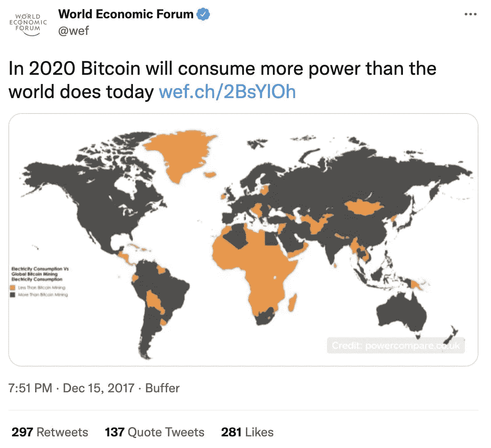

在这条推文的四天前，新闻周刊[发表了一篇文章](https://www.newsweek.com/bitcoin-mining-track-consume-worlds-energy-2020-744036)，标题与世界经济论坛的推文类似，标题为:*“比特币开采将在 2020 年消耗掉世界所有的能源，”*，文章进一步指出，*“据 Digiconomist 称，仅在上个月，比特币网络的能源消耗就增加了 25%。如果这种增长继续下去，到 2019 年，网络消耗的能源将与美国一样多，到 2020 年底，将与整个世界消耗的能源一样多。”没有什么比这更偏离事实的了。*

事实上，如今比特币只消耗了全球电力的 0.32%，远低于世界经济论坛和《新闻周刊》的预测。

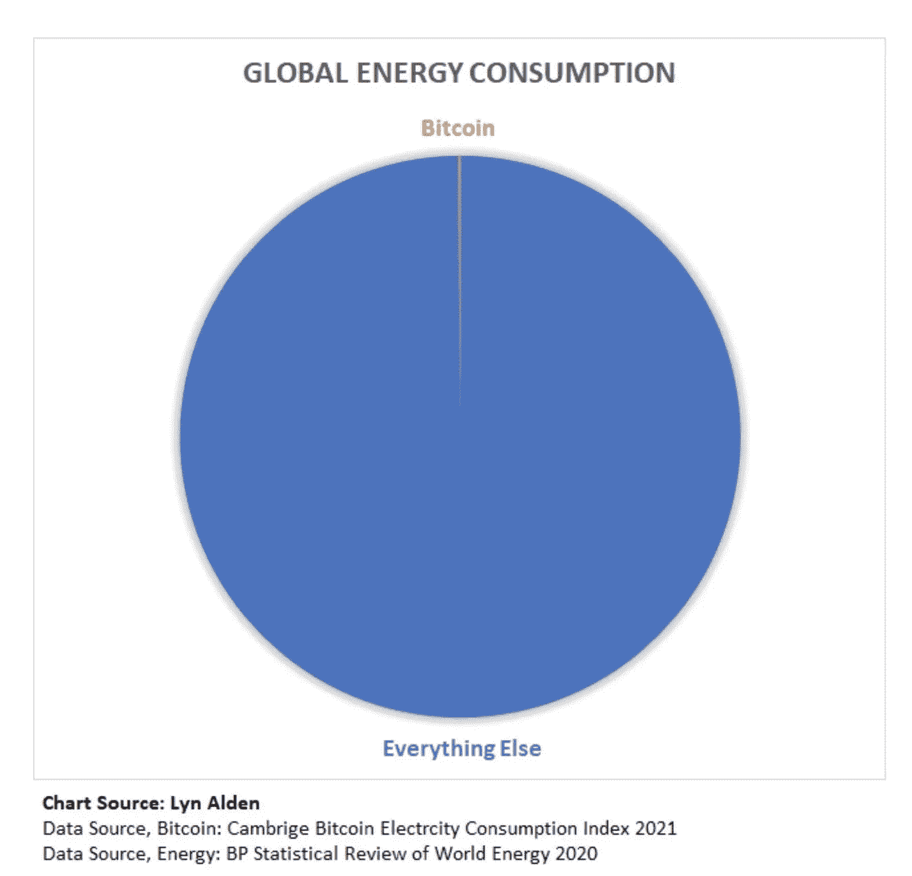

比特币在能源领域的另一个流行批评是，比特币比大多数国家使用的能源都多。事实上，在上面引用的《新闻周刊》的文章中，他们是这样说的:*“对目前开采比特币需要多少能源的分析表明，这比包括爱尔兰、尼日利亚和乌拉圭在内的 159 个国家目前的能源消耗还要多。加密货币平台 Digiconomist 的* [*比特币能耗指数*](https://digiconomist.net/bitcoin-energy-consumption) *将比特币的使用量与丹麦持平，每年消耗 33 太瓦的电力。”*虽然比特币网络确实比一些国家消耗更多的电力，但谷歌、亚马逊、网飞、银行系统、家用烘干机、圣诞灯和金矿行业也是如此。

这一论点是有缺陷的，因为它从本质上预设了能源消耗是有害的，电力是一种有限的资源，一旦流向比特币采矿，就会剥夺其他人或更多“有用行业”的电力。此外，声称一种能源的使用比另一种浪费更多或更少是完全主观的，因为所有用户都产生了成本并支付了完全的市场价格来消耗电力。

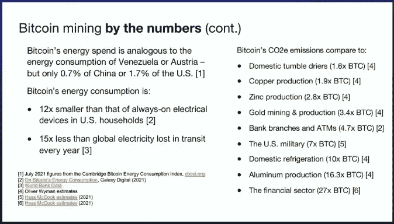

上个月,《纽约时报》发表了一篇标题为、“*比特币矿工希望将自己重塑为环保人士”*的[报道，并声称*“一笔比特币交易现在需要超过 2000 千瓦时的电力，或者足够一个普通美国家庭使用 73 天。”就像 1902 年一样，他们发表了一份声明，这份声明不仅不正确，而且至少可以说是疯狂的。对于不熟悉比特币内部运作的普通读者来说，这种说法似乎是可信的，因此他们无知地加入了攻击比特币能源使用的运动，除了上述热门产品之外，没有做任何额外的研究。*](https://www.nytimes.com/2022/03/22/technology/bitcoin-miners-environment-crypto.html)

在 2005 年著名的斯坦福大学毕业典礼演讲中，已故的史蒂夫·乔布斯在反思他从大学辍学是如何塑造了他的苹果之旅时说:“当然，当我在大学的时候，不可能把未来的点点滴滴联系起来。但是十年后回头看，非常非常清楚。还是那句话，你不能向前看，把点点滴滴串联起来；你只能把它们联系起来。”(7)

新发明、新技术也是如此。当它们第一次出现时，它们看起来很奇怪，毫无意义，但是当更多的人理解了他们正在解决的问题，并且随着技术本身的改进，回想起来就很明显了。在这种情况发生之前，普通人将会被巧妙构建的故事所蒙蔽，并加入攻击有可能显著改善他们生活的事物的合唱。

1971 年，尼克松总统终止了美元与黄金的自由兑换，此后出生或长大的大多数人一生只知道和使用法定货币；因此无法诊断其内在的缺陷。他们所熟悉的是一个由央行主导的世界，在这个世界里，政府发行货币、通货膨胀和货币崩溃是常事，而不是例外，他们现在习惯于接受现状，视其为常态。结果，当一种更好的货币形式以比特币的形式出现时，拒绝它比接受它更容易，尽管事实上这些人中的大多数都直接或间接地受到了法定货币体系的伤害。

价值百万美元的问题是，比特币的能源使用合理吗？一个很好的后续问题是，为什么比特币首先要消耗如此多的能量？这篇文章将解决这些问题，同时强调比特币的能源使用是这种去中心化货币网络的一个重要特征，而不是一个缺陷。这篇文章的目的不是让你同意我提出的所有观点，而是让你自己客观地、批判性地看待这些数据，并做出自己的决定。

***“我认为重要的是从第一原理推理，而不是通过类比。我们处理生活的正常方式是类比推理。【举个例子】我们这样做是因为这就像其他人做过的事情，或者像其他人正在做的事情。(根据基本原则)你把事情归结为最基本的真理……然后从那里推理。”***

*埃隆·马斯克*

在深入探讨所有能源问题之前，让我们先回到基本原则，理解比特币旨在解决的根本问题。大多数抱怨比特币能源使用量的人都认为比特币毫无用处，因此网络不必要地“浪费电力”，这对环境有害。为了充分理解比特币能源消耗的合理性，我们必须首先理解货币在经济中扮演的角色。

除非货币在有效协调经济活动中所扮演的角色得到充分理解，否则比特币作为一种解决方案的能源成本永远不会显得合理或正当。当美元、欧元和日元等法定货币运行良好时，为什么要为替代货币网络消耗如此多的电力？问题是，它们不起作用。如前所述，比特币是修复破碎的货币体系的解决方案，这个问题对大多数人来说是看不见也不可理解的。

例如，自 2019 年以来，黎巴嫩一直在应对一场经济危机，这场危机导致恶性通货膨胀，黎巴嫩镑对美元贬值 90%。截至 2021 年 8 月，通货膨胀率高达 290%，为世界最高，结果超过 75%的黎巴嫩公民现在生活在贫困中。由于燃料短缺以及医疗用品和其他基本物品的短缺，轮流停电成为常态。

2022 年 4 月 4 日，黎巴嫩副总理萨德·米沙出现在当地频道 Al-Jadeed 上，[向全世界宣布黎巴嫩已经破产。*“国家已经像黎巴嫩银行一样破产，损失已经发生，我们将努力减少人民的损失，”*米沙说，他接着说，损失将在国家、银行、储户和中央银行黎巴嫩银行之间分配。](https://www.middleeastmonitor.com/20220404-lebanon-goes-bankrupt-deputy-prime-minister/)

最简单的观点是将此视为政府方面的财政管理不善，尽管这可能有一定的道理，但恶性通货膨胀和最终的货币崩溃是所有法定货币的最终结局。不稳定的货币使得黎巴嫩很难有效地协调内部经济活动，也很难生产全球经济中贸易所需的商品。货币贬值扭曲了相关货币的价格机制，导致经济失衡。

随着货币的经济协调能力减弱，供应链中断随之而来，导致商品供应(如食品、医疗用品等)下降。)以及供需不平衡。随后，随着实际商品相对于货币供应变得相对稀缺，随着货币功能的崩溃，人们最终会囤积实际商品，同时尽快抛售货币，恶性通货膨胀就会出现。货币操纵对经济的破坏。

虽然一些经济体确实比其他经济体管理得更好，但事实仍然是，所有法定货币由于其共同的基础，最终都面临同样的命运，正如当前全球通胀加剧所证明的那样。比特币旨在从根本上修复这一有缺陷的基础。因此，我们现在可以在两种金融体系之间做出选择:1)无限供给的中央集权货币，这种货币被设计成随着时间的推移而贬值；2)具有固定供给的分散货币，这种货币以能源消耗的形式带来成本，但正外部性是长期的经济稳定。(8)比特币的存在是为了防止更多国家重蹈黎巴嫩或委内瑞拉的覆辙，它是全球至少 12 亿人的救生船，对于这些人来说，恶性通货膨胀是常态而非例外。

比特币是一种去中心化的无记名资产和点对点支付系统，它的运行不依赖于任何中央机构。比特币也是一种无需许可的仅附加账本，任何人都可以验证，任何人都可以“附加”，从而确保整个网络的完整性，并确保其抵制审查。它由一个分散的节点网络(运行比特币协议的计算机)保护，这些节点验证并中继交易；以及验证和中继块(带时间戳的事务组)。除了上述所有内容之外，矿工还执行比特币的**工作证明功能(PoW)** ，通过它生成、求解并传输到网络的其余部分。换句话说，节点验证事务，而挖掘器在分散的基础上每十分钟为它们执行一次清除功能。

这是最激怒比特币批评者和 ESG 战士的工作证明，最近由绿色和平组织、塞拉俱乐部和 Ripple 联合创始人克里斯·拉森(Chris Larsen)发起的[“改变代码而不是气候”](https://www.coindesk.com/tech/2022/03/29/bitcoiners-scoff-at-chris-larsens-5m-campaign-to-force-a-btc-code-change/)活动就证明了这一点，他已承诺为此捐赠 500 万美元。这场运动的目的是让比特币从消耗大量能源的“浪费性”PoW 共识算法转向；发起媒体运动，反对在《纽约时报》(这并不奇怪)、《彭博》、《华尔街日报》、《政治》和《脸书》等出版物中使用它。据 [Coindesk](https://www.coindesk.com/tech/2022/03/29/bitcoiners-scoff-at-chris-larsens-5m-campaign-to-force-a-btc-code-change/) 报道，这场运动还将针对比特币的支持者，如埃隆·马斯克、杰克·多西和富达首席执行官艾比·约翰逊。在[的一条推特帖子](https://twitter.com/chrislarsensf/status/1508657056319885316)中，拉森说，

> *另一方面，许多矿工正在重新利用旧的煤炭天然气发电厂，而不是他们越来越多地使用的电量的负责人(抬高居民的能源账单/不顾过载从电网吸取电力)。这是不可接受的…矿工承诺 100%使用绿色能源是一个很好的开始。但在我看来，这并不是一个简单的长期解决方案，因为战俘只是鼓励寻找最便宜的能源，而不是正确的做法……”*(9)**

*还需要一两篇文章来揭示克里斯推理中的缺陷，但我可以肯定的是，他刚刚损失了 500 万美元。工作证明是否浪费的问题，没有充分把握它所解决的问题，是无法回答的。没有对工作证明的理解，理解比特币将被证明是困难的，尤其是在它的能源使用方面。**与中央集权制不同，分权制没有单一的真理来源。**这仅仅意味着，由于没有看门人来验证添加到区块链的新事务的准确性，他们依赖于分布式节点网络来验证传入的事务，并将它们作为新块添加到链上。*

*比特币工作证明的全部意义在于**创造一个无可辩驳的交易历史**，通过纳入工作证明，Satoshi 建立了一个系统，使得所有参与者有可能以一种不可信的方式独立地在**同一真相上获得经济激励**。换句话说，工作证明是一种共识机制，它使分散网络中的匿名实体能够相互“信任”,并确保只有当块需要一定的计算能力才能产生时，它们才被视为有效。你也可以把它看作是物理世界验证数字世界的一种手段。因此，功的证明利用能量的转换作为做功的证据。*

*例如，网站通过解答验证码作为一种“工作证明”来验证你是人类。鉴于机器人很难完成这项任务，当提供正确答案时，网站知道你是人类。在比特币中，工作就是计算。计算是连接比特的数字领域和物理领域的桥梁。计算消耗能量，因此能量是桥梁。移除通往现实世界的桥梁，你将不会拥有无可辩驳的交易历史。*

*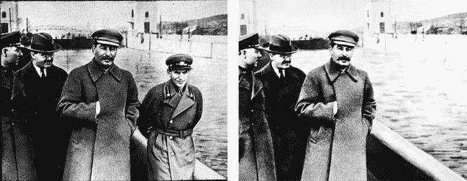*

*在没有中央权威机构来决定哪些事务是有效的(即，有效块)的情况下，工作是事实的仲裁者，并且最长的区块链是投入最多工作的那个；因此网络的其余部分基于该代码将其识别为真实的。这就是所谓的中本聪共识。工作证明是绝对必要的，因为没有它，不可信的数字货币就无法运行。(10) Hugo Nguyen [完美地总结了这一点](https://bitcointechtalk.com/the-anatomy-of-proof-of-work-98c85b6f6667)他说:*

> *“从根本上来说，我相信将能量附加到块上的想法是正确的&这可能是虚拟模拟不变性的唯一方式……通过将能量附加到块上，我们赋予它“形式”，允许它在物理世界中具有真正的重量和后果。我们也可以认为 PoW 是一种魔力，它将一堆 0 和 1 带入生活。换句话说， **PoW 是数字&和物理**之间的桥梁(11)*

*换句话说，没有能源作为支撑，不言而喻的真实交易历史是不可能的。这与赌注证明(PoS)截然相反，PoS 依赖于人类验证者来达成共识，他们的投票权基于他们押了多少令牌。像拉森这样的人喜欢这种共识机制，因为它不太耗费能源。唯一的问题是，这是一个政治系统，是另一种形式的中央银行，信任人类来验证交易。换句话说，它实现了集中化，因为像 Larsen 这样的网络参与者是能够获得“*预先开采的硬币”*的内部人士，可以持有更多股份，从而控制潜在的区块链，为自己谋利。*

*与法定货币不同，比特币是“开采”出来的，而不是印刷出来的。即使我们提到“挖掘比特币”，请记住，被挖掘的不是比特币。区块被开采，目前矿工如果找到一个有效的区块，就会获得 ***新*比特币**的奖励，因为找到新区块本来就很难。区分“挖掘比特币”和“挖掘区块”非常重要，因为它澄清了一些事情:*

*首先，比特币的开采速度**与比特币的能源使用无关。这是因为供给率是固定的，不会因为你选择开采多少能源而改变。Satoshi 结合了 ***的工作证明*** 和一个 ***的难度调整*** 到那个工作证明，以确保这个节奏无论如何都保持不变。开采难度在每开采 2016 个区块后进行调整，平均每两周进行一次。这就是所谓的*难度调整，*挖掘新比特币的难度根据网络上所有矿工的综合计算能力向上或向下调整。***

*可以把它想象成一个自动调温器，它调节网络，使街区之间保持一致的 10 分钟间隔。如果没有这种难度调整，如果更多的矿工加入网络，找到一个区块的平均时间将会下降。反之亦然；如果矿工人数显著减少，那么找到一个区块所需的时间也会显著增加。*

*这意味着每两个星期，不管矿工对网络贡献的综合计算能力，块之间的平均时间可能增加或减少，但它被重置回 10 分钟。这种调整保持了一致的区块生产，因此为新比特币的开采提供了一致的供应时间表。目前，矿工每成功开采一个区块将获得 6.25 个比特币的奖励，即使他们决定将采矿能量投入增加一倍，开采的比特币数量仍将保持不变，仍为每区块 6.25 个比特币。未能理解这一重要方面导致许多人相信媒体经常吹捧的误导性和不正确的*每交易能源成本指标*。剑桥大学另类金融中心是这样解释的:*

> *“流行的‘每笔交易的能源成本’指标经常出现在媒体和其他学术研究中，尽管存在多个问题。首先，交易吞吐量(即系统可以处理的交易数量)**与网络的电力消耗无关。**增加更多的采矿设备并因此增加电力消耗将对**处理的交易数量**没有影响。其次，单个比特币交易可能包含隐藏的语义，观察者可能无法立即看到或理解。例如，一笔交易可能包括对单个地址的数百笔支付，结算二层网络支付(例如，打开和关闭闪电网络中的通道)，或者可能使用 OpenTimestamps 等开放协议表示数十亿个带时间戳的数据点。”(12)*

*简而言之，用“比特币的总能源使用量”除以“交易次数”来确定“每笔交易使用的能源”是基于一个不正确的假设，即你花费或持有比特币的决定对当天比特币网络的能源支出有影响，而实际上根本没有影响。*

*其次，除了带来新的比特币，**矿工还负责维护网络的安全性和完整性，**确认交易，并发出支持或拒绝网络变化的信号，等等。执行这项工作从设计上来说是能源密集型的，需要世界各地的矿工贡献大量的计算能力，全天候运行。这是工作证明中的工作，也是绝对必要的。如果不了解挖掘过程，很容易将寻找有效块的高能耗过程等同于“寻找新的比特币”。这种特殊的观点使得所有这些电能似乎都转化成了新的比特币。所利用的能量是保护公共账本的安全层，而“创造新的比特币”只是一个副作用。*

*比特币的公共账本受到其综合计算能力的保护:在其工作证明链中完成工作所消耗的所有能量的总和。无论是现在还是将来，比特币的能源消耗都充当了保护所有用户的所有比特币余额的电气屏障。根据 Ark Invest 的 2022 年大创意报告，2021 年比特币的年结算量超过了 Visa 的支付量，达到 13.1 万亿美元。这比前一年的数量激增了惊人的 463%。(13)这难道不是值得保护的重要金融基础设施吗？对于比特币，那些理解声音和抗审查货币的社会效益的人给出了肯定的答案。(10)*

*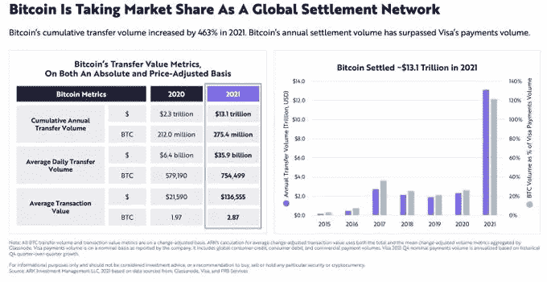*

*在能量货币系统下，标准是一小时消耗一定量的能量，相当于一美元。这只是一个用不同于国际银行集团给我们制定的标准来思考和计算的问题，我们已经习惯了这些标准，以至于我们认为没有其他合适的标准。*

**亨利·福特**

*1921 年，亨利·福特提出了一个创造新货币的建议，这种货币将由能源支持，而不是由黄金支持。福特对黄金的蔑视并不是秘密，正如他所说的，“黄金在战争中的本质邪恶在于它可以被控制。打破控制，你就停止了战争…黄金是世界上最没用的东西。我对钱不感兴趣，而是对钱仅仅是一种象征的东西感兴趣。”*

*根据《纽约论坛报》当年发表的一篇文章，福特的目标是结束他认为与金钱控制有关的战争。*

*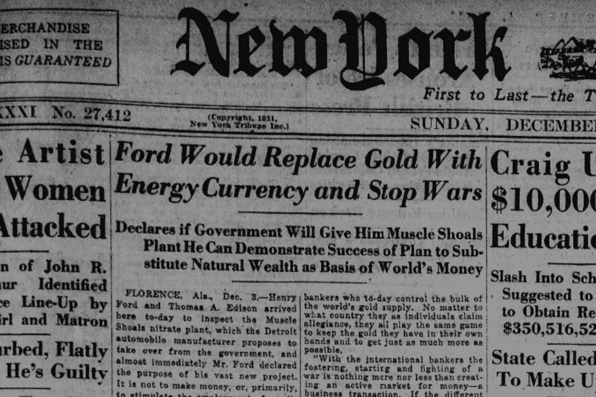*

*他的推理是，战争可以结束，因为每个国家都可以用其“不朽的自然财富”能源资源来支撑其货币。在接下来的三年里，他试图竞标 Muscle Shoals 大坝，以启动这一宏伟的愿景，但没有成功，最终放弃了，并失望地发表了以下声明:*

> *"本应由任何人在一周内决定的一件简单的事务变成了一件复杂的政治事务。"*

*快进到 2022 年，我们现在有了一种远远超过福特在 1921 年设想的货币和货币系统，那就是比特币。在了解了比特币消耗如此多能源的原因后，让我们看看比特币在全球年发电量和总耗电量中所占的份额，同时参考全球能源生产和消耗量。*

*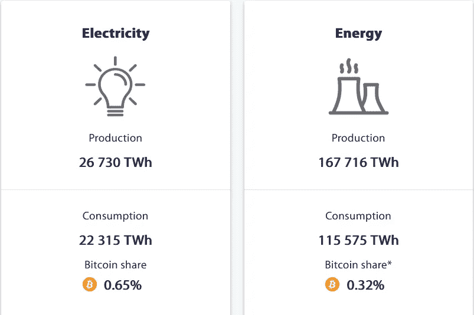*

*由剑桥替代金融中心计算的上述比较清楚地表明，比特币的能源消耗无论是相对于全球总发电量还是总发电量来衡量，都是一个舍入误差，分别为 0.65%和 0.32%。接下来，让我们将比特币与其他能源密集型行业以及住宅用电进行比较。*

*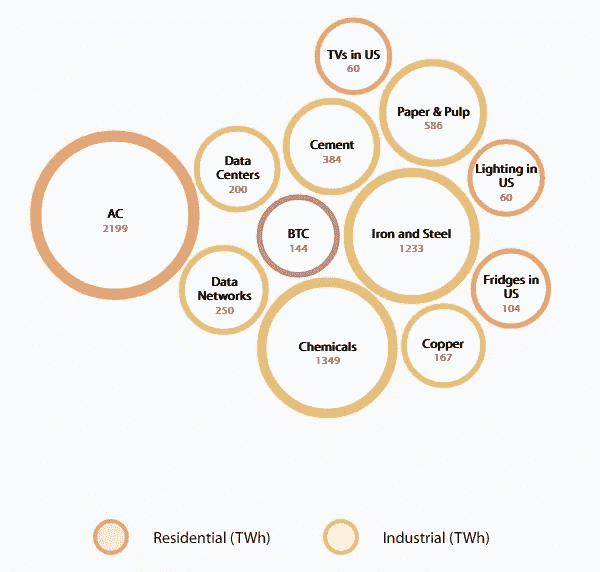*

*我不知道你，但我似乎不记得上一次在媒体上看到对造纸和纸浆工业高能耗的抱怨是什么时候了。*

*大多数 ESG 战士和比特币批评者都没有意识到的一件事是，比特币采矿将无法有效利用的闲置能源资产货币化。你可以把它想象成比特币采矿，充当闲置发电设施的全球电池。在这种情况下，比特币矿工不会与其他行业或居民用户争夺相同的资源，而是利用了原本会损失或浪费的剩余能源。简而言之，比特币采矿回收了浪费的能源，减轻了资本破坏，并提供了一种机制来拯救世界上任何地方的闲置能源。*

*根据加拿大石油和天然气工程师、上游数据公司创始人史蒂夫·巴伯(Steve Barbour)的说法；*

> *“当你开始生产石油时，天然气就会爆发，如果油井靠近管道，相关的天然气可以卖给发电厂或用于家庭取暖。但是有些井离管道很远，连接起来没有经济意义。这种气体被称为滞留气体。如果他们用不了，也卖不出去，那就烧了，一般，有时候还会发泄。燃烧它——通常被称为燃烧——对环境有害。都是二氧化碳，没有任何好处。将其直接排放到大气中更糟糕，因为甲烷比二氧化碳吸收更多的热量，从而加速地球变暖。”(14)*

*滞留天然气占全球目前已探明天然气储量的 40-60%。在美国能源信息署的 2020 年天然气报告中，他们[估计【2019 年美国每天至少燃烧 14.8 亿立方英尺的天然气。根据宏观分析师 Lyn Alden 的说法，这相当于 150 TWh 的能量，足以在 2021 年为**整个比特币网络供电；仅仅依靠我们搁浅的天然气。(4)**](https://www.eia.gov/todayinenergy/detail.php?id=46176)*

*利用这种闲置的闲置气体开采比特币不仅提供了额外的收入来源，还使石油公司能够保持合规，同时减少其运营对环境的负面影响。根据下面的比较，今年迄今为止全球燃烧的天然气量足以为整个比特币网络供电 4.8 倍。*

*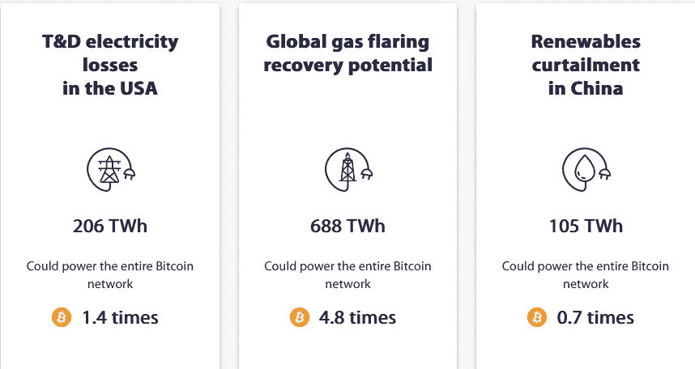*

*最后，关于碳排放的问题，尽管比特币开采是能源密集型的，但它只占全球碳排放的 0.1%。原因是，除了我们迄今为止讨论的所有因素之外，大多数比特币开采都利用了可再生能源。(15)*

*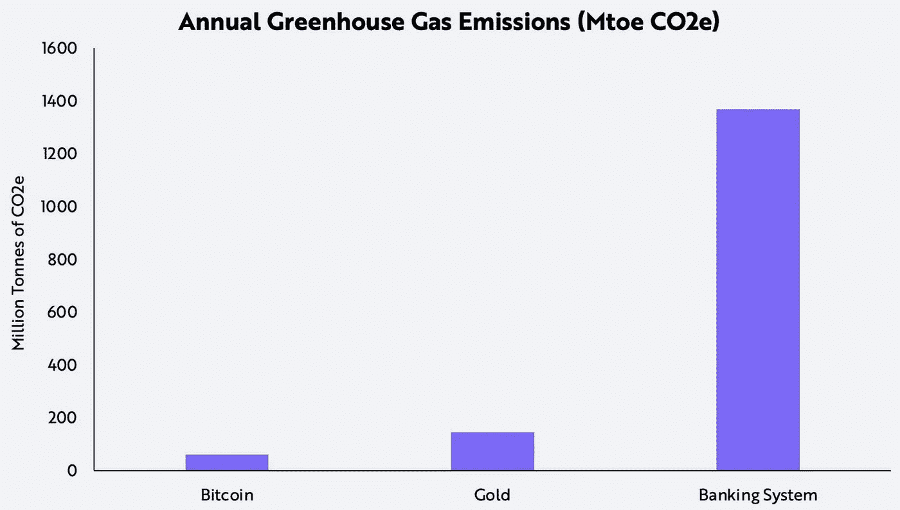*

****“最基本的问题不是什么是最好的，而是由谁来决定什么是最好的。”****

*托马斯·索维尔*

*总之，基于我在这篇文章中提出的发现，以及我遗漏的许多其他发现，我对比特币是否浪费能源这个问题的答案是响亮的“不”。大多数流传出来的 fud 通常来自没有花时间了解比特币在幕后如何工作的人，或者在某些情况下，如果比特币取代法定货币系统，那些有着隐藏议程的人就会脱轨。*

*一个去中心化的非主权货币网络的能源成本不仅可以忽略不计，而且被认为是合理的，因为比特币已经成为尼日利亚、黎巴嫩、乌克兰、阿富汗、委内瑞拉、古巴和土耳其等国人民的金融救生船。不同于以枪支为后盾、以征服为支撑的法定货币体系，比特币锚定在所有人的通用货币——能源之中，并以物理定律为后盾。*

*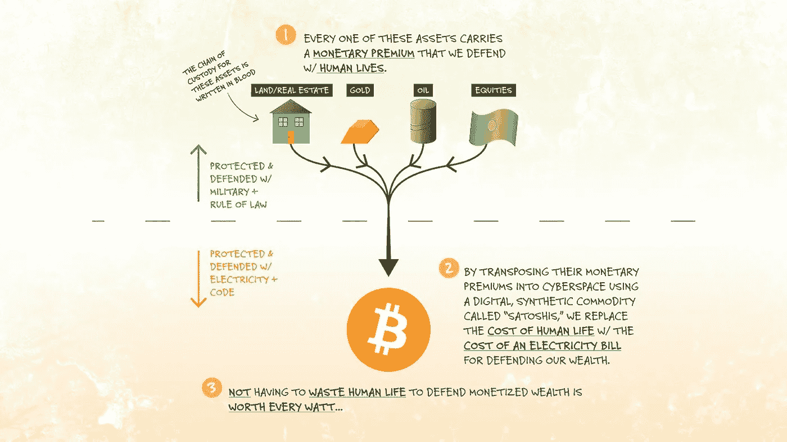*

*虽然这里提供的信息绝不是结论性的，但我希望你至少能做好自己关于比特币的功课，不要让你的观点被主流媒体左右。在我们的世界里，任何事情都需要花费时间和精力，比特币也不例外。更大的问题是，这些成本合理吗？他们值得吗？亚历克斯·格拉德斯坦在下面的话中完美地总结了比特币的整体社会效益:*

> *“我们正处于伟大的数字金融变革的开端，我们日常使用的货币正在从一种不记名资产——一种不会泄露我们任何信息的资产——演变为一种监控和控制机制。这对于这个世界上的一些人来说更为紧迫，对于另一些人来说可能不那么紧迫，这取决于他们所处的政治体制。当我看到这种不受政府或企业控制的新货币形式时，我想到了当今世界的大图景，在这个世界上，有 42 亿人生活在威权主义之下，12 亿人生活在两位数或三位数的通胀之下。当我们谈论货币崩溃的事实时，这不是理论上的，也不仅仅是关于一个国家。”(4)*

# *来源*

*1.《纽约时报》。感兴趣的汽车话题:许多业余爱好者正在用购买的零件制造机器。*纽约时报。*【在线】1902 年。[引用日期:2022 年 4 月 9 日。】[https://www . nytimes . com/1902/07/13/archives/automobile-topics-of-interest-many-eminentals-be-buding-machines . html](https://www.nytimes.com/1902/07/13/archives/automobile-topics-of-interest-many-amateurs-are-buuding-machines.html.)*

*2.**历史。**福特汽车公司揭开了 t 型车*的历史。*【在线】【引用日期:2022 年 4 月 9 日。】[https://www . history . com/this-day-in-history/福特汽车公司-揭开-模型-t.](https://www.history.com/this-day-in-history/ford-motor-company-unveils-the-model-t.)*

*3.新闻周刊。比特币开采有望在 2020 年前消耗掉全球所有能源。《新闻周刊》。【上线】2017 年 12 月 11 日。[引用日期:2022 年 4 月 9 日。][https://www . Newsweek . com/bit coin-mining-track-consume-worlds-energy-2020-744036。](https://www.newsweek.com/bitcoin-mining-track-consume-worlds-energy-2020-744036.)*

*4.奥尔登·利恩。比特币的能源使用不是问题。原因如下。*利恩奥尔登投资策略。*【上线】2021 年 12 月。[引用日期:2022 年 4 月 10 日。】[https://www.lynalden.com/bitcoin-energy/.](https://www.lynalden.com/bitcoin-energy/.)*

*5.**卡特，Nic。**揭秘比特币。*乙字。*【在线】2021。[引用日期:2022 年 4 月 10 日。】[https://www.thebword.org/c/track-1-demystifying-bitcoin.](https://www.thebword.org/c/track-1-demystifying-bitcoin.)*

*6.《纽约时报》。比特币矿工希望将自己重新塑造成环保主义者。《纽约时报》。2022 年 3 月 22 日。[引用日期:2022 年 4 月 9 日。】[https://www . nytimes . com/2022/03/22/technology/bit coin-miners-environment-crypto . html](https://www.nytimes.com/2022/03/22/technology/bitcoin-miners-environment-crypto.html.)*

*7.乔布斯，史蒂夫。乔布斯说:“你必须找到你喜欢的东西。”。斯坦福新闻。2005 年 6 月 14 日。[引用日期:2022 年 4 月 9 日。][https://news.stanford.edu/2005/06/14/jobs-061505/.](https://news.stanford.edu/2005/06/14/jobs-061505/.)*

*8.**刘易斯·帕克。**比特币不浪费能量。*被解放的资本。*【上线】2019 年 8 月 16 日。[引用日期:2022 年 4 月 9 日。】[https://unchained.com/blog/bitcoin-does-not-waste-energy/.](https://unchained.com/blog/bitcoin-does-not-waste-energy/.)*

*9.**拉尔森，克里斯。克里斯·拉森。*推特。*【在线】2022 年 3 月 29 日。[引用日期:2022 年 4 月 10 日。]***

*10.**吉吉·德。**比特币的能源消耗——视角的转变。*吉吉。*【上线】2018 年 6 月 10 日。[引用日期:2022 年 4 月 10 日。】[https://der gigi . com/2018/06/10/bit coin-s-energy-consumption/。](https://dergigi.com/2018/06/10/bitcoin-s-energy-consumption/.)*

*11.**阮，雨果。**解剖工作的证明。*中等。*【在线】2018 年 2 月 11 日。[引用日期:2022 年 4 月 10 日。][https://bitcointechtalk . com/the-anatomy-of-proof-of-work-98 c 85 b 6 f 6667。](https://bitcointechtalk.com/the-anatomy-of-proof-of-work-98c85b6f6667.)*

*12.**剑桥大学。**剑桥比特币用电指数。剑桥另类金融中心。2022 年 4 月 10 日。[引用日期:2022 年 4 月 10 日。】[https://ccaf.io/cbeci/index/comparisons.](https://ccaf.io/cbeci/index/comparisons.)*

*13.**方舟投资。** *大思路 2022。* s.l .:方舟投资，2022。*

*14.市场。地下采矿者使用“滞留”在井中的天然气为高耗能的钻井平台提供动力。市场。2022 年 3 月 25 日。[引用日期:2022 年 4 月 10 日。][https://www . market place . org/2022/03/25/crypto-miners-use-natural-gas-stranded-in-wells-to-power-energy-hungry-rigs/。](https://www.marketplace.org/2022/03/25/crypto-miners-use-natural-gas-stranded-in-wells-to-power-energy-hungry-rigs/.)*

*15.尼克·卡特，罗斯·史蒂文斯。 *比特币净零。纽约市，2021 年。**

*16.方舟投资公司。揭穿常见的比特币神话。方舟投资公司。2021 年 6 月 29 日。[引用日期:2022 年 4 月 10 日。][https://ark-invest . com/articles/analyst-research/bit coin-myths/。](https://ark-invest.com/articles/analyst-research/bitcoin-myths/.)*

*17.**阿摩斯，赛弗迪安。** *比特币标准。* s.l. : John Wiley & Sons，2018。*

*18.**劳雷·杰森。**推特。[在线][引用日期:2022 年 2 月 12 日。]*

*19.**赫尔德·丹。**证明工作是高效的。*中等。*【在线】2018。[引用日期:2022 年 4 月 10 日。】[https://danhedl.medium.com/pow-is-efficient-aa3d442754d3.](https://danhedl.medium.com/pow-is-efficient-aa3d442754d3.)*

*20.**哈珀，科林。**油田炼金术:比特币如何将废物、排放转化为工作证明。*比特币杂志。*【上线】2019 年 5 月 8 日。[引用日期:2022 年 4 月 10 日。][https://bitcoinmagazine . com/business/oil-field-alchemy-how-bit coin-can-turn-waste-emissions-proof-work。](https://bitcoinmagazine.com/business/oil-field-alchemy-how-bitcoin-can-turn-waste-emissions-proof-work.)*

> *加入 Coinmonks [电报频道](https://t.me/coincodecap)和 [Youtube 频道](https://www.youtube.com/c/coinmonks/videos)了解加密交易和投资*

# *另外，阅读*

*   *[如何在 FTX 交易所交易期货](https://coincodecap.com/ftx-futures-trading) | [OKEx vs 币安](https://coincodecap.com/okex-vs-binance)*
*   *[CoinLoan 审查](https://coincodecap.com/coinloan-review) | [YouHodler 审查](/coinmonks/youhodler-4-easy-ways-to-make-money-98969b9689f2) | [BlockFi 审查](https://coincodecap.com/blockfi-review)*
*   *[XT.COM 评论](https://coincodecap.com/profittradingapp-for-binance)币安评论 |*
*   *[SmithBot 评论](https://coincodecap.com/smithbot-review) | [4 款最佳免费开源交易机器人](https://coincodecap.com/free-open-source-trading-bots)*
*   *[比特币基地僵尸程序](/coinmonks/coinbase-bots-ac6359e897f3) | [AscendEX 审查](/coinmonks/ascendex-review-53e829cf75fa) | [OKEx 交易僵尸程序](/coinmonks/okex-trading-bots-234920f61e60)*