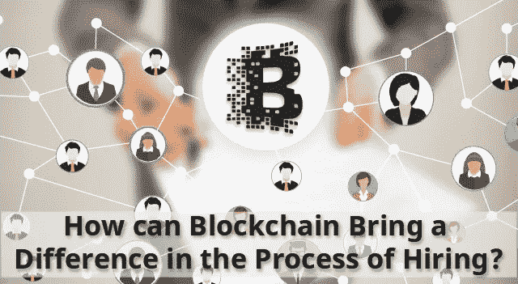

# 区块链如何在招聘过程中带来不同？

> 原文：<https://medium.com/coinmonks/is-blockchain-able-to-make-a-difference-in-the-process-of-hiring-287230e99446?source=collection_archive---------15----------------------->

## 区块链在招聘过程中的差异

纵观历史，当我们谈论**区块链技术的作用时，比特币已经成为焦点。**

随着创新对商业的影响变得非常容易理解，我们开始看到创新的兴起。[**区块链技术**](https://blog.engineermaster.co/how-and-why-become-blockchain-developer-in-2022-know-by-ems-experts/) **现在被全世界很多企业和政府所采用。唯一有很大范围的行业是招聘。**

我有一个朋友在招聘部门工作了十年。我只是对人们收集参考资料的过程(即旧过程)感到沮丧和越来越缺乏信任。

通过过时的过程，我的意思是引用很容易被操纵、误用和滥用。

近几年来，招聘人员收集的推荐信数量下降了惊人的数量，即三分之二。

过去，推荐信显示的是员工的真正才能和技能，但根据 CareerBuilder 的研究，75%的招聘经理发现员工在简历中谎报了自己的技能和成就。

甚至，现在有一种趋势正在被追随，即招聘完全基于工作人员在 Linkedin 等“个人品牌”页面上指出的能力。

在我看来，这是我们做出重要决定的一个糟糕的基础，对有技能的员工也不公平，因为他们无法联系到招聘人员，而这些员工才是真正值得的。

虽然，传统的背景调查方法可能不经济、单调，有时还会出错。

在我看来，没有比通过经过验证的证明人来检查员工的技能更好的方法了。损失还在继续。

并在网络上的每台设备上共享，****是*** 最安全、最值得信赖的数据编辑方式，也是确保员工资格的无可挑剔的方式。*

*随着推荐人的可靠性、满意度和真实性的下降，我发现了一个应用区块链技术的机会，通过消除招聘中的许多不准确性来改变推荐。*

# *招聘:基于区块链*

*点击这里- [招聘:基于区块链](https://blog.engineermaster.co/how-can-blockchain-bring-a-difference-in-the-process-of-hiring/)*

**