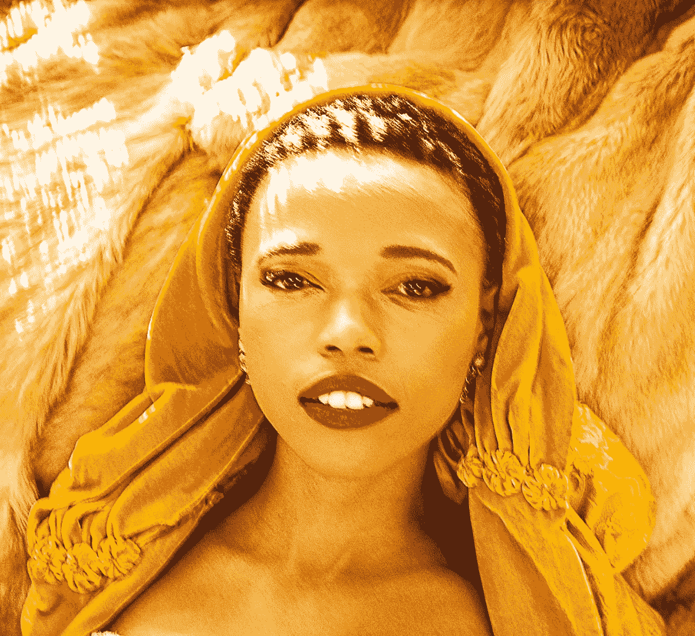

# 区块链是时尚行业的下一个 glow up 工具包吗？

> 原文：<https://medium.com/coinmonks/is-blockchain-the-fashion-industrys-next-glow-up-toolkit-a2e87b5b29b0?source=collection_archive---------20----------------------->

图梅洛·莫妮卡·塞特拉巴

容光焕发是向更好的方向彻底转变，通常是成年的标志。几十年来，时装业一直被批评没有照顾好自己。生产过剩，工人被剥削，大量的碳足迹，假冒伪劣等等。区块链会成为这一季的时尚发光挑战吗？我探索这种结合如何能带来好的改变。

Model: Tumelo Setlaba. Photographer: Max Katz. Wardrobe: moonstruck_experience

**生产过剩**

有些服装正在生产，但却永远不会被用于它的预期用途。[彭博](https://www.bloomberg.com/graphics/2022-fashion-industry-environmental-impact/)估计每秒钟大约有 2150 件衣服被扔掉。呀！

就我个人而言，在这个问题上，最让我恼火的是规模。"没有一件衣服适合所有人。"资深时尚顾问维多利亚·尼科尔斯告诉我。“对于标准规模，你所能期望的最好结果是大约 75%的人口”。

这意味着一批中号 t 恤中大约有 25%需要“计算”(字面意思)。也就是说，每件衣服必须找到适合顾客身材、形状、尺寸和合身程度的方法，而顾客一开始甚至不认为自己是一个媒介。

> 使用 UberEats 应用程序，就像希望找到一个火绒火柴一样——没有人希望在上面找到你，即使你们可能会觉得对方很美味。

因此，40%的购物者最终会在网上购买衣服，并打算在家里试穿，然后将大部分衣服退回。然后，多达四分之一的被退回的衣服(哦，你好，增加了快递的碳足迹)不能被转售，最终被扔进了垃圾填埋场。XXL 呀！！

焕发 101 是关于提高自尊和对自己身体感觉良好。但是试着在不同的品牌、不同的国家，甚至在同一家商店里穿不同的尺码…

> **…突然一个人变成了身体畸形大学的 A 号学生。这不是美容学校，但我当然选择退出这一个，谢谢！**

在 Stylexxa，我们使用区块链技术来收集购物者的生物特征数据，并将其与服装数据相结合，在您的在线购物体验中实时告诉您某件商品是否合适。作为购物者，只需在几秒钟内使用我们在任何参与零售商网站上提供的人体扫描仪测量自己，其余的由我们管理。

为什么这需要区块链？服装数据存在于全球非常复杂的时装供应链中。因此，利用区块链互操作性的优势，Stylexxa 几乎是系统不可知的。我们可以更轻松地与各种制造商和零售商集成，以实现数据的收集、安全和分发。

**信用到期的加密**

团队里没有“我”，但区块链有。这部分时尚产业的光芒是关于照耀时尚的创造者，尊重所有权或者仅仅是贡献；因此，在该表扬的地方给予表扬。

区块链技术允许设计师和品牌开发一种不可改变的创作证明，作为一种价值储存手段，可以在数字世界中交易、存储和转移。这使得跟踪版税支付、商标、许可证设计和销售来源变得非常方便。

例如像 [Bernstein](https://www.bernstein.io/fashion-design-blockchain) 这样基于区块链的解决方案可以让设计师记录创作过程的每一步。

**“虽然现行法律体系提供的保护是有价值的，但版权、商标和未注册的设计权并不总是有效的，因为它们可能难以证明，因此难以执行。”公司解释道。**

为什么这很重要？在时尚界，有无数关于创意和文化盗窃的说法。还记得 Zara 似乎盗用了南非本土天才 Laduma Ngxokolo 的设计和他的爆炸性品牌 maXhosa 的设计吗？或者当小品牌成为快时尚巨头的牺牲品时，她涉嫌[窃取他们的设计](https://fashionmagazine.com/style/shein-stolen-designs/)？还是 Zara 和 Shein [互相抄袭](https://www.instagram.com/zara.vs.shein/?hl=en)的时候！Lol。

虽然我是协作和共同创造的忠实信徒，但我很高兴地宣布，在爱情、战争和区块链中，一切都是公平的。

***假冒不可爱***

容光焕发是关于独特的身份，创意和真实性。人们可以说奢侈时尚产品也是如此。作为一个复写纸或赝品，剥夺了一个人或一件产品的价值。

随着区块链技术(加上跟踪芯片或代码标签)嵌入到时装供应链中，产品的原创性很容易获得。这鼓励消费者拒绝假冒产品，或者来自道德上有问题的生产线的产品。

[AURA](https://auraluxuryblockchain.com/?cli_action=1647869912.292) ，LVMH、普拉达集团、历峰财团出品的验证奢侈品的区块链平台就是一个很好的例子。

首席执行官 Derck Mekkering 告诉我， [RadyGo](https://www.radygo.tech/) 在 RadyGo 智能标签的开发方面走在了曲线(和立法)的前面，这种标签可以跟踪服装从销售点到报废的生命周期。这种情况下的主要目标是确保负责任的退货、再利用和回收。

**结论**

所以俗话说，“美丽只是表面的”。时尚行业可能看起来很吸引人，但它可能不具备所有吸引人的内在品质，区块链可能是走向真正的行业深度自爱的第一步。

**关于 Stylexxa 的更多信息**

Stylexxa 是区块链支持的供应链 SaaS 解决方案，鼓励制造商、品牌、零售商和购物者之间安全、合作地共享数据，以解决在线时尚零售中的尺码问题。

> 加入 Coinmonks [电报频道](https://t.me/coincodecap)和 [Youtube 频道](https://www.youtube.com/c/coinmonks/videos)了解加密交易和投资

# 另外，阅读

*   [CryptoHopper 替代品](/coinmonks/cryptohopper-alternatives-d67287b16d27) | [HitBTC 审查](/coinmonks/hitbtc-review-c5143c5d53c2)
*   [CBET 评论](https://coincodecap.com/cbet-casino-review) | [库科恩 vs 比特币基地](https://coincodecap.com/kucoin-vs-coinbase)
*   [折叠 App 审核](https://coincodecap.com/fold-app-review) | [Kucoin 交易机器人](/coinmonks/kucoin-trading-bot-automate-your-trades-8cf0ca2138e0) | [Probit 审核](https://coincodecap.com/probit-review)
*   [如何匿名购买比特币](https://coincodecap.com/buy-bitcoin-anonymously) | [比特币现金钱包](https://coincodecap.com/bitcoin-cash-wallets)
*   [币安 vs FTX](https://coincodecap.com/binance-vs-ftx) | [最佳(SOL)索拉纳钱包](https://coincodecap.com/solana-wallets)
*   [比诺莫评论](https://coincodecap.com/binomo-review) | [斯多葛派 vs 3Commas vs TradeSanta](https://coincodecap.com/stoic-vs-3commas-vs-tradesanta)