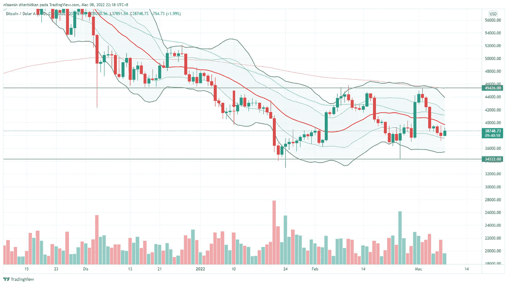

# $BTC 在这个价格通道内波动

> 原文：<https://medium.com/coinmonks/is-btc-ranging-in-a-channel-357962c93e5c?source=collection_archive---------86----------------------->

Photo by [Art Rachen](https://unsplash.com/@artrachen?utm_source=unsplash&utm_medium=referral&utm_content=creditCopyText) on [Unsplash](https://unsplash.com/s/photos/bitcoin?utm_source=unsplash&utm_medium=referral&utm_content=creditCopyText)

*(免责声明:本文并非理财建议。这篇文章只是分享我对比特币当前价格形势的浅显分析。你应该做自己的投资研究。)*

首先，我不是比特币 maxi，但我喜欢叠加 sat！似乎所有其他硬币的价格变动几乎类似于$BTC 图表。所以，如果你在交易加密软件，最好是获得最新的$BTC 更新。

Screenshot of Bitcoin chart on TradingView

对上图的一些评论:

1.  请注意，美元在 EMA200 线(粉红色线)下方交易。仍然没有上升趋势。
2.  $已经开始拉锯 EMA50。大概是想突破 EMA200。
3.  自上次下跌以来没有更低的低点。$范围在 34–45k 之间。
4.  在上升到阻力线之前，美元通常在下布林线之外触底。在$ ranges 再次上升之前，可能会有另一次转储到 34k。
5.  如果$破坏了上面两行中的任何一行，通道将失效。

*你看到这个频道了吗？*

*你认为这个频道在中断前会持续一段时间吗？*

*会突破阻力还是支撑线？*

老实说，我不知道。如果你在这个范围内交易，你需要密切关注价格。把你的止损设置在你能管理损失的水平。如果你是 hodling，你不需要经常看价格。

再次强调，在做出任何投资决定之前，一定要做好自己的研究，因为这不是财务建议。

别忘了按下那个**拍手**按钮以示支持！