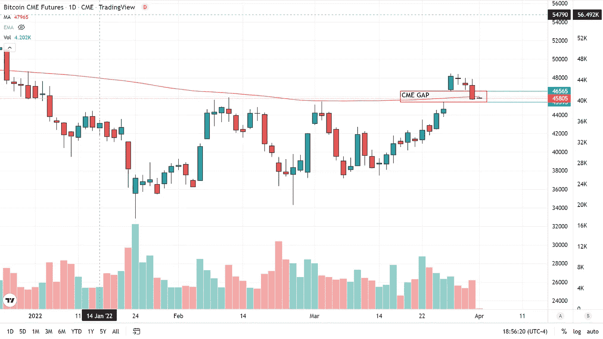
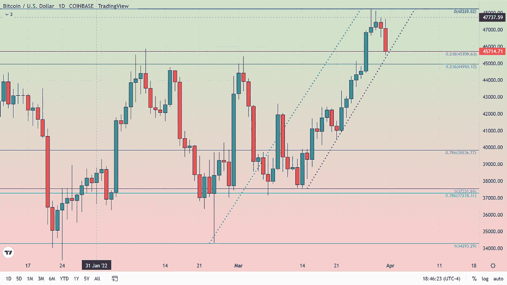

# BTC 的反弹还在吗？

> 原文：<https://medium.com/coinmonks/is-btcs-rally-still-intact-6e02f1b2bc61?source=collection_archive---------61----------------------->

根据比特币基地的数据，截至美国东部时间下午 4:50(2022 年 3 月 31 日)，比特币交易价格接近当天低点，约为 45700 美元。在芝加哥商业交易所的期货市场，比特币最活跃的合约月份(4 月 BTCJ2022)的交易价格接近 45，845 美元。一些分析师一直在寻找上周五至周一 CME 期货图表上形成的缺口，以填补这一缺口。随着 CME 在 Globex 重新开盘前的 1 小时休息时间的到来，周末创造的差距(45，395 美元至 46，565 美元)似乎将接近被消除，但截至今天不会完全填补。

与现货图表相比，CME 图表的另一个有趣的特点是 200 天简单移动平均线(红线)的位置。在现货市场，这一长期移动平均线位于 48，300 美元，实际上标志着当前的阻力。尽管 CME 期货图上的 200 日均线自 2022 年初以来一直处于阻力状态，但周一当价格差距形成时被超越。在 CME 期货中，200 天均线固定在 45，880 美元，尽管当天市场跌破该平均线，但随着当天交易的结束，该平均线可能会成为支撑，因为价格仅比该长期技术指标低约 100 美元。

让我们回到现货市场，看看始于 3 月中旬、让 BTC 突破 48000 美元的反弹，我们可以看到，过去两天相当于一次非常浅的回调。

看上面的图表，两个不同的数据集被用于回撤的开始。你可以看到过去 16 天的 23%回撤线(蓝色)和过去 35 天的 23%回撤线(紫色)都表明 23%的水平很重要，无论是支撑还是阻力都很活跃。这个水平通常被认为是将价格下跌定义为回撤的最小距离。因此，比特币收盘高于这一水平对多头来说是一个好兆头，并预示着可能会有更多的上行空间。

过去两天没有造成图表损坏，我们的目标结论是高达 53，000 美元仍然是我们目前的模型。接受我们电话的交易者昨天在 48，000 美元的位置撤回了一半的利润，并在 43，000 美元的位置保持了另一半的多头。保护性止损应该保持不变，价格在 16 美元以内，我们止损获利(剩下的一半)，低点在 45，516 美元。

对于任何有兴趣阅读我更多文章的人，只需点击这个[链接](https://www.thegoldforecast.com/bitcoin)。

> 加入 Coinmonks [电报频道](https://t.me/coincodecap)和 [Youtube 频道](https://www.youtube.com/c/coinmonks/videos)了解加密交易和投资

# 另外，阅读

*   [如何在 FTX 交易所交易期货](https://coincodecap.com/ftx-futures-trading) | [OKEx vs 币安](https://coincodecap.com/okex-vs-binance)
*   [CoinLoan 评论](https://coincodecap.com/coinloan-review) | [YouHodler 评论](/coinmonks/youhodler-4-easy-ways-to-make-money-98969b9689f2) | [BlockFi 评论](https://coincodecap.com/blockfi-review)
*   [XT.COM 评论](https://coincodecap.com/profittradingapp-for-binance)币安评论 |
*   [SmithBot 评论](https://coincodecap.com/smithbot-review) | [4 款最佳免费开源交易机器人](https://coincodecap.com/free-open-source-trading-bots)
*   [比特币基地僵尸程序](/coinmonks/coinbase-bots-ac6359e897f3) | [AscendEX 审查](/coinmonks/ascendex-review-53e829cf75fa) | [OKEx 交易僵尸程序](/coinmonks/okex-trading-bots-234920f61e60)