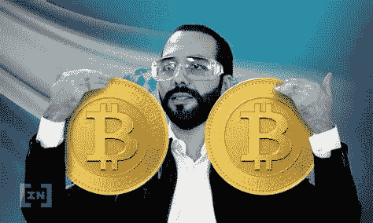
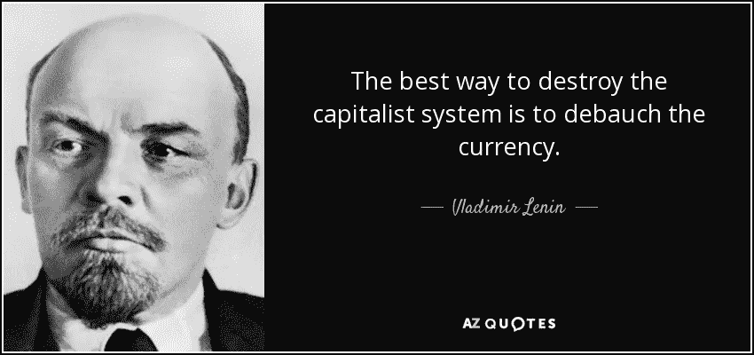
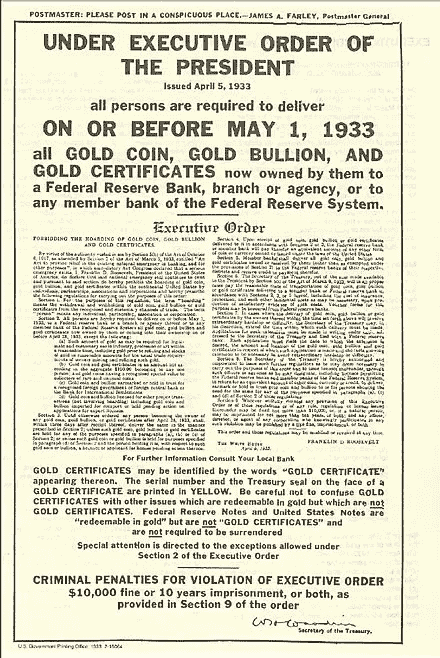
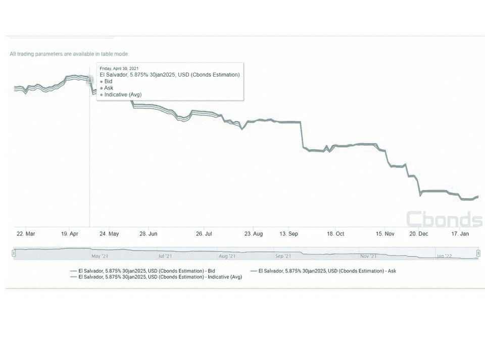

# 布克勒对比特币是好是坏？

> 原文：<https://medium.com/coinmonks/is-bukele-good-or-bad-for-bitcoin-430700d8176e?source=collection_archive---------6----------------------->

这不是对萨尔瓦多总统布克莱的政治观点。我们中的大多数人对萨尔瓦多知之甚少，我们无法正确评价布克勒的政策。到目前为止，他的同胞们给予了他广泛的支持，这就足够了。比特币社区也不应该盲目地为布克勒的比特币立场喝彩。**这里的关键问题是布克勒总统采取的策略对比特币**是好是坏。我指的是长期而言，长期采用比特币作为全球储备资产，这将润滑一场新的经济复兴，这种复兴是由一种分散的、稀缺的、不受审查的资产促成的，这种资产不会成为任何人的负债。成为全球储备资产的道路仍很漫长，获得构成全球金融体系的数万亿美元中的一小部分，仍将是金融海洋中的一个小水滴。比特币绝不是黄金的风险。也不会威胁到美元的储备货币地位。

正如列宁所指出的，对这一体系的真正威胁是滥用印刷机以及由此衍生的特权。那些攻击比特币的人是罪魁祸首，[受益于菲亚特系统的同一群寄生虫正在杀死他们的金鹅](https://andreabianconi.medium.com/the-too-many-fallacies-of-the-fiat-currency-system-7f883b25f28c)。比特币只是一种技术，它最终让人们能够选择退出被滥用的特权体系，并以前所未有的方式储存他们的财富。如果说有什么不同的话，那就是金融机构和政治家们应该听从煤矿中的金丝雀。矛盾的是，比特币可以让法定货币体系恢复一些表面上的纪律。拜登政府提出的对比特币的政治攻击——要么通过任意限制其使用，要么通过实施明显旨在破坏比特币的不相称的税收制度——将等同于罗斯福在 1933 年对黄金实施的臭名昭著的 EO 6102。对基本自由权利和资本主义制度本质的变相攻击。

# 捅了马蜂窝

回到萨尔瓦多的法律，我必须说，到目前为止，我对布克莱的比特币策略相当不以为然。而且，我公开反对比特币法定货币法。因此，这一次，我站在了 IMF 一边，尽管原因显然完全不同。我担心萨尔瓦多，我担心比特币被拖入一场不必要的地缘政治斗争，它不需要这场斗争。

对小国萨尔瓦多来说，与国际货币基金组织(IMF)开战毫无意义。IMF 是整个金融体系和美元储备地位的代表。为了什么？仅仅因为发表了一份政治声明，称比特币现在是合法货币，并捅了一个危险的马蜂窝？谁在乎呢。真的，对于想要使用比特币的萨尔瓦多人来说，比特币是不是法定货币没有任何实际区别。他们还是会用它。成为法定货币违背了比特币所代表的一切。它违背了它所有的自由主义基础，自由，非胁迫，非审查，分权。强制实施法定货币法等于(多小于多)让比特币成为半法定货币。通过建立使用比特币的正确激励机制，法律力量所能实现的一切都可以更好地实现。毕竟这是比特币教给我们的，对吗？因此，如果它实际上没有让萨尔瓦多人受益，也没有让萨尔瓦多与金融遗产机构的关系受益，那么谁会受益呢？

我还不能回答。但是，除非布克莱正在玩一场更大的游戏，或者他在背后有人支持的情况下与国际货币基金组织进行代理斗争，否则在这个微妙的转折点上与国际金融机构对抗对该国来说似乎是一种自杀策略。自夏季以来，萨尔瓦多债券遭到抛售，收益率大幅上升。

# 玩火的风险

如果火山债券的认购不如预期，谨慎的做法是假设萨尔瓦多迟早会再次需要国际货币基金组织和世界银行的支持，以高得多的利率为到期债券再融资。这对它的经济将是非常有害的。此外，为了降低国际债券市场目前要求的利率，Bukele 必须向国际债权人表明，比特币的采用正在改善其经济状况。这将需要很长时间，因为实施我下面提到的所有步骤需要时间，以便通过采用比特币标准来真正促进经济发展。仅仅通过颁布法定货币法不可能奇迹般地做到这一点。与此同时，金融市场将把萨尔瓦多的空气都挤出来了，除非——这是一个冒险的赌注——布克勒计划用他们现在购买的比特币呼吸一些新鲜空气，以防它们在合理的时间框架内会升值很多。但押注美国国债价格升值与促进可持续生产率增长截然不同。这也不会让国际贷款人放心。萨尔瓦多不是微观战略。一个主权国家不能简单地复制粘贴一份企业财政部的剧本。它需要更多，它需要可持续的长期经济发展政策。

因此，尽管与国际货币基金组织的明显自杀式对峙对我来说仍是一个谜，但有一种更好的方式来促进比特币的采用，而不会在一场远比布克莱和萨尔瓦多更大的地缘政治游戏中惹恼全球金融机构。

怎么会？

很简单，照国际货币基金组织说的做，取消法定货币法。这并不是因为国际货币基金组织这么说，而是因为比特币的采用没有必要，至少目前没有必要。

# 可持续发展和比特币应用的真正战略

更重要的是，比特币作为储备资产的采用——在此基础上，需要建立一个经济体系来促进可持续增长，避免美元化或欧元化的陷阱——比它简单地用作汇款或支付账单的货币要复杂得多。这是漫长的采用周期的最后一步。首先是通过他们无法控制的美元硬通货保护萨尔瓦多人的储蓄免受进口通货膨胀的影响。然后是建立基于比特币的银行基础设施、服务和铁路。接下来是吸引投资者。然后创建比特币离岸服务。那么，最终，比特币作为价值储存手段以及可能作为货币的无缝、无摩擦的使用，将是上述一切的必然结果。到那时，比特币将成为实质上的法定货币，无需任何法律来宣布它。慢慢地，慢慢地，然后突然。所有这些都没有惹恼国际货币基金组织和他们的亲信。

相反，[银行可以从使用比特币作为其银行服务的储备数字资产中获得很大利润](https://andreabianconi.medium.com/bitcoin-and-the-lost-art-of-commercial-banking-6057442da435),同时美元储备地位也不会受到威胁，因为比特币在 1971 年之前不作为货币流通，而是作为储备资产流通，就像黄金一样。让我们更详细地看看萨尔瓦多和任何其他发展中经济体应该采取的实际步骤:

可以从 www.bianconiandrea.com[的](https://www.bianconiandrea.com/)网站免费下载一份名为《[监管政策促进新兴经济体加密货币/区块链相关创新和投资](https://www.bianconiandrea.com/)的白皮书

这篇文章也是关于萨尔瓦多的法定货币法。

1.第一步是采取最低限度的监管框架，为企业创新留下充足的空间，而不受什么限制。特别是新的技术应用，如数字令牌化资产(即稳定债券和令牌化证券)，必须在当地法律框架内得到认可。比特币在法律上被视为一种财产、一种资产还是一种记账单位都无关紧要。重要的是，它与法定货币的兑换不应该被征税，而且应该尽可能没有摩擦。

2.第二步是实施一个灵活的加密银行章程，主要管理加密资产的发行和保管，就像怀俄明州为 SPDIs(特殊目的 Dep)实施的那样。机构)。必须鼓励银行接入比特币协议，建立新的银行基础设施。在这方面，萨尔瓦多可能真的处于新一波浪潮的最前沿由比特币支持的自由银行。原因很简单。通过将比特币作为储备资产，商业银行可以开始开发新一波在岸和离岸的免费银行服务，这可能会将萨尔瓦多戏剧性地转变为南美的瑞士。因为比特币银行的储备在任何时候都是完全可审计的(储备证明)，一个非常有活力和竞争力的银行服务系统可能会出现，而不需要政府的控制、限制和最低储备比率义务，而在一个不透明的不可审计的法定系统中，甚至在一个基于黄金的标准中，这些都是非常需要的。一个可靠的比特币银行网络是吸引加密资本的基础。参见“[比特币与商业银行失传的艺术](https://andreabianconi.medium.com/bitcoin-and-the-lost-art-of-commercial-banking-6057442da435)”。

3.需要保管应用和服务。当地法规必须考虑到这一点。法律必须区分监管和非监管服务和应用。货币转移法必须考虑到这一点，并且在必要时必须更新。这是将该国定位为加密货币活动中心的关键。

4.通过灵活的许可流程激励加密交换的建立。

5.给予奖励以吸引秘密资本/投资者和人才资本。税收优惠非常重要。钱流向待遇更好的地方。而且人力资本也会转移到商业机会和生活水平更好的地方，或者至少是前景更好的地方。像投资居住权和公民权这样的项目非常重要。一个新的比特币电子居留计划，类似于爱沙尼亚的电子居留计划，可能是一个明智的选择。

6.可能将投资于该国的比特币资本引入央行持有的比特币基金，为该国的基础设施和发展项目提供融资(想想使用残余和可再生能源的比特币采矿)。这可能会鼓励当地央行将部分外汇储备配置给比特币。

7.鼓励使用比特币支付行政费用和税收，并确保加密货币和当地法定货币之间的自由和完全可兑换性。业务采用也很重要，特别是对于昂贵的项目，如支付房地产。所有这些都将为政府现代化的数字金库带来充足的资金储备。支持(而不是强迫)比特币化，以缓慢逆转经济的美元化。

8.动员比特币投资者创建一个比特币采用剧本和一个由合格专业人士组成的任务组，以帮助发展中国家。集中资源，邀请邻近的南美国家和其他发展中国家亲眼看看在一个国家采用比特币标准可以做些什么。创建一个自由发展中国家的比特币联盟。这里的目标是将比特币银行从国家边界扩展到国际边界，为基于比特币的国际贸易奠定基础。同样，比特币不需要成为贸易货币，但它可以成为更好的国际贸易体系的润滑剂。想想在这个受政治控制的金融体系中，任意的制裁是如何影响许多国家的贸易和发展的。

# 结论

如果布克勒那样做了，就没有理由让比特币成为该国的法定货币。比特币将成为萨尔瓦多经济和社会的基石。此外，它很可能支持萨尔瓦多发行新的 CBDC。与中国共产党独裁政权所激发的全球趋势相反——它已经将数字人民币打造为一种控制、胁迫和压迫的工具——萨尔瓦多的 CBDC 可能会受到自由主义原则的启发，被打造得更类似于电子现金。最终，比特币可以与黄金和法定货币和平共处。自由市场力量和良好的激励机制将决定它的未来，而不是法律的力量。

这一切都要求布克勒总统非常小心。听从可靠而谨慎的顾问(当然不是充斥比特币节日的冲动的 twitter 狂热人群)，因为真正的比特币采用需要仔细规划。最重要的是，我们比特币人非常关心萨尔瓦多人民，希望这是一个真正的成功，可以为其公民带来经济发展和财富。如果布凯勒总统和萨尔瓦多在这个项目上取得成功，我们都会成功。否则，我们都会失败。

[www.bianconiandrea.com](http://www.bianconiandrea.com)—2022

*******************************************************************

***如果你喜欢这篇文章，请在左下角“鼓掌”x 次，这样它就会被更多的人分享。多谢***

*******************************************************************

**法律免责声明**:本网站及其中包含的信息仅供一般指导，并不构成法律意见。因此，它不应被用来替代就具体问题与律师的磋商。本文中的所有信息均按“原样”提供，不保证完整性、准确性、及时性或任何形式的明示或暗示的担保。

**投资免责声明**:本网站及其中包含的信息无意成为与所提交材料相关的建议或信用分析的来源，本网站中包含的信息和/或文件不构成投资建议。

www.bianconiandrea.com—2022 年

*原载于 2022 年 2 月 2 日 https://andreabianconi.medium.com***。**

> *加入 Coinmonks [电报频道](https://t.me/coincodecap)和 [Youtube 频道](https://www.youtube.com/c/coinmonks/videos)了解加密交易和投资*

## *也阅读*

* [## 杠杆代币[多头代币]终极指南

### 杠杆化令牌是具有杠杆化风险敞口的 ERC20 令牌，不考虑保证金、要求、管理…

medium.com](/coinmonks/leveraged-token-3f5257808b22)  [## 最佳加密交易所| 2022 年十大加密货币交易所| CoinCodeCap

### 哪一个是最好的加密交换？在本文中，我们将根据多种加密货币列出 10 大加密货币交易所

coincodecap.com](https://coincodecap.com/crypto-exchange)  [## 2022 年最佳加密交换平台| CoinCodeCap

### 随着时间的推移，我们大多数人将转向 dex 以获得更好的安全性和隐私。因此。在这里，我们将讨论…

coincodecap.com](https://coincodecap.com/best-swap-platforms)  [## 10 大最佳在线赌场|赢得并赢取免费 BTC 2022 | CoinCodeCap

### 接收、支付和赚取加密货币| |有各种各样的最佳在线赌场可供选择，有可能…

coincodecap.com](https://coincodecap.com/best-online-casinos)  [## 2021 年最佳加密借贷平台| 6 大比特币借贷平台

### 获得比特币和其他加密货币的最佳贷款利率

medium.com](/coinmonks/top-5-crypto-lending-platforms-in-2020-that-you-need-to-know-a1b675cec3fa)  [## 2021 年 6 大最佳硬件钱包|顶级加密硬件钱包[更新]

### 最好的加密货币硬件钱包是绝对必要的。我们将在 NGRAVE、Ledger Nano X 和…

medium.com](/coinmonks/the-best-cryptocurrency-hardware-wallets-of-2020-e28b1c124069)  [## 加密交易机器人——19 款最佳免费加密交易机器人

### 2022 年币安、比特币基地、库币和其他密码交易所的最佳密码交易机器人。四进制，位间隙…

medium.com](/coinmonks/crypto-trading-bot-c2ffce8acb2a)  [## 最佳 4 个加密交易信号电报通道

### 这是乏味的找到正确的加密交易信号提供商。因此，在本文中，我们将讨论最好的…

medium.com](/coinmonks/best-crypto-signals-telegram-5785cdbc4b2b)  [## Bitsgap 评论-交易机器人加密信号和套利 2022

### 这篇文章的重点是 Bitsgap 审查，这是一个最终的交易解决方案，并提供交易机器人，信号…

coincodecap.com](https://coincodecap.com/bitsgap-review)*