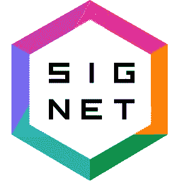
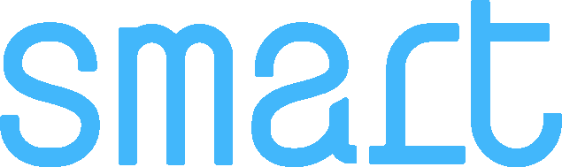

# 大麻对于医疗保健就像比特币对于金融一样吗？

> 原文：<https://medium.com/coinmonks/is-cannabis-to-healthcare-as-bitcoin-is-to-finance-e58146c9f7cf?source=collection_archive---------52----------------------->

Image by NickvPe at Pixabay

杰西·沃尔登[写了](https://variant.fund/writing/past-present-future-from-co-ops-to-cryptonetworks)关于通过[网络 2](https://www.investopedia.com/terms/w/web-20.asp) 平台中的数据赋予商业力量。可悲的是，随着时间的推移，这些平台从合作行为演变/恶化为掠夺行为。

因此，与 Web2 不同，Web3 支持[利益相关者资本主义](https://www.investopedia.com/stakeholder-capitalism-4774323)。在最近的一篇文章中，世界经济论坛证实，这种形式的资本主义提供了股东资本主义和国家资本主义之外的好处，并被广泛视为促进进步、人类和地球的全球经济的基础。

《连线》杂志将 Web3 解释为“…一个基于区块链的分散式在线生态系统。建立在 Web3 基础上的平台和应用将不会由一个中央把关者拥有，而是由用户拥有，用户将通过帮助开发和维护公共资产、服务和市场来获得他们的所有权。”

从 Web2 到 Web3 的转变在哪里最明显？

当然，在 2008 年经济衰退之后，一系列新的数字轨道出现了，但没有对当时的传统金融机构造成太大影响。十多年后，比特币区块链在常用的银行基础设施之外独立运行，继续为越来越多的用户提供价值。这是一个真正的分布式网络支持利益相关者资本主义的例子。比特币区块链是一个从人们的贡献中成长起来的有机实体。就中央管理团队而言，没有人在家。

也许大多数人都没有注意到，医疗保健中的分布式网络可能不是遥远的未来。

正如比特币之于金融，大麻之于医疗保健……尽管显然没有那么分散。

大麻作为一种治疗睡眠、疼痛、焦虑和其他疾病的家用药物，在很大程度上发生在传统医学之外，就像比特币区块链在传统金融轨道之外运行一样。参与者使用 Web3 技术向他们的社区提供早期形式的利益相关者资本主义。这种方法改善了行业商业模式的财务状况，并确保以基于经验的方式提供治疗益处。

让我们考虑两个关键的优势:

1.  债务融资的新框架:在保护商业秘密的同时分配风险的开放信贷模式。
2.  使用 web3 工具的隐私和安全性的基于经验的众包智能。

债务融资的新框架

2018 年，小企业管理局(SBA)阻止银行向大麻行业提供贷款或银行业务。这一举措意味着团队将不得不仅使用股权资本来扩大业务规模，而不是像其他行业那样偏好股权和债务资本的平衡。首选的公司债务与股权之比通常是 4:3，但随着小企业管理局的裁决，大麻的股权资本膨胀到了债务资本的 5 倍。

银行和民间资本都是债务来源，但银行出局了，为什么民间资本没有更多扩张？市场中的债务反映了贷款失败的总体风险，但在大麻产业中并非如此。无法获得公共债务也阻碍了标准的风险评级机制(标准普尔、穆迪和芬奇)，私人贷款也没有损失保护担保。

进入 [Chroma Signet](https://chromasignet.com/) ，这是一款 Web3 产品，提供信用风险分析并支持大麻行业的债务资本交易。这导致解决两个主要问题:

1.收集公司/业务相关数据的成本

2.分享这些数据的风险

它是如何工作的？Chroma 利用网络金融支持债务资本。银行通常将企业视为孤岛。网络金融评估供应链的信誉，评估网络中分支机构(企业)的风险。Chroma 关注借款人及其供应链的信用价值，揭示上游和下游的信用状况，以生成全面的金融风险评估。

这有什么帮助？

[保理业务](https://en.wikipedia.org/wiki/Factoring_(finance))通常由卖方主导，卖方为快速付款的买方提供折扣。色度启用反向因子分解；买方主导的交易，其中金融机构同意以加速的速度支付卖方的发票，以换取折扣，从而避免 30-90 天的延迟。通过这种方式，供应商将通过 Chroma 接受 95%的付款，一旦全部贷款支付完毕，额外的 5%将出现在贷方的资产负债表上。

金融风险评估算法是公开的，供公众检查和改进，而供应商和客户的具体身份仍然用密码隐藏。通过这种方式，行业可以提供对算法的改进，同时不获取竞争对手的商业秘密，例如各种供应商和/或客户的身份。

由于政府已经强制要求该行业提供从种子到销售的数据，ChromaSIGNET 使得收集数据变得容易，几乎不需要标准化。从种子到销售的供应链数据是信贷模型的宝贵输入，但必须加以保护，以免与其他方不当共享。Chroma 使用了 [ZN-SNARK](/@imolfar/why-and-how-zk-snark-works-1-introduction-the-medium-of-a-proof-d946e931160) ，一种知识加密的零知识简洁非交互论证。因此，公司可以将私有数据提交给信用模型，而没有后续使用私有内容的风险。

这种方法颠覆了国家信用代理机构 S&P、穆迪和惠誉的模式，它们是 2008 年金融危机的主要参与者。算法的黑箱方法可能导致产生比预期大得多的风险。没有评估策略，投资者很难确定什么时候机会风险超过了他们的舒适水平。

这一点值得重复；与我们的国家信用评估代理不同，Chroma 隐藏了数据，但保持了消耗数据和分配风险的信用模型开放，以进行持续评估和改进。随着越来越多的企业依赖于网络的力量，使用这种开放的信用评估模式可能会变得司空见惯。

基于经验的众包智能

几十个人的经历可以安全地联系在一起，这样就不会浪费任何经历，这听起来可能很有抱负。防止偏头痛的瑜伽练习不再简单地消失了。取而代之的是，这些经历被收集和数字化，从而使它们在成千上万的其他可能重要的同现事件中安全地被探索。对于基于机器的人工智能来说，管理大量移动部件并识别潜在的相关共现是一项简单的工作。使用 Web3 方法，许多人的健康经验可以合作，告知团体和个人某些治疗方案的益处或缺乏益处。

由于 CBD、[大麻二酚](https://www.health.harvard.edu/blog/cannabidiol-cbd-what-we-know-and-what-we-dont-2018082414476)产品不适合传统疗法，大型严格随机对照试验的资金保障仍然存在问题。天然产品很难申请专利，如果没有获得知识产权的途径，导致高额利润的可靠商业模式就不是一个选择。一定有别的办法。

找出哪些症状对哪些人有效并不是一件容易的事情。随着时间的推移，个人对各种植物产品的反应可能会有显著差异。有趣的是，已经报道了反应中的性别差异。

闭环=是什么？+效果如何？

一个从种子到销售的价值链依赖于一个利益相关者的资本主义支持系统，这个价值链还包括不同人群的治疗效用。

[智能大麻](https://www.smartcannabis.life/forbusiness)提供这种附加基础设施。私密、安全和可认证的客户体验仍然是大麻市场成功业务增长的驱动力。顾客因分享他们的体验而获得奖励，包括代币和返现选项。

由于慢性背痛，科林难以入睡。他过去使用过阿片类药物和镇静剂，但发现很难戒断。他的在线支持小组建议他尝试 CBD/THC 组合。过了几个晚上，科林才确信这种新产品有帮助。他每天都上传自己的经历来记录自己的进步，并希望能帮助其他可能正在与类似痛苦作斗争的人。现在八个月过去了，科林继续从这种产品和其他推荐的天然产品中获益。他希望阿片类药物和处方镇静剂将成为突破性疼痛异常发作的罕见和最后的选择。

想象一下，科林使用他的 [SSI](https://en.wikipedia.org/wiki/Self-sovereign_identity) 登录他的智能大麻应用程序，并扫描他使用的产品的条形码。这提供了产品的基因图谱，成分的完整列表，以及种子到销售的 providence 数据。然后，他添加他的症状之前和之后的数据、可能的加重或减轻因素以及他的剂量和时间数据。该平台奖励科林代币和未来购买折扣。通过这种方式，Corrin 可以为自己的利益跟踪他对天然产品的具体使用，同时为基于经验的证据库做出贡献，使所有参与者受益。

这种利益相关者合作资本主义模式确保企业能够动态、真实地接触到消费者层面的工作。通过使用[联合学习](https://en.wikipedia.org/wiki/Federated_learning)方法，Corrin 的经验细节可以保留在他自己的设备上，而分析工具可以访问预先批准的数据部分，以提供搜索临床相关相关性的算法。通过这种方式，企业可以发现哪些产品有效，哪些产品可能优于其他产品，以及哪些产品可能是多余的或从他们的产品中缺失。技术为寻求发现哪些产品表现良好，同时发现更有可能扩大其市场的新客户群的企业提供详细、盲法和无偏见的研究。

个体生物学极其复杂。

仅仅使用机器来模拟这种复杂性仍然是有问题的，正如最近 IBM 沃森资产的[大甩卖](https://www.linkedin.com/pulse/three-reasons-why-watson-based-ai-might-fail-brigitte-piniewski-md)所证明的那样。此外，人有购买力，而机器没有。让地球上的人们充满活力的健康和强劲的购买力支撑着所有的经济。有了 Web3，我们可以利用内置隐私保护元素的新协作方式，同时获得这样做的商业利益。

由于客户有意通过私下分享他们的经验来支持企业，他们正在确保行业继续以安全和基于证据的方式前进。随着时间的推移，治疗建议将变得越来越个性化，因为每个人都从以前的治疗中受益。

Web3 支持的利益相关者资本主义提供了一条通向前所未有的更可靠的情报的道路，反过来，创造了更多的财富。

这确实是早期阶段。还有许多事情有待解决。让我们卷起袖子，让它发生。

> *加入 Coinmonks* [*电报频道*](https://t.me/coincodecap) *和* [*Youtube 频道*](https://www.youtube.com/c/coinmonks/videos) *了解加密交易和投资*

# 另外，阅读

*   [3 商业评论](/coinmonks/3commas-review-an-excellent-crypto-trading-bot-2020-1313a58bec92) | [Pionex 评论](https://coincodecap.com/pionex-review-exchange-with-crypto-trading-bot) | [Coinrule 评论](/coinmonks/coinrule-review-2021-a-beginner-friendly-crypto-trading-bot-daf0504848ba)
*   [莱杰 vs Ngrave](/coinmonks/ledger-vs-ngrave-zero-7e40f0c1d694) | [莱杰 nano s vs x](/coinmonks/ledger-nano-s-vs-x-battery-hardware-price-storage-59a6663fe3b0) | [币安评论](/coinmonks/binance-review-ee10d3bf3b6e)
*   [Bybit Exchange 评论](/coinmonks/bybit-exchange-review-dbd570019b71) | [Bityard 评论](https://coincodecap.com/bityard-reivew) | [Jet-Bot 评论](https://coincodecap.com/jet-bot-review)
*   [3 commas vs crypto hopper](/coinmonks/3commas-vs-pionex-vs-cryptohopper-best-crypto-bot-6a98d2baa203)|[赚取加密利息](/coinmonks/earn-crypto-interest-b10b810fdda3)
*   最好的比特币[硬件钱包](/coinmonks/hardware-wallets-dfa1211730c6) | [BitBox02 回顾](/coinmonks/bitbox02-review-your-swiss-bitcoin-hardware-wallet-c36c88fff29)
*   [BlockFi vs 摄氏](/coinmonks/blockfi-vs-celsius-vs-hodlnaut-8a1cc8c26630) | [Hodlnaut 点评](/coinmonks/hodlnaut-review-best-way-to-hodl-is-to-earn-interest-on-your-bitcoin-6658a8c19edf) | [KuCoin 点评](https://coincodecap.com/kucoin-review)
*   [Bitsgap 审查](/coinmonks/bitsgap-review-a-crypto-trading-bot-that-makes-easy-money-a5d88a336df2) | [Quadency 审查](/coinmonks/quadency-review-a-crypto-trading-automation-platform-3068eaa374e1) | [Bitbns 审查](/coinmonks/bitbns-review-38256a07e161)
*   [密码本交易平台](/coinmonks/top-10-crypto-copy-trading-platforms-for-beginners-d0c37c7d698c) | [Coinmama 审核](/coinmonks/coinmama-review-ace5641bde6e)