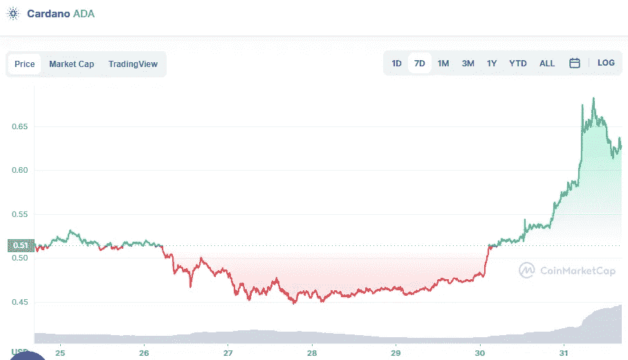

# 卡达诺(ADA)在今天是一个好的投资吗？

> 原文：<https://medium.com/coinmonks/is-cardano-ada-a-good-investment-today-7f7edaa7cbc3?source=collection_archive---------47----------------------->

Source photo [Cardano price today, ADA to USD live, marketcap and chart | CoinMarketCap](https://coinmarketcap.com/currencies/cardano/)

自昨晚收盘以来，ADA 的价格已经惊人地上涨了 30%，达到 0.677766 美元。同样，在过去的七天里，它上涨了 32 %,但在过去的 30 天里，它下跌了 10%。

美国糖尿病协会的图表显示，其指标已经上升到新的高度。特别是美国，其相对实力指数(紫色)已经越过 95。然而，看空者可能会辩称，这是一个过度买入的迹象…