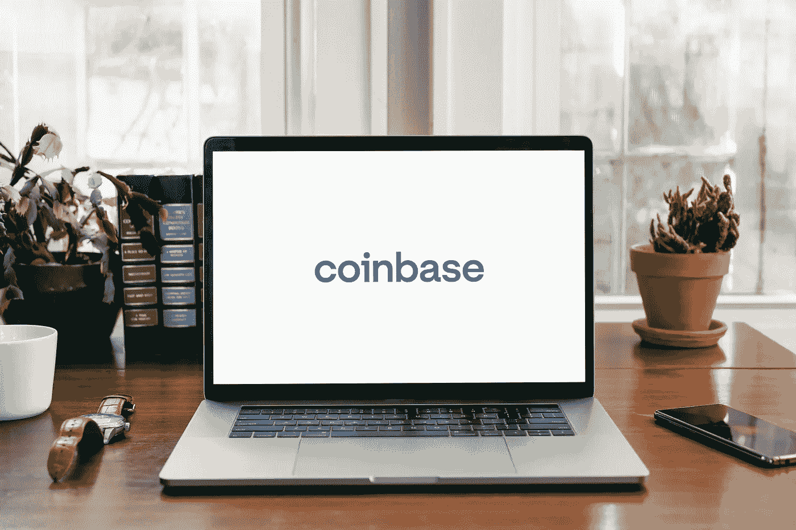

# 2022 年 5 月比特币基地是一个好的投资吗？

> 原文：<https://medium.com/coinmonks/is-coinbase-a-good-investment-in-may-2022-ca94451c756d?source=collection_archive---------14----------------------->

Source photo Unspalsh.com

随着比特币(BTC 兑美元)跌破 40，000 美元，交易量减少，比特币基地(纳斯达克代码:COIN)一直处于修正模式。该公司目前的预期市盈率约为 30 倍，此前六个月下降了 66%。

据该公司称，比特币基地 2021 年的收入为 74 亿美元，调整后的 EBITDA 为 41 亿美元。尽管事实上这些…