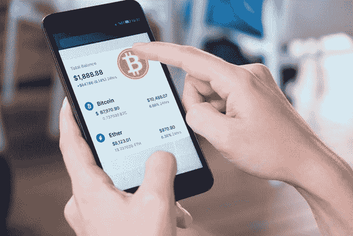

# 比特币基地是 2022 年的好股票吗？

> 原文：<https://medium.com/coinmonks/is-coinbase-a-good-stock-to-own-in-2022-dcf28f5592f0?source=collection_archive---------77----------------------->

对于投资者来说，加密经济可能是一个令人生畏的领域。有成千上万种不同的令牌和应用程序，以及众多希望获得市场份额的公共和私人参与者。*(纳斯达克代码:COIN)是业内最知名的公司之一，虽然它主要是作为一个加密交易平台而闻名，但它正在向其他相关应用领域做出一些有趣的举动。然而，它也面临着许多快速增长的风险投资支持的初创企业的激烈竞争。*

*这是投资 [*【比特币基地】*](https://www.coinbase.com/join/9npib9) 的明智时机吗，还是它的竞争对手正将其地位置于危险之中？*

**

*竞争加剧推动创新*

*目前，[*比特币基地*](https://www.coinbase.com/join/9npib9) 面临的最大威胁之一是私有的加密货币交易所 FTX，该交易所正在进行积极的营销，试图获得市场份额。*

*这位新贵签署了一项协议，在 19 年内支付 1.35 亿美元获得 NBA 迈阿密热火队(Miami Heat)主场——现名为 FTX 竞技场——的冠名权。比特币基地的*书中有一页是这样写的:建立一个 20 亿美元的基金来投资加密初创公司，重点是游戏和安全公司。**

**FTX 成立于 2019 年，已经筹集了 20 亿美元的风险资本，其中大部分资金是在过去六个月里筹集的。10 月，它以 250 亿美元的估值筹集了 4.2 亿美元。仅仅几个月后，该公司完成了 4 亿美元的 C 轮融资，估值为 320 亿美元。由于这是一家私营公司，找到 FTX 的准确收入数据可能有点困难。然而，在撰写本文时，比特币基地的市值约为 500 亿美元。FTX 不仅在向比特币基地的估值迈进，还在以惊人的速度前进。**

**私人股本投资者正急切地寻找下一个秘密金矿。根据市场研究公司 Pitchbook 的数据，在过去几年中，crypto 的风险资本交易量急剧增长。**

**指标 2016 2017 2018 2019 2020 2021 2022 年初至今总交易价值 11.8 亿美元 19.1 亿美元 84.5 亿美元 39.2 亿美元 62.1 亿美元 56.1 亿美元交易数量 272 445 1 203 896 816 1 877 239**

**越来越多的资本被部署到更多的公司，每个公司都希望在加密经济中建立自己的利基市场。虽然这可以被视为对*比特币基地、的逆风，但人们也可以认为，这种来自市场的压力已经导致其管理层做出一些明智的决定。***

***加密在 Web 3.0 中的作用***

***尽管加密应用程序的发展仍处于早期阶段，但热衷者们预见区块链技术将在 Web 3.0 的发展中扮演重要角色。Web 3.0 已经成为元宇宙等新概念的代名词，但更广泛地说，它预计将是互联网的新一轮迭代，具有更多人工智能，并且由于使用了区块链，更加分散化——这是支持加密货币和不可替代令牌(NFT)的相同底层技术。***

***另一个进军 Web 3.0 的竞争对手是币安的加密货币交易所 [*比特币基地*](https://www.coinbase.com/join/9npib9) 。它仅在五年前成立，但从那时起，它已成为世界上最大的密码交易所。币安利用这种增长，对杂志和数字出版商福布斯进行了 2 亿美元的战略投资。这笔交易标志着加密行业对美国传统媒体资产的首次重大投资。***

**观察各种密码领导人如何在棋盘上周旋是很有趣的。FTX 依靠巨额营销支出来获得牵引力，而币安正在展示 crypto 可能很快就会对传统媒体产生的影响。此外，NFT 平台 OpenSea 的估值在过去两年中大幅增长至 130 亿美元。**

**看来，比特币基地要在迅速扩张的竞争对手面前站稳脚跟，还有很长的路要走。然而，投资者应该意识到，即使在科技领域，也有可能增长过快。**

**稳扎稳打赢得比赛**

**正如*由于对比特币(CRYPTO:BTC)、以太坊(CRYPTO:ETH)和柴犬(CRYPTO:SHIB)等迷因币的热情不断高涨，比特币基地见证了创纪录的交易量，NFT 交易平台 OpenSea 是 2021 年更广泛采用加密的主要受益者。今年 1 月，它在 C 轮融资中筹集了 3 亿美元，并在短短六个月内将其估值从 2021 年 7 月的 15 亿美元增加到超过 130 亿美元。然而，尽管现金充裕，OpenSea 也承受着一些成长的烦恼。***

***它已经成为多种加密欺诈方案的目标，一些用户的 NFT 因此损失了价值。据报道，截至 2 月初，OpenSea 已经向其用户报销了 1000 多 ETH，相当于当时的 270 万美元。尽管该公司已经发展到大约 150 名员工，但从事产品开发的员工还不到 40 人。鉴于 OpenSea 估计处理所有 NFT 交易量的 98%,它显然需要在人员配备方面进行更多投资，以跟上其增长轨迹。***

***尽管 FTX、币安和 OpenSea 在不同的加密经济领域运营，但它们有一个共同点:相对年轻。与近十年历史的 [*【比特币基地】*](https://www.coinbase.com/join/9npib9) 不同，它的主要竞争对手似乎受益于宏观因素，如零售和机构投资者对密码越来越感兴趣，但他们是否有商业头脑投资于创新、赚钱的功能，而不是主要依赖营销策略，还有待观察。***

**为未来发展奠定基础**

**[*比特币基地*](https://www.coinbase.com/join/9npib9) 明白要取得长期成功需要什么。在更深的层面上，该公司已经表明，元宇宙将不仅仅是游戏、艺术品、交易和社交。所有这些组件必须通过安全平台连接在一起，以创建一个端到端的全谱加密结构。**

**比特币基地的 NFT 平台将于今年晚些时候推出，该公司与万事达卡合作促进销售。此外，*今年早些时候，比特币基地通过收购加密衍生品平台 FairX，对 FTX 收购加密衍生品交易所 LedgerX 做出了迅速回应。***

***尽管它面临着资金雄厚的新贵的激烈竞争，但它的管理层并没有袖手旁观。当 FTX 在竞技场冠名权上挥霍无度，币安投资商业媒体以努力扩大加密领域的覆盖面时，*正将其利润用于雇佣数千名新员工来开发更多的产品和服务。其精心策划的战略反映了一个为多年强劲增长奠定基础的成熟业务。因此，2022 年可能是在*建仓的大好时机。*****

***这篇文章代表了作者的观点，他可能不同意一个杂色傻瓜高级咨询服务的“官方”推荐立场。我们是杂色的！质疑投资理论——即使是我们自己的投资理论——有助于我们对投资进行批判性思考，并做出有助于我们变得更聪明、更快乐、更富有的决策。***

> ****加入 Coinmonks* [*电报频道*](https://t.me/coincodecap) *和* [*Youtube 频道*](https://www.youtube.com/c/coinmonks/videos) *了解加密交易和投资****

# ***另外，阅读***

*   ***[Bookmap 评论](https://coincodecap.com/bookmap-review-2021-best-trading-software) | [美国 5 大最佳加密交易所](https://coincodecap.com/crypto-exchange-usa)***
*   ***最佳加密[硬件钱包](/coinmonks/hardware-wallets-dfa1211730c6) | [Bitbns 评论](/coinmonks/bitbns-review-38256a07e161)***
*   ***[新加坡十大最佳加密交易所](https://coincodecap.com/crypto-exchange-in-singapore) | [购买 AXS](https://coincodecap.com/buy-axs-token)***
*   ***[红狗赌场评论](https://coincodecap.com/red-dog-casino-review) | [Swyftx 评论](https://coincodecap.com/swyftx-review) | [CoinGate 评论](https://coincodecap.com/coingate-review)***
*   ***[投资印度的最佳密码](https://coincodecap.com/best-crypto-to-invest-in-india-in-2021)|[WazirX P2P](https://coincodecap.com/wazirx-p2p)|[Hi Dollar Review](https://coincodecap.com/hi-dollar-review)***
*   ***[加拿大最佳加密交易机器人](https://coincodecap.com/5-best-crypto-trading-bots-in-canada) | [KuCoin 评论](https://coincodecap.com/kucoin-review)***
*   ***[火币加密交易信号](https://coincodecap.com/huobi-crypto-trading-signals) | [HitBTC 审核](/coinmonks/hitbtc-review-c5143c5d53c2)***
*   ***[如何在 FTX 交易所交易期货](https://coincodecap.com/ftx-futures-trading) | [OKEx vs 币安](https://coincodecap.com/okex-vs-binance)***