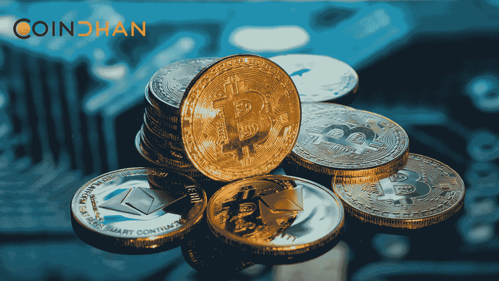

# CoinDhan 是合法的加密货币平台吗？

> 原文：<https://medium.com/coinmonks/is-coindhan-a-legit-cryptocurrency-platform-84b44043d857?source=collection_archive---------49----------------------->

Coindhan.com 是一个加密资产交易平台，总部位于印度。该平台允许印度居民购买、出售、交易和持有比特币、以太坊、XRP 等数字货币。该交易所声称提供安全、可靠和快速的服务。

CoinDhan 的目标是用更好的金融基础设施升级印度。该交易所认为，为了增强他们的金融系统，他们需要拥有一系列令人羡慕的加密货币，并帮助印度学习和发展，同时拥抱加密和区块链生态系统。通过这些手段，该交易所正在努力通过加密货币的采用为印度带来经济自由。

CoinDhan 提供高级交易功能:

*   交易费用从 0%开始
*   订单的快速执行
*   一个专门的关系经理将了解交易者的需求，并为管理账户提供建议和帮助
*   交易者可以享受高级订单类型，根据自己的条件进行交易
*   全天候提取/存入资金
*   集成多层资金保护，并将资金存储在冷钱包中
*   获得全天候支持服务
*   在几分钟内完成 KYC

> 加入 Coinmonks [电报频道](https://t.me/coincodecap)和 [Youtube 频道](https://www.youtube.com/c/coinmonks/videos)了解加密交易和投资

# 另外，阅读

*   [加拿大最佳加密交易机器人](https://coincodecap.com/5-best-crypto-trading-bots-in-canada) | [KuCoin 评论](https://coincodecap.com/kucoin-review)
*   [火币加密交易信号](https://coincodecap.com/huobi-crypto-trading-signals) | [HitBTC 审核](/coinmonks/hitbtc-review-c5143c5d53c2)
*   [如何在 FTX 交易所交易期货](https://coincodecap.com/ftx-futures-trading) | [OKEx vs 币安](https://coincodecap.com/okex-vs-binance)
*   [OKEx vs KuCoin](https://coincodecap.com/okex-kucoin) | [摄氏替代品](https://coincodecap.com/celsius-alternatives) | [如何购买 VeChain](https://coincodecap.com/buy-vechain)
*   [ProfitFarmers 回顾](https://coincodecap.com/profitfarmers-review) | [如何使用 Cornix 交易机器人](https://coincodecap.com/cornix-trading-bot)