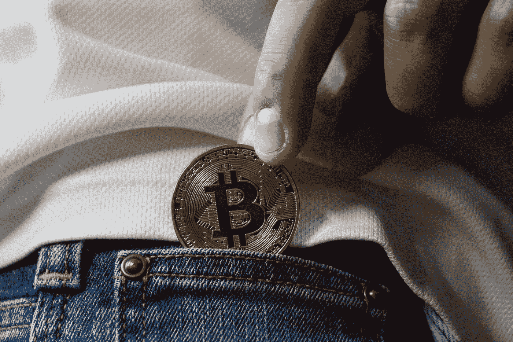

# Crypto 要死了吗？

> 原文：<https://medium.com/coinmonks/is-crypto-dying-8d03ada3f135?source=collection_archive---------33----------------------->

## 有，但实际上没有。

Worldspectrum on pexels

每个人都在思考这个问题。crypto 要死了吗？让我问你一个后续问题。股市是不是要死了？如果你是妄想，不认为我们正走向衰退，那么我为你感到非常遗憾。然而，答案是加密死亡是一个更中性的。让我解释一下。

密码是一种有价值的资产。我们都知道。但是当经济陷入困境时。人们需要变卖这些资产来维持生活。股票市场和密码市场正在跳水。我觉得总有一天会恢复的。但我们必须考虑，我们是否有能力继续在这些资产上存钱，或者试图用它们来支付账单。就我个人而言，我不知道我能坚持多少。我在努力为生活买单，我在慢慢尝试重新评估我需要什么和不需要什么，以及如何节省/降低账单。我认为这是你必须考虑的个人决定，并开始为衰退的样子做准备。在投入更多资金之前，确保你已经做好了准备。

除此之外，如果你有能力继续购买更多，股市和密码的下跌可能是你正在寻找的重置。以太坊和其他数字资产有很多值得期待的地方。我们将看到未来会发生什么。也许我错了，我的偏见不知道密码正落向哪个坑。也许我需要多读一些书。或者 crypto 显示它就像任何资产一样。它随着经济的波动而起伏。

> 加入 Coinmonks [电报频道](https://t.me/coincodecap)和 [Youtube 频道](https://www.youtube.com/c/coinmonks/videos)了解加密交易和投资

# 另外，阅读

*   [折叠 App 审核](https://coincodecap.com/fold-app-review) | [Kucoin 交易机器人](/coinmonks/kucoin-trading-bot-automate-your-trades-8cf0ca2138e0) | [Probit 审核](https://coincodecap.com/probit-review)
*   [如何匿名购买比特币](https://coincodecap.com/buy-bitcoin-anonymously) | [比特币现金钱包](https://coincodecap.com/bitcoin-cash-wallets)
*   [币安 vs FTX](https://coincodecap.com/binance-vs-ftx) | [最佳(SOL)索拉纳钱包](https://coincodecap.com/solana-wallets)
*   [比诺莫评论](https://coincodecap.com/binomo-review) | [斯多葛派 vs 3Commas vs TradeSanta](https://coincodecap.com/stoic-vs-3commas-vs-tradesanta)
*   【Capital.com】|[港加密借贷平台](https://coincodecap.com/crypto-lending-hong-kong)
*   [如何在 Uniswap 上交换加密？](https://coincodecap.com/swap-crypto-on-uniswap) | [A-Ads 评论](https://coincodecap.com/a-ads-review)
*   [WazirX vs CoinDCX vs bit bns](/coinmonks/wazirx-vs-coindcx-vs-bitbns-149f4f19a2f1)|[block fi vs coin loan vs Nexo](/coinmonks/blockfi-vs-coinloan-vs-nexo-cb624635230d)