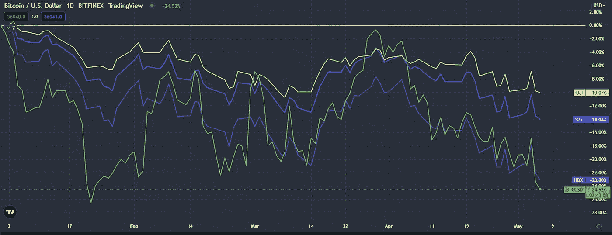
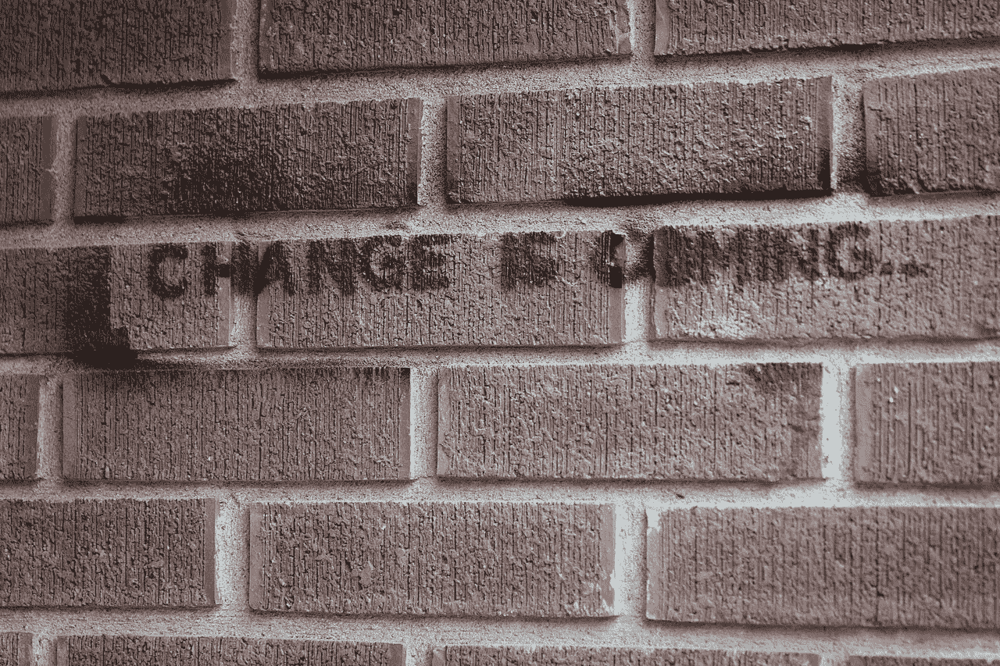

# Crypto 会面临更大的损失吗？

> 原文：<https://medium.com/coinmonks/is-crypto-headed-for-deeper-losses-ca75fd0ff31f?source=collection_archive---------66----------------------->

对市场的快速思考

在过去的一个月里，加密技术的总市值下降了约 20%。对于加密领域来说，这是一个艰难的时期，但这些是我们在加密货币中必须应对的波动。

在过去的几周里，我读了很多关于加密市场的看跌文章和帖子，老实说，让我吃惊的是，有多少人表现得好像 crypto、DeFi 和 NFT 都在他们自己的“泡沫”中他们忘记了看更大的画面。

## 对冲策略的终结

多年来，比特币和其他加密货币通常被认为是针对传统市场和政府不足的对冲。显然，现在情况已经不同了。

在 2021 年牛市期间，来自主流传统金融实体的资金涌入市场。大部分资金今天仍在那里，因此比特币/加密比过去更像主流市场是有道理的，这正是正在发生的事情。

今年，我和其他人一样感受到了痛苦，但与美国股市相比，比特币的价格波动给了我很大的决心。在我看来，这是走向大规模采用的第一步。

## 大局

在对加密货币市场的状况做出结论之前，将全球市场视为一个整体比以往任何时候都更重要。

如果你进入 crypto 是为了对冲你的股票市场投资，那么可能是时候重新考虑你的策略，改变你的投资组合了。然而，我怀疑我的大多数观众进入 crypto 是为了获得更大的回报。在这种情况下，如果你有能力这样做，现在就是关掉图表等待的时候了。

全球经济市场是一头复杂的野兽，很少有人真正知道未来会发生什么。在我看来，看待这种情况只有两种方式:

## #1 —历史重演

第一种观点认为，从长期来看，全球市场最终将反弹，并再次创下历史新高。这几乎肯定会发生，就像过去一直发生的那样，所以从这个角度来看我们的情况是非常安全的。

此外，密码市场也很有可能会再创新高。它可能会落后一点，也可能会领先一步，但很难想象 crypto 会在这一点上落后。这不是 2018 年。加密货币作为一种投资现在处于完全不同的水平。

## # 2——潮流的改变

第二种观点更激进一点，可能性小一点，但也不是不可能。对于权力下放的铁杆狂热分子、区块链迷和 defi degens 来说，我们正处于世界经济重大转变的风口浪尖。

如果政府政策和其他因素未能重振全球市场，最终消费者将被迫转向其他地方，你可以说 crypto 是利用这一机会的最佳选择。

虽然这种情况不太可能发生，但它将创造历史上最大的财富转移，整个加密社区将随着每周荒谬的回报而起舞。

那么，你是那种坚强而踏实的人，还是那种爱做梦的人？无论哪种方式，都没有理由对密码市场的现状过于悲观。希望你已经保留了足够的现金来抵御未来几个月的战斗，如果是这样，你需要做的就是不去管你的加密投资，保持对市场的宏观看法，过你自己的生活。否则，你可能会发现自己在卖底…

> 加入 Coinmonks [电报频道](https://t.me/coincodecap)和 [Youtube 频道](https://www.youtube.com/c/coinmonks/videos)了解加密交易和投资

# 另外，阅读

*   [3 商业评论](/coinmonks/3commas-review-an-excellent-crypto-trading-bot-2020-1313a58bec92) | [Pionex 评论](https://coincodecap.com/pionex-review-exchange-with-crypto-trading-bot) | [Coinrule 评论](/coinmonks/coinrule-review-2021-a-beginner-friendly-crypto-trading-bot-daf0504848ba)
*   [莱杰 vs n rave](/coinmonks/ledger-vs-ngrave-zero-7e40f0c1d694)|[莱杰 nano s vs x](/coinmonks/ledger-nano-s-vs-x-battery-hardware-price-storage-59a6663fe3b0) | [币安评论](/coinmonks/binance-review-ee10d3bf3b6e)
*   [Bybit Exchange 审查](/coinmonks/bybit-exchange-review-dbd570019b71) | [Bityard 审查](https://coincodecap.com/bityard-reivew) | [Jet-Bot 审查](https://coincodecap.com/jet-bot-review)
*   [3 commas vs crypto hopper](/coinmonks/3commas-vs-pionex-vs-cryptohopper-best-crypto-bot-6a98d2baa203)|[赚取加密利息](/coinmonks/earn-crypto-interest-b10b810fdda3)
*   最好的比特币[硬件钱包](/coinmonks/hardware-wallets-dfa1211730c6) | [BitBox02 回顾](/coinmonks/bitbox02-review-your-swiss-bitcoin-hardware-wallet-c36c88fff29)
*   [BlockFi vs Celsius](/coinmonks/blockfi-vs-celsius-vs-hodlnaut-8a1cc8c26630)|[Hodlnaut 点评](/coinmonks/hodlnaut-review-best-way-to-hodl-is-to-earn-interest-on-your-bitcoin-6658a8c19edf) | [KuCoin 点评](https://coincodecap.com/kucoin-review)