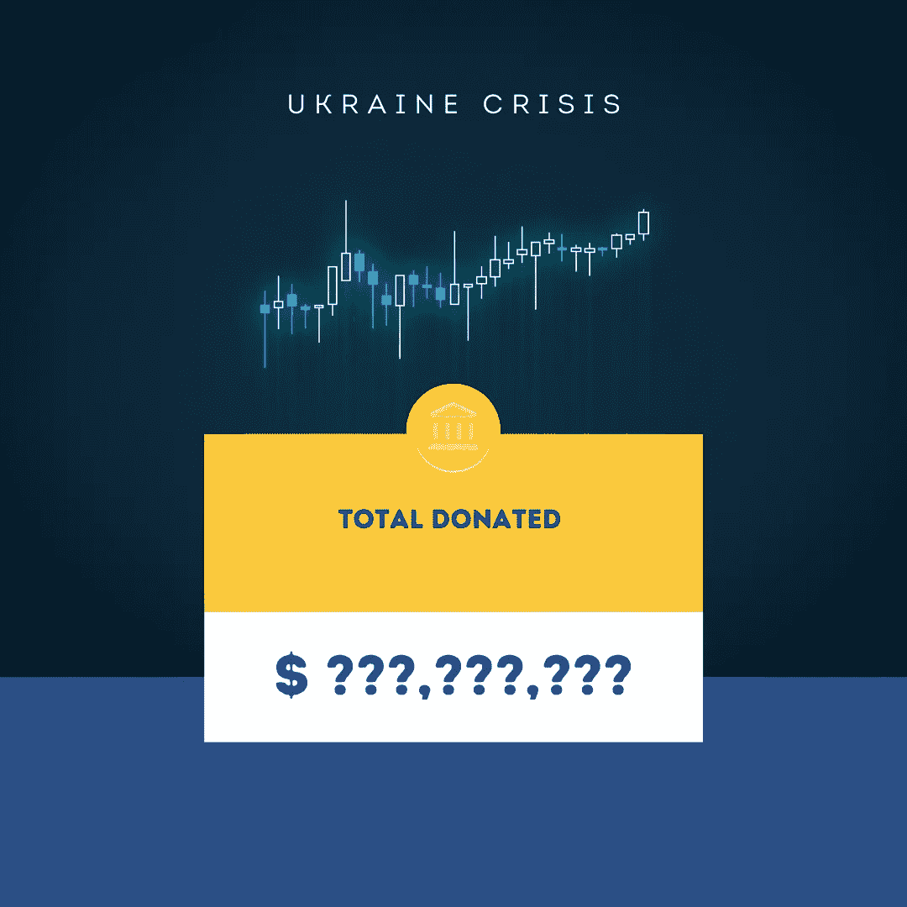
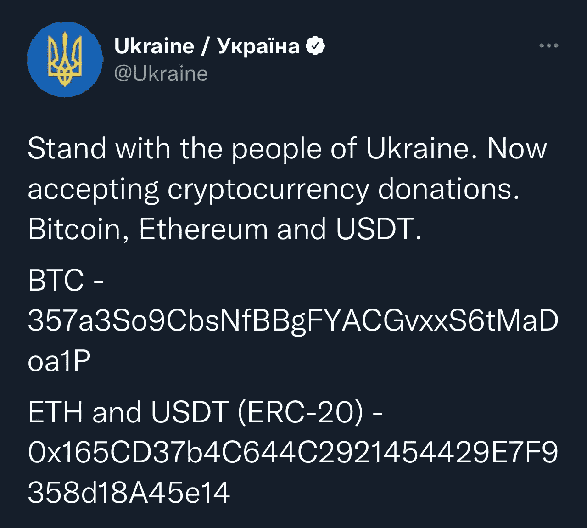

# “加密”在帮助乌克兰方面发挥了作用吗？

> 原文：<https://medium.com/coinmonks/is-crypto-playing-a-part-in-helping-ukraine-2bfeb6f1a5ab?source=collection_archive---------41----------------------->

银行关门了。自动取款机是空的。

随着危机的持续，亲乌克兰的活动人士正在向该国发送越来越多的加密货币。人们——甚至是该国新兴加密行业的领导人——正在公开他们的加密钱包地址，并在社交媒体网站和 Telegram 等应用程序上请求捐款。

据报道，一个基于比特币的援助乌克兰军方的非政府组织已经筹集了数百万美元，其他人正在使用加密货币购买各种军事设备、医疗用品，甚至面部识别工具。有些筹款活动已经持续了几个月，但上周才真正开始。

专家表示，在两个国家处于战争状态的情况下，依靠传统的银行业务是不可能的，而且他们害怕被监视。结果，乌克兰接受了加密货币。

俄罗斯已经受到一些国家的制裁。这引起了某些方面的担忧，即俄罗斯可能利用加密来逃避制裁，转移资金而不被发现。

据《纽约时报》报道，俄罗斯政府一直在构建一种数字货币，俄罗斯也一直在开发工具来帮助掩盖数字交易的起源。换句话说，如果制裁的目的是阻止国家和公司与俄罗斯做生意，加密将是规避制裁的一种手段。

前联邦检察官迈克尔·帕克告诉《纽约时报》,认为俄罗斯没有计划制裁和寻找替代方案的必要性是“天真”的。

一些经济分析师预测，机构资金将进入加密货币市场，引起市场的重大转变。

此外，crypto 有可能在纳斯达克上市，这将提高区块链及其应用作为传统货币替代品的可信度。

因为比特币(密码:BTC)是世界上最受欢迎的加密货币，所以人们转向它并不奇怪。然而，由于冲突的影响，冲突的成本已降至历史最低点。尽管如此，它继续受益于其作为第一种加密货币的地位。大多数人都熟悉比特币，因为它已经存在了这么久。流通中的比特币永远不会超过 2100 万枚，因此一些人认为这是一种可靠的通胀对冲。

当前的冲突凸显了加密货币的重要性及其在金融界的地位。

你能把 crypto 作为捐赠送给你自己吗？

*是的，你可以。*

直接捐给乌克兰政府是保证你的加密货币捐给乌克兰最安全的方式就是直接捐给政府。周六，乌克兰官方(并经过验证的)推特账户分享了两个加密货币钱包地址:一个用于比特币，一个用于以太坊。它也接受 USDT 和波尔卡多特。

