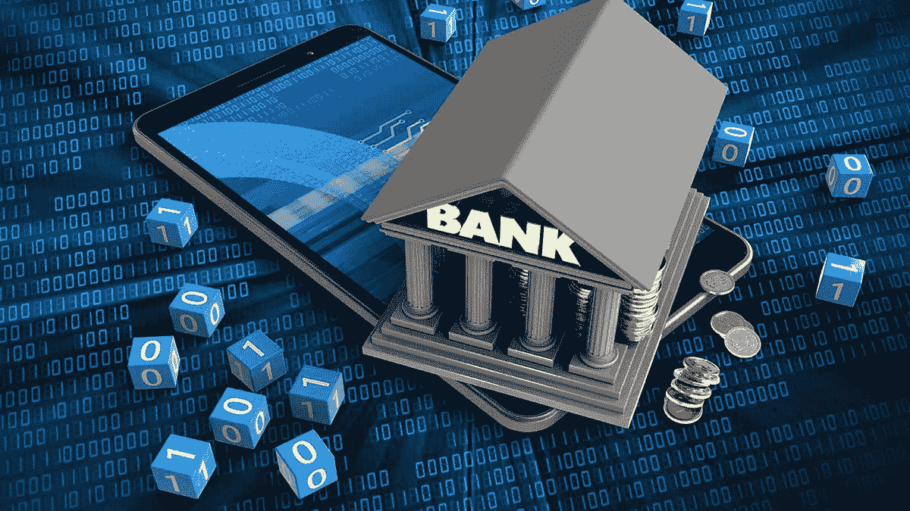
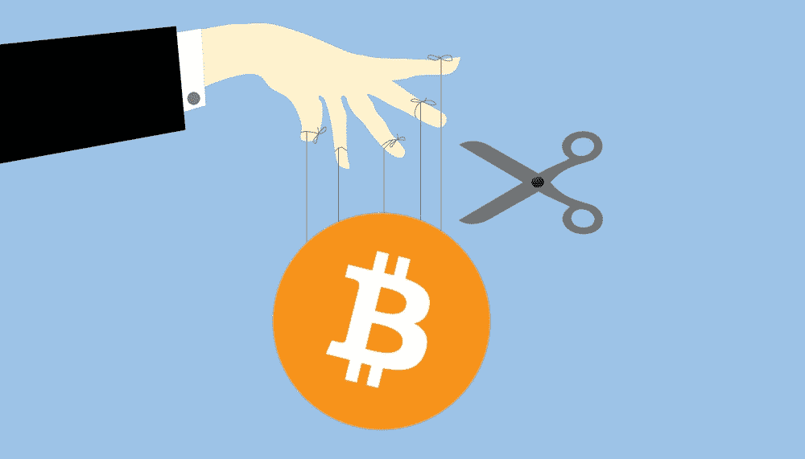

# Crypto 真的是庞氏骗局吗？

> 原文：<https://medium.com/coinmonks/is-crypto-really-a-ponzi-scheme-7abaf3982814?source=collection_archive---------9----------------------->

# 对其支持者来说，crypto 是几个世纪以来金融的启示录。对批评者来说，crypto 仅仅是一个庞氏骗局。看看世界上第一种加密货币比特币，有助于解决这个难题。

bitcoin and fiat

根据来自 CoinMarketCap 的数据，在过去的几个月里，整个市场已经下跌了 6000 亿美元。比特币已经从 2021 年最后一个月创纪录的 69K 美元跌至 47K 美元。

但是从更大的角度来看，密码产业每年都在急剧增长，而[T3 的数字也没什么好奇怪的。例如，几个月前，比特币突破了 1 万亿美元市值的里程碑，而加密市场的总市值飙升至超过](https://www.fortunebusinessinsights.com/industry-reports/cryptocurrency-market-100149)[3 万亿美元](https://www.statista.com/statistics/730876/cryptocurrency-maket-value/)。

这些统计数据清楚地表明了加密金融的崛起，而传统银行业正在经历几次反弹。机构投资者已经开始关注了！甚至国家政府也发现了行业内的可能性，并投资于比特币。加密似乎离取代美元不远了。

但是密码市场上的事情可以在几周或几天内发生巨大的变化(有时甚至是几个小时！).通过这些令人发指的涨跌，许多人不禁想知道:加密是金融的未来吗？我们是不是很快就会去买非功能性广告，并把它们放在元宇宙的空间里，而不是挂在墙上的好图片上？加密是传统系统反弹的解决方案，还是庞氏骗局的更高级版本？

# 分散技术的作用

他们自己创造的传统银行模式的一些最大挑战包括(主要是)他们自己的政策、监管和利率，这需要多个漫长的过程来完成。一种加密支付模式出现，提供了以前从未有过的服务，个人可以匿名持有自己的资产。

中本聪提出的分散化银行流程被视为复杂银行系统的理想解决方案。虽然这个系统有自己的漏洞，但它也有几个让人难以拒绝的优点。

# 数字化对银行系统的影响

traditional banking institutions

如果你涉足金融市场(尤其是在线)，你很可能会遇到诸如区块链、人工智能(AI)、加密货币、NFTs 等术语。

目前，我们正在经历许多变化，包括每天交易的显著增加，而[加密货币是推动这些变化的一个重要因素](https://www.insiderintelligence.com/insights/digital-banking-trends/)。

尽管几个世纪以来，菲亚特一直是人们首选的支付货币，但技术的进步为一种更先进的新货币形式——加密货币——铺平了道路。与传统银行系统相比，加密银行系统的主要优势之一是分散化、更快的交易和匿名性等。

# 为什么加密被视为庞氏骗局

自从最近美国比特币交易所交易基金(ETF)推出以来，比特币在许多局外人看来就开始像一个庞氏骗局。他们为什么这么认为？这种信念主要来自于交易所交易基金吸引大量资金到比特币的潜力，允许到达底部的投资者带着大利润离开顶部，使金字塔倒塌。

The question: is bitcoin a Ponzi scheme?

据《南华早报》报道，[官方对比特币和其他加密货币的监管，以及央行数字货币(CBDC)的创建，被视为在可能的崩溃发生之前的解决方案。](https://www.scmp.com/comment/opinion/world/article/3154210/why-bitcoin-looking-more-pyramid-scheme-and-central-banks)

目前，比特币的全部市值，包括数字或物理挖掘的比特币，约为 9000 亿美元(T4)。但如果对加密的狂热持续下去，比特币交易所交易基金可能吸引的资金数量可能会达到这个数字的数倍，尤其是在得到全球最大股票市场的引领之后。

同一份报告称，这表明通过 ETF 流入比特币的合法资金可能会取代比特币所代表的非法资金，早期投资者可以通过卖出获利离开，剩下的只有数字。

# 加密银行的未来还是庞氏骗局？

从定义上来说，比特币和密码肯定不是庞氏骗局。以第一种加密货币比特币为例，我们来看看为什么加密不是庞氏骗局的一些合法理由:

*   庞氏骗局承诺的远远超过市场自然提供或完成的。另一方面，比特币无法做出这样的承诺，因为它甚至没有一个可以这样做的代表。对许多人来说，个人将从比特币中获利的想法只是一种误解。
*   其次，庞氏骗局需要新成员的加入来维持当前的现金流。比特币又一次无法满足这一要求。相反，比特币可以在相同数量的持有者或参与者的情况下保持相同的价格价值。然而，随着参与者的减少，价格也会上涨。

还有，比特币的收益和价值是通过技术产生的。传统银行对银行、员工等支付收取至少 2%的费用，而加密货币能够以更少的开销和更快的方式完成同样的事情——因此，交易更高效，成本更低。

这种效率的作用是一个值得投资的赚钱行业。符合“造一个更好的捕鼠器”的传统商业理念。任何看不到这种自然产生的价值的人肯定会错过很多。

> 加入 Coinmonks [电报频道](https://t.me/coincodecap)和 [Youtube 频道](https://www.youtube.com/c/coinmonks/videos)了解加密交易和投资

# 另外，阅读

*   [本地比特币审核](/coinmonks/localbitcoins-review-6cc001c6ed56) | [加密货币储蓄账户](https://coincodecap.com/cryptocurrency-savings-accounts)
*   [什么是融资融券交易](https://coincodecap.com/margin-trading) | [成本平均法](https://coincodecap.com/dca)
*   [支持卡审核](https://coincodecap.com/uphold-card-review) | [信任钱包 vs 元掩码](https://coincodecap.com/trust-wallet-vs-metamask)
*   [Exness 回顾](https://coincodecap.com/exness-review)|[moon xbt Vs bit get Vs Bingbon](https://coincodecap.com/bingbon-vs-bitget-vs-moonxbt)
*   [如何开始用加密贷款赚取被动收入](https://coincodecap.com/passive-income-crypto-lending)
*   [BigONE 交易所评论](/coinmonks/bigone-exchange-review-64705d85a1d4) | [电网交易 Bot](https://coincodecap.com/grid-trading)