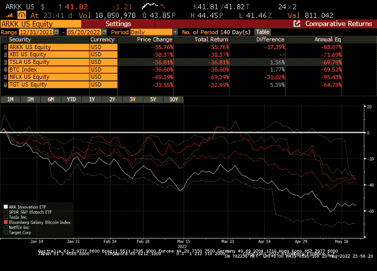
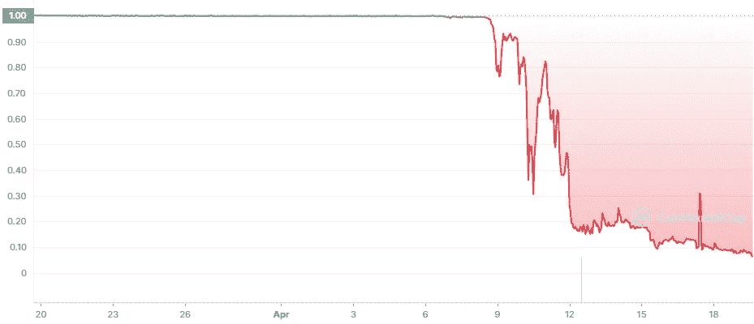

# Crypto 值得冒这个险吗？

> 原文：<https://medium.com/coinmonks/is-crypto-worth-the-risk-7c7c8f04528c?source=collection_archive---------37----------------------->

如何在加密资产管理中建立信任

Photo by [Cristofer Maximilian](https://unsplash.com/@cristofer?utm_source=unsplash&utm_medium=referral&utm_content=creditCopyText) on [Unsplash](https://unsplash.com/s/photos/risk?utm_source=unsplash&utm_medium=referral&utm_content=creditCopyText)

重点是不要笼统地称比特币或加密技术的终结。从一开始就有许多人尝试过，你可以在这里看看这种预示厄运的预言的发生。尽管许多协议会因为试图创新而消亡，但加密技术将会继续存在。

在加密令牌上定向可能与任何风险资产一样有风险。持有比特币的风险并不比持有凯西伍德(Cathie Wood)的 ARKK、生物科技 ETF 或特斯拉、网飞或塔吉特(Target)的单一股票头寸高。自年初以来下降了 30%至 70%。无论好坏，你的本金都暴露在巨大的波动中。

Bloomberg, 20May22 11.57am EDT

现实情况是，对加密风险的理解和管理都很糟糕。最近 Terra 网络上 Anchor 协议的崩溃就是一个恰当的例子。它有它的缺陷，主要是 UST 没有抵押，只有卢纳和 LFG 基金会的储备支持——这两者都与 UST 有着密切的联系。市场力量开始怀疑 Anchor-Terra 的可持续性。鲸鱼扔掉了一堆 UST。它脱钩了。信心动摇了，每个人都跑向出口。出口太小，允许在高折价下进行有限的赎回。恐慌加剧。UST 赎回加速。露娜撞毁了。LFG 耗尽了捍卫联系汇率的储备。链条被挂起。结束了。

CoinmarketCap: 1-month TerraUSD to USD 20May22 at 12.08pm EDT

事实上，泰拉的 UST 失败了，尽管它承诺设法稳定盯住美元，这令人震惊。但总而言之，这是一次经典的“银行挤兑”。这种情况一直发生在新兴市场货币身上，1992 年发生在英镑身上，2008 年发生在银行身上。

银行接受现金存款，并把钱投入风险更高的资产以获取利差。在任何时候，他们都必须管理资产配置价值低于现金存款的风险。作为缓冲，他们积累了相当于其资产总额 10%至 20%的股权。

就这一点而言，UST 的失败与其说在于锚协议的机制，不如说在于其资产组合的脆弱性。它唯一的资产是 LUNA，与 UST 的关联度为 1:1。没有 20%的股权缓冲能拯救这一切。

因此，必须在整个资产分配体系中管理加密风险。每个投资决策都需要一个框架。Crypto 也不例外。

-识别交易对手、合同安全性、流动性、治理、价格预测、基础资产的波动性或监管框架的风险。

-根据你能承受的风险进行配置，无论是通过波动买入并持有，还是在本金安全的情况下获取收益

-通过协议、交易策略、令牌设置限额，并设置获利目标和止损水平

-通过 Nexus Mutual 购买保险或通过 Lyra options 进行对冲

虽然 TradFi 投资经理日复一日地这样做，但这仍处于加密的早期，风险管理只是慢慢地逐步推出。

它提供了银弹吗？绝对不行。它有助于为投资者提供必要的防范措施。最重要的是，它增强了他们的信心，这种信心会转化为信任。信任应该是任何资产管理公司最值得称赞的资产。

底线是，人类贸易依赖于信任。当它坏了，所有人都跑了。信任是由共识建立的。Crypto 和 web3 最擅长建立共识。我们还早。

**关于—**

*360 咨询有限责任公司是一家总部位于波士顿的 RIA 公司，管理投资，包括加密*

👉[上午 9 点至 30 点](https://twitter.com/930AM2)🐰🕳

**来源—**

👉链上银行结束游戏由 0x ham[https://0xhamz.substack.com/p/defis-original-sin?s=w](https://0xhamz.substack.com/p/defis-original-sin?s=w)

👉出现“比特币已死”的文章[https://www.bitcoinisdead.org/](https://www.bitcoinisdead.org/)

👉期权交易[https://www.lyra.finance/](https://www.lyra.finance/)

👉https://nexusmutual.io/保险协议

> 加入 Coinmonks [电报频道](https://t.me/coincodecap)和 [Youtube 频道](https://www.youtube.com/c/coinmonks/videos)了解加密交易和投资

# 另外，阅读

*   [最佳以太坊钱包](https://coincodecap.com/best-ethereum-wallets) | [电报上的加密货币机器人](https://coincodecap.com/telegram-crypto-bots)
*   [交易杠杆代币的最佳交易所](https://coincodecap.com/leveraged-token-exchanges)
*   [最佳加密分析或链上数据](https://coincodecap.com/blockchain-analytics) | [Bexplus 评论](https://coincodecap.com/bexplus-review)
*   [NFT 十大市场造币集锦](https://coincodecap.com/nft-marketplaces)
*   [AscendEx Staking](https://coincodecap.com/ascendex-staking)|[Bot Ocean Review](https://coincodecap.com/bot-ocean-review)|[最佳比特币钱包](https://coincodecap.com/bitcoin-wallets-india)
*   [Bitget 回顾](https://coincodecap.com/bitget-review)|[Gemini vs block fi](https://coincodecap.com/gemini-vs-blockfi)|[OKEx 期货交易](https://coincodecap.com/okex-futures-trading)
*   [美国最佳加密交易机器人](https://coincodecap.com/crypto-trading-bots-in-the-us) | [不断回顾](https://coincodecap.com/changelly-review)