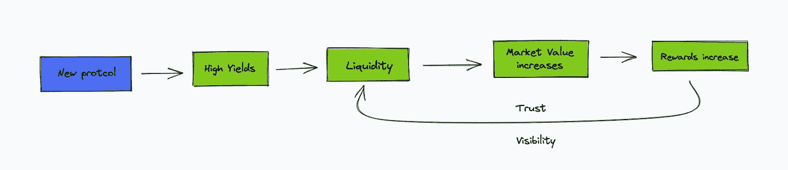

# 去中心化金融死了吗？从 DeFi 1.0 到现在

> 原文：<https://medium.com/coinmonks/is-decentralized-finance-dead-from-defi-1-0-to-now-69a7fb9996f?source=collection_archive---------5----------------------->

*2020 年夏季 DeFi 期间，分散式融资出现了爆炸式增长，但当前协议面临哪些挑战和现状？*

# D 去中心化金融 1.0

*农业、高产、年息、治理令牌和通货膨胀。*

当这个新领域出现时，它包括用越来越多令人印象深刻的收益吸引投资者(称为“degens”)，以使协议可行。
流动性是分散融资的核心，用户还没有意识到该系统是基于庞氏骗局。

The mechanisms of DeFi 1.0 — Pure Utopia

为了获胜，他们必须离开一个农场，轮流去另一个农场，把代币卖给下一个需要把代币卖给下一个用户的用户(如果有用户的话)。

协议的另一个收入来源被称为“猿税”,这源于玩家在赌场采取的心态。

赢的钱看起来是如此的不理性，以至于一个人觉得自己在控制中，不断地输入新的协议和循环，却从未获利(在这一点上基本上是赌博)，最终失去一切。要了解这个 Ape 税背后的过程，你可以在这里找到 **rekt 关于它的**视频[。](https://www.youtube.com/watch?v=HJzwEi9iJsc)

这些协议的机制是不可持续的，仅仅依赖于持续的流动资金，这就是为什么它们的寿命开始减少，并最终造成不可避免的令牌膨胀。用户兴趣的下降导致了流动性的减少，从而结束了需要永久流动性的协议。庞氏骗局和代币膨胀被曝光，协议不再能吸引新的投资者。

***就这样，DeFi 1.0 结束了…***

# **分权财务 2.0**

*赌注，债券，叉子，提高 APYs 和象征性通货膨胀*。

在 2021 年底，围绕不可替代代币的炒作正在消退，市场正在缓慢回升，走向历史高点。Olympus DAO 的系统开始被采用，试图解决 DeFi 2.0 面临的流动性问题。但是协议的机制是如何创新分散融资的呢？

通过维持一个多样化的财政部来维持价格(作为一个中央银行),并拥有由各种资产支持的流动性，奥林巴斯道系统提供了一个真正的解决方案，作为一种价格变化的稳定货币。最终目的不是一个固定的价格，而是通过它的象征经济学来实现一个相对稳定的价格。

本文不会深入讨论该协议是如何工作的，请在这里阅读白皮书。

理解了这一新策略的重要性，市场参与者模仿了这一过程并创造了叉形欧姆。其功能与分散的中央银行完全相同，但策略更加激进。

然而，尽管系统复杂，协议仍然需要信任和流动性来继续正常工作。用户相信 Olympus DAO 唯一不再可靠的时候是在熊市期间，但这只是对系统的信任危机，因为它的弱点在分叉结束时暴露出来。

分叉的结束是由于激进策略的回归(*我写了一篇关于它的文章*)，但基本面是相同的，主要参与者 OHM 也遭受了流动性退出的影响。这又一次引发了代币的膨胀，代币在崩盘期间损失了 99%的价值。

Olympus MC — DeFi 2.0 Liquidity

***不再信任机制，不再有流动性，不再有赤字 2.0…***

# 去中心化金融 3.0？

*缩放、合并、跨链、速度和交易费用。*

显示协议漏洞的多次黑客攻击以及以太坊从工作证明到利益证明的转变(*合并*)是 2022 年 DeFi 的两大看点。

可以肯定的是，这种转变将在集成和交易速度方面提供机会，这很可能导致部署 *DeFi 3.0* 。

在这个新牛市的第一行，我们有 **Aave 协议**，这是一个分散的非托管流动性协议，几天前发布了它的 V3。该版本对价格产生了重大影响，价格上涨了 80%,包括更大的借贷能力、隔离池、跨链门户和分散式社交网络的推出。

Total Aave users over time

与*$露娜*、 *$FXS* 的 4 池联盟在**曲线**和**凸**上也有动作，可能通过这个协议控制了 47%的流动性，赢得了曲线战。你可以在这里阅读关于联盟的文章。尽管这是一个意想不到的举动，但评估戴稳定币(故意遗漏)和协议的后果将是有趣的。

Total Curve users over time

总之，可以肯定的是，我们正处于 DeFi 新的增长期的开端，它只是在等待以太坊的合并。我们必须关注提供跨链解决方案(Aave)和通过治理和收益率(曲线)解决流动性问题的协议。

> 加入 Coinmonks [电报频道](https://t.me/coincodecap)和 [Youtube 频道](https://www.youtube.com/c/coinmonks/videos)了解加密交易和投资

# 另外，阅读

*   [5 款最佳加密交易终端](https://coincodecap.com/crypto-trading-terminals) | [最佳 DeFi 应用](https://coincodecap.com/best-defi-apps)
*   [最佳网上赌场](https://coincodecap.com/best-online-casinos) | [币安评论](/coinmonks/binance-review-ee10d3bf3b6e) | [BitMEX 评论](https://coincodecap.com/bitmex-review)
*   [麻雀交换评论](https://coincodecap.com/sparrow-exchange-review) | [纳什交换评论](https://coincodecap.com/nash-exchange-review)
*   [美国最佳加密交易机器人](https://coincodecap.com/crypto-trading-bots-in-the-us) | [变化回顾](https://coincodecap.com/changelly-review)
*   [在印度利用加密套利赚取被动收入](https://coincodecap.com/crypto-arbitrage-in-india)