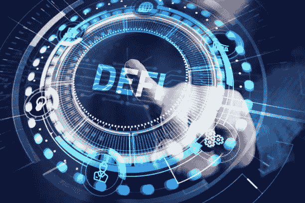

# 分散金融是未来吗？

> 原文：<https://medium.com/coinmonks/is-decentralized-finance-the-future-e64defa0cde8?source=collection_archive---------34----------------------->

## 了解 DeFi 以及它将如何改变我们的金融体系

image by palititch on iStock

假设你想从美国汇一些钱到你兄弟在尼日利亚的银行账户，你会被银行的了解你的客户(KYC)和反洗钱所困扰。(反洗钱)政策

来自发送的分支机构和接收的分支机构的费用都相当可观，需要一些时间和审查才能到达。这些都是分散金融正在解决的问题。

另一个值得注意的问题是发展中国家的个人能否利用银行和银行系统。不使用银行金融服务的大约 17 亿人中有一半以上来自这些国家。

好消息是，这 17 亿人口中的三分之二可以使用电话和互联网连接，因此他们可以毫不费力地获得 Defi 服务。

> 这仅仅意味着，世界上任何一个拥有移动设备和互联网连接的人都可以访问金融服务，而无需任何验证过程或限制。

Defi 还解决了透明度的问题。没人知道银行做什么。他们的投资和金融活动并不完全公开。2008 年金融危机就是一个很好的例子。

Defi 的特点是分散和自治的，这意味着所有协议和活动对所有人开放，没有中央权力控制其活动。

Defi 让每个人都可以在没有任何中介的情况下获得所有金融服务。

Defi 的著名部门。

*   ***stable coins***——这些是为了减少加密中的波动性而创造的硬币。它们通常与现实生活中的货币挂钩，并由现实生活中的金钱支持。分散的 stablecoins 可以由 Dao 运行，这使得它们是开放的和无权限的。

Maker's DAI 是一种稳定的硬币，可用于借贷服务，多枚硬币可用作抵押品。

*   借贷——通过银行处理贷款很困难，需要很多过程，比如充足的抵押品。

然而，分散借款不需要这样的过程和个人验证。人们可以使用加密资产作为抵押来获得贷款。回报可以通过对贷款池的贡献来获得。

Aave 是一种货币市场协议，允许用户借入和借出多达 24 种不同的资产。

*   ***交易所***——在集中交易所进行加密货币交易，是指资产存放在交易所，交易所也充当中间人。分散式交易所不需要在其上存储硬币来提供这种服务。

分散式交易所(DEX)可以是基于订单簿的(如 Serum ),用户可以按自己想要的价格设定买卖订单，也可以是基于流动性池的(pancakeswap ),用户向一对资产或一个资产池提供流动性，并从为所述资产池执行的每笔交易中赚取少量费用。

基于流动性池的 dex 的不利之处在于，流动性提供者可能会遭受非永久性损失。

**指标的障碍**

-大多数人使用 CEXs，因此 DEX 上的流动性更少，这可能导致更高的滑点和糟糕的价格执行。

-尽管一些 DEX 现在提供限价单等功能，但许多 DEX 没有 cex 拥有的止损单等功能。

dex 正在增长，并获得了更高的需求。一些创新将消除这一障碍。

**德克斯聚合器**

交换大量代币将确保高滑点和高溢价。聚合器有助于将资金分散到不同的交易所，以获得最好的价格，同时避免高滑点。1inch 是一家领先的 DEX 聚合公司。

*   ***治理***

DeFi 协议以分散自治组织的形式存在。这意味着权力没有等级之分，没有人可以单独做决定。成员通过储存在区块链上的代码提交提案，也通过这种方式投票。

治理令牌由 Dao 创建，用于激励积极的参与者。

> 分散融资仍处于早期阶段，并在快速发展。这是我们金融体系的未来，因为它平整了操场，给每个人平等的机会。

> 加入 Coinmonks [电报频道](https://t.me/coincodecap)和 [Youtube 频道](https://www.youtube.com/c/coinmonks/videos)了解加密交易和投资

# 另外，阅读

*   [加拿大最佳加密交易机器人](https://coincodecap.com/5-best-crypto-trading-bots-in-canada) | [Bybit vs 币安](https://coincodecap.com/bybit-binance-moonxbt)
*   [阿联酋 5 大最佳加密交易所](https://coincodecap.com/best-crypto-exchanges-in-uae) | [SimpleSwap 评论](https://coincodecap.com/simpleswap-review)
*   购买 Dogecoin 的 7 种最佳方式 | [ZebPay 评论](https://coincodecap.com/zebpay-review)
*   [最佳期货交易信号](https://coincodecap.com/futures-trading-signals) | [期交所评论](https://coincodecap.com/liquid-exchange-review)
*   [用于 Huobi 的加密交易信号](https://coincodecap.com/huobi-crypto-trading-signals) | [Swapzone 审查](/coinmonks/swapzone-review-crypto-exchange-data-aggregator-e0ad78e55ed7)
*   最佳[密码交易机器人](https://coincodecap.com/best-crypto-trading-bots) | [购买索拉纳](https://coincodecap.com/buy-solana) | [矩阵导出评论](https://coincodecap.com/matrixport-review)
*   [Coldcard 评论](https://coincodecap.com/coldcard-review) | [BOXtradEX 评论](https://coincodecap.com/boxtradex-review)|[uni swap 指南](https://coincodecap.com/uniswap)